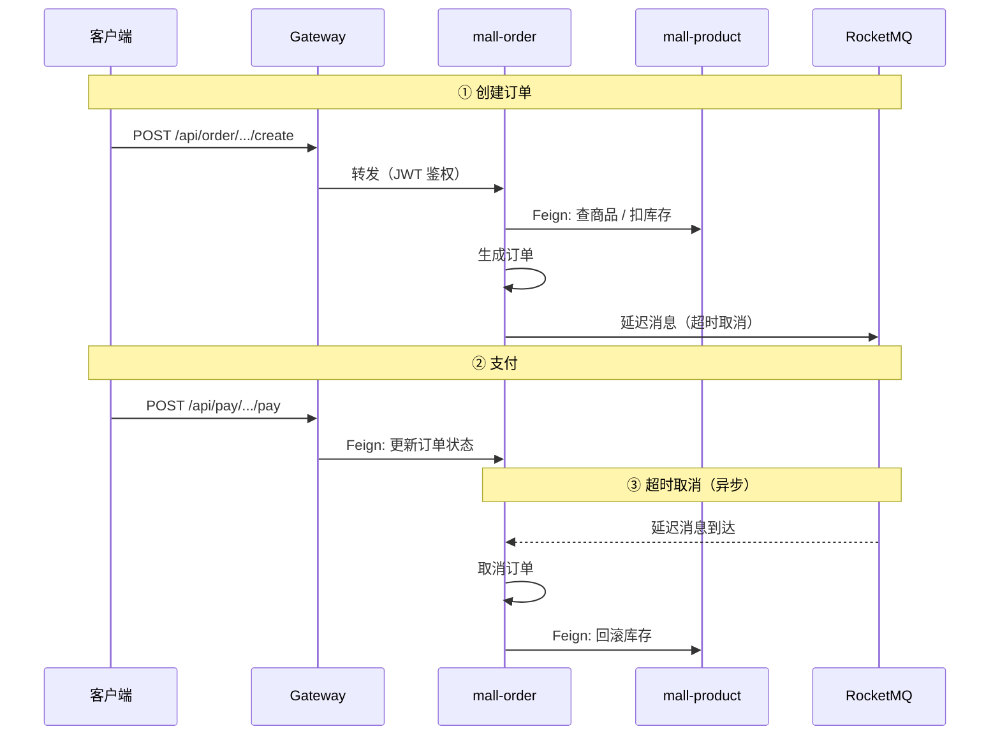

<p align="center">
  <h1 align="center">Mall Cloud</h1>
  <p align="center">基于 Spring Cloud Alibaba 微服务架构的 B2C 电商平台</p>
</p>

<p align="center">
  
  
  
  
  
</p>

---

> **项目评价：** 这是一套完整的微服务脚手架，覆盖了 Spring Cloud Alibaba 全家桶的集成实践，对学习微服务架构有很高的参考价值。但**离生产可用还有较大距离**——业务逻辑设计不够严谨（订单状态机缺失、鉴权链路不完整、数据同步机制不透明），更适合作为**学习项目**而非直接上线。详见[已知问题](#已知问题)。

---

## 📑 目录

- [项目简介](#项目简介)
- [功能概览](#功能概览)
- [项目结构](#项目结构)
- [系统架构](#系统架构)
  - [整体架构](#整体架构)
  - [服务依赖关系](#服务依赖关系)
  - [核心流程：下单 → 支付](#核心流程下单--支付)
  - [异步解耦：消息队列](#异步解耦消息队列)
- [网关路由](#网关路由)
- [基础设施](#基础设施)
- [数据库设计](#数据库设计)
- [快速开始](#快速开始)
- [设计要点](#设计要点)
- [已知问题](#已知问题)
- [多仓库拆分方案](#多仓库拆分方案)

---

## 项目简介

`Mall Cloud` 是一套基于 **Spring Cloud Alibaba** 全家桶的 B2C 电商微服务系统，完整覆盖商品、订单、营销、支付、推荐、消息推送等电商核心业务域。

**核心特性：**

- 🚪 统一 API 网关，JWT 鉴权 + Sentinel 流控
- 🔐 RBAC 权限模型（用户 → 角色 → 菜单 / 部门）
- 📦 17 个 Maven 模块，9 个独立部署微服务 + 6 个 Feign 客户端
- 🔄 MySQL + Elasticsearch 双写，ShardingSphere 分库分表
- ⚡ RocketMQ 延迟消息驱动订单超时取消，异步解耦浏览记录采集
- 🔗 认证 SDK 自动透传用户上下文，Feign 调用零侵入
- 🧠 Ollama AI 对话集成
- 💰 支付宝沙箱支付 + 阿里云短信

---

## 功能概览

| 业务域 | 服务 | 核心能力 |
|--------|------|---------|
| 🔐 认证授权 | `mall-auth` | 登录注册、RBAC 权限（用户/角色/菜单/部门/岗位）、Caffeine 本地缓存 |
| 🏗️ 基础服务 | `mall-basic` | 字典管理、行政区域、文件上传（MinIO）、短信（阿里云 SMS）、敏感词过滤、AI 对话（Ollama）、Quartz 定时任务 |
| 🛒 商品中心 | `mall-product` | 商品 CRUD、分类/品牌/属性体系、MySQL+ES 双写搜索、购物车、首页管理（轮播图/公告/推荐） |
| 📋 订单交易 | `mall-order` | 下单→支付→发货→收货→评价 全生命周期、退货退款、ES 订单搜索、**分库分表（8库）** |
| 🎫 营销中心 | `mall-marketing` | 优惠券发放/领取/核销、秒杀商品、优惠金额试算 |
| 💰 支付服务 | `mall-pay` | 支付宝沙箱支付、二维码生成（ZXing）、**无数据库**（纯 Feign 调用） |
| 📊 智能推荐 | `mall-recommend` | 商品推荐（Mahout）、收藏管理、浏览历史、**分库分表（8库，按 user_id）** |
| 💬 消息推送 | `mall-message` | WebSocket + STOMP 实时推送、通知管理、**分库分表（8库，按 to_user_id）** |

---

## 项目结构

```
mall_cloud_server/
├── mall-common/                   公共 Starter 模块
│   ├── 实体基类 (BaseEntity / 分页)
│   ├── 工具类 (雪花 ID / Token / MD5 / Excel)
│   ├── 全局响应包装 & 异常处理
│   ├── 敏感词脱敏
│   └── 基础设施自动配置 (Redis / Feign / 全局异常)
│
├── mall-gateway/                  网关层
│   └── Spring Cloud Gateway + JWT 校验 + CORS + Sentinel
│
├── mall-auth/                     认证服务（登录、RBAC 权限）
├── mall-auth-client/              认证服务 Feign 接口 & DTO
├── mall-auth-api-starter/         认证 SDK（JWT 解析、用户上下文透传）
│
├── mall-basic/                    基础服务（字典、短信、文件、Quartz）
├── mall-basic-client/             基础服务 Feign 接口 & DTO
│
├── mall-product/                  商品服务（商品、分类、品牌、购物车、ES 搜索）
├── mall-product-client/           商品服务 Feign 接口 & DTO
│
├── mall-order/                    订单服务（订单、退货、分库分表）
├── mall-order-client/             订单服务 Feign 接口 & DTO
│
├── mall-pay/                      支付服务（支付宝对接，无数据库）
├── mall-pay-client/               支付服务 Feign 接口 & DTO
│
├── mall-marketing/                营销服务（优惠券、秒杀）
├── mall-marketing-client/         营销服务 Feign 接口 & DTO
│
├── mall-recommend/                推荐服务（收藏、浏览历史，分库分表）
├── mall-message/                  消息推送服务（WebSocket + 站内通知，分库分表）
│
└── docs/                          项目文档
```

> [!NOTE]
> 每个 `*-client` 模块定义该服务的 Feign 接口，供其他服务引入。业务配置全部托管在 Nacos 配置中心，本地 `bootstrap.yml` 仅配置 Nacos 地址和 namespace。

---

## 系统架构

### 整体架构

```
客户端 (Web / Mobile)
        │
        ▼
  ┌──────────────────────────┐
  │  mall-gateway  (8080)    │
  │  JWT · CORS · Sentinel   │
  └──────────────────────────┘
        │
        ▼
  ┌──────────────────────────┐
  │  9 个业务微服务            │
  │  auth / basic / product  │
  │  order / pay / marketing │
  │  recommend / message     │
  └──────────────────────────┘
        │
        ▼
  ┌──────────────────────────┐
  │  中间件 & 外部服务         │
  │  Nacos · Redis · MySQL   │
  │  ES · MongoDB · RocketMQ │
  │  MinIO · 支付宝 · 阿里云   │
  └──────────────────────────┘
```

各服务使用的中间件详见[基础设施](#基础设施)。所有服务通过 Nacos 注册发现，Feign 调用自动透传 JWT 用户上下文。

### 服务依赖关系

> 实线箭头 = 编译期引入 `*-client` 模块 + 运行时 OpenFeign 调用。
> 每次调用自动透传 JWT，下游通过 `AuthApiInterceptor` 还原用户信息。

| 调用方 ↓ / 被调方 → | auth | basic | product | order | marketing |
|:---|:---:|:---:|:---:|:---:|:---:|
| **mall-auth** | — | SMS/字典/上传 | — | — | — |
| **mall-basic** | 用户信息 | — | — | — | — |
| **mall-product** | 用户信息 | 字典/区域 | — | 订单操作 | — |
| **mall-order** | 用户/地址 | — | 商品/库存/购物车 | — | 优惠券 |
| **mall-pay** | — | — | — | 订单状态 | — |
| **mall-marketing** | 用户信息 | 上传/字典 | 商品信息 | — | — |
| **mall-recommend** | — | — | 商品信息 | — | — |
| **mall-message** | 用户信息 | — | — | — | — |

### 核心流程：下单 → 支付



### 异步解耦：消息队列

| 生产者 | Topic | 消费者 | 用途 |
|--------|-------|--------|------|
| mall-order | `ORDER_TIMEOUT_CANCEL_TOPIC` | mall-order | 延迟消息，取消超时未付订单 |
| mall-product | `RECOMMEND_PRODUCT_VIEW_TOPIC` | mall-recommend | 记录用户浏览历史 |

> [!IMPORTANT]
> **同步（Feign）vs 异步（RocketMQ）的取舍：**
> - 需要**即时响应**（查商品、扣库存、算优惠）→ 同步 Feign 调用，强一致性链路
> - 允许**最终一致**（超时取消、浏览记录、定时任务）→ 异步 RocketMQ，服务间通过 Topic 解耦
> - `mall-product` ↔ `mall-order` 之间存在**双向同步调用**，属于业务耦合，后续可考虑将订单状态变更改为异步事件


---

## 网关路由

| 路径前缀 | 转发目标 | 备注 |
|----------|----------|------|
| `/api/basic/**` | `lb://mall-basic-api` | 基础服务 |
| `/api/auth/**` | `lb://mall-auth-api` | 认证服务 |
| `/api/product/**` | `lb://mall-product-api` | 商品服务 |
| `/api/marketing/**` | `lb://mall-marketing-api` | 营销服务 |
| `/api/order/**` | `lb://mall-order-api` | 订单服务 |
| `/api/pay/**` | `lb://mall-pay-api` | 支付服务 |
| `/api/recommend/**` | `lb://mall-recommend-api` | 推荐服务 |
| `/api/message/ws**` | `lb:ws://mall-message-api` | WebSocket 连接 |
| `/api/message/**` | `lb://mall-message-api` | 消息服务 |

**JWT 白名单（无需 Token）—— 完整列表（共 38 个路径）：**

<details>
<summary><b>点击展开完整白名单</b></summary>

```
# mall-auth（认证相关）
/api/auth/v1/web/user/getCode                # 获取验证码
/api/auth/v1/web/user/login                   # 登录
/api/auth/v1/web/user/loginByPhone            # 手机号登录
/api/auth/v1/web/user/logout                  # 登出
/api/auth/v1/web/user/info                    # 获取用户信息
/api/auth/v1/web/user/resetPassword           # 重置密码
/api/auth/v1/mobile/user/register             # 移动端注册

# mall-auth（菜单）
/api/auth/v1/menu/searchByPage                # 查询菜单列表
/api/auth/v1/menu/insert                      # 添加菜单
/api/auth/v1/menu/update                      # 修改菜单
/api/auth/v1/menu/deleteByIds                 # 删除菜单

# mall-auth（角色）
/api/auth/v1/role/all                         # 查询所有角色

# mall-auth（部门）
/api/auth/v1/dept/findById                    # 查询部门信息
/api/auth/v1/dept/searchByPage                # 查询部门列表
/api/auth/v1/dept/searchByTree                # 查询部门树

# mall-auth（岗位）
/api/auth/v1/job/searchByPage                 # 查询岗位列表
/api/auth/v1/job/deleteByIds                  # 删除岗位

# mall-auth（用户管理）
/api/auth/v1/user/findByPhone                 # 通过手机号查询用户

# mall-basic（文件/短信/敏感词）
/api/basic/v1/file/upload                     # 上传文件
/api/basic/v1/image/upload                    # 上传图片
/api/basic/v1/commonSmsRecord/findSmsRecord   # 查询短信记录
/api/basic/v1/commonSensitiveWord/checkSensitiveWord  # 校验敏感词

# mall-product（移动端）
/api/product/v1/mobile/product/searchProduct              # 搜索商品
/api/product/v1/mobile/product/getDetail                  # 商品详情
/api/product/v1/mobile/product/searchProductComment       # 商品评论
/api/product/v1/mobile/index/getIndexCarouselImageList    # 首页轮播图
/api/product/v1/mobile/index/getIndexProductList          # 首页商品列表
/api/product/v1/mobile/index/getIndexNoticeList           # 首页公告列表
/api/product/v1/mobile/index/searchIndexNoticeByPage      # 搜索公告
/api/product/v1/mobile/index/getIndexNoticeDetail         # 公告详情
/api/product/v1/mobile/category/getCategoryByParentId     # 商品分类

# mall-product（管理端）
/api/product/v1/category/searchByTree        # 查询分类树

# mall-pay
/api/pay/v1/mobile/pay/doPay                 # 支付接口
/api/pay/v1/mobile/pay/createQrCode          # 创建支付二维码
```
</details>

> [!WARNING]
> 白名单路径散落在各服务的 `@NoLogin` 注解中，Gateway 配置为集中管理。**当前 Gateway 行为为"验签但放行"**，身份校验由下游服务自行完成。如要启用 Gateway 层拦截，需确保白名单完整覆盖所有无需登录的接口。

---

## 基础设施

启动前确保以下服务已就绪：

| 服务 | 地址 | 说明 |
|------|------|------|
| Nacos | `<your-server-ip>:8848` | 注册中心 & 配置中心 |
| Redis | `<your-server-ip>:6379` | 缓存 & Redisson 分布式锁 |
| MySQL | `localhost:3306` | 多实例（见下方数据库设计） |
| Elasticsearch | `<your-server-ip>:9200` | 商品 / 订单 / 秒杀搜索 |
| MongoDB | `<your-server-ip>:27017` | 文件元数据 / 文档存储 |
| RocketMQ | `<your-server-ip>:9876` | 异步消息（延迟消息推量约 0.1 QPS） |
| MinIO | `<your-server-ip>:9002` | 文件 / 图片对象存储 |
| Sentinel | `localhost:9903` | 流量监控 Dashboard |
| Ollama | `localhost:11434` | AI 对话（deepseek-r1:8b） |
| 支付宝沙箱 | `openapi-sandbox.dl.alipaydev.com` | 开发测试支付 |
| 阿里云 SMS | `dysmsapi.aliyuncs.com` | 短信验证码 |

---

## 数据库设计

### 部署拓扑

| 微服务 | 数据库 | 分片策略 | 说明 |
|--------|--------|---------|------|
| `mall-gateway` | 无 | — | 纯网关，无数据库 |
| `mall-auth` | `mall_auth` | 单库 | 认证鉴权、RBAC、收货地址 |
| `mall-basic` | `mall_basic` | 单库 | 字典、行政区域、图片、任务调度 |
| `mall-product` | `mall_product` | 单库 | 商品中心、分类品牌、首页管理、购物车 |
| `mall-marketing` | `mall_marketing` | 单库 | 优惠券、秒杀 |
| `mall-order` | `mall_trade_0~7` | 8 库 × N 表 | 订单、订单项、收货地址 |
| `mall-pay` | 无 | — | 纯支付 API 对接 |
| `mall-recommend` | `mall_recommend_0~7` | 8 库 × 16/64 表 | 收藏、浏览历史 |
| `mall-message` | `mall_message_0~7` | 8 库 × 64 表 | 站内通知 |

### 各服务对应的表

#### mall-auth（库：`mall_auth`）

| 表名 | 说明 |
|------|------|
| `auth_user` | 系统用户 |
| `auth_user_role` | 用户-角色关联 |
| `auth_user_avatar` | 用户头像 |
| `auth_role` | 角色 |
| `auth_role_menu` | 角色-菜单关联 |
| `auth_role_dept` | 角色-部门关联 |
| `auth_menu` | 菜单权限 |
| `auth_dept` | 部门 |
| `auth_job` | 岗位 |
| `delivery_address` | 用户收货地址 |

#### mall-basic（库：`mall_basic`）

| 表名 | 说明 |
|------|------|
| `common_dict` | 字典 |
| `common_dict_detail` | 字典详情 |
| `common_area` | 行政区域 |
| `common_photo` | 图片资源 |
| `common_photo_group` | 图片分组 |
| `common_job` | Quartz 定时任务 |
| `common_job_log` | 任务执行日志 |
| `common_sms_record` | 短信发送记录 |
| `common_sensitive_word` | 敏感词库 |
| `common_task` | 异步任务 |

#### mall-product（库：`mall_product`）

| 表名 | 说明 |
|------|------|
| `product` | 商品 |
| `product_detail` | 商品详情（富文本） |
| `product_photo` | 商品图片 |
| `product_comment` | 商品评价 |
| `product_comment_photo` | 评价图片 |
| `product_attribute` | 商品-属性关联 |
| `product_group` | 商品分组 |
| `product_group_attribute` | 分组-属性关联 |
| `category` | 分类 |
| `brand` | 品牌 |
| `attribute` | 属性 |
| `attribute_value` | 属性值 |
| `unit` | 单位 |
| `shopping_cart` | 购物车 |
| `product_favorites` | 商品收藏（写操作） |
| `product_view_record` | 浏览记录（写操作） |
| `mall_index_carousel_image` | 首页轮播图 |
| `mall_index_notice` | 首页公告 |
| `mall_index_product` | 首页推荐商品 |

> `product_favorites` 和 `product_view_record` 由 mall-product 写入，mall-recommend 通过 RocketMQ 异步消费后同步到分库分表做查询。

#### mall-marketing（库：`mall_marketing`）

| 表名 | 说明 |
|------|------|
| `coupon` | 优惠券定义 |
| `coupon_user_receive` | 用户领券记录 |
| `coupon_user_provide` | 用户发券记录 |
| `seckill_product` | 秒杀商品 |

#### mall-order（库：`mall_trade_0~7`，ShardingSphere 分库分表）

| 逻辑表名 | 物理分片 | 说明 |
|----------|---------|------|
| `t_order` | 8 库 × 32 表 | 订单主表 |
| `t_order_item` | 8 库 × 256 表 | 订单明细 |
| `t_order_delivery_address` | 8 库 × 32 表 | 订单收货地址 |
| `t_order_return_apply` | 每库 4 表 | 退货申请 |
| `t_order_return_item` | 每库 8 表 | 退货明细 |
| `t_order_return_voucher` | 每库 16 表 | 退货凭证 |

#### mall-recommend（库：`mall_recommend_0~7`，ShardingSphere 分库分表）

| 逻辑表名 | 物理分片 | 分片键 | 说明 |
|----------|---------|--------|------|
| `product_favorites` | 8 库 × 16 表 | `user_id` | 用户收藏 |
| `product_view_record` | 8 库 × 64 表 | `user_id` | 浏览历史 |

#### mall-message（库：`mall_message_0~7`，ShardingSphere 分库分表）

| 逻辑表名 | 物理分片 | 分片键 | 说明 |
|----------|---------|--------|------|
| `common_notify` | 8 库 × 64 表 | `to_user_id` | 站内通知 |

#### mall-pay / mall-gateway

无数据库。

> [!WARNING]
> 分库分表的建表 SQL 位于各服务 `sql/` 目录下：`mall_trade_sharding.sql`（约 408 KB）、`mall_message_sharding.sql`、`mall_recommend_sharding.sql`。**务必通过脚本批量初始化，严禁逐表手动创建**。

---

## 快速开始

### 第零步：配置文件准备

> [!IMPORTANT]
> 出于安全考虑，所有服务的 `application.yml` 已被 `.gitignore` 排除，仓库中仅提供 `.template` 模板文件。
> **启动前必须将模板复制为实际配置文件：**

```bash
# 在项目根目录 mall_cloud_server/ 下执行以下命令，将模板复制为实际配置文件
for dir in mall-gateway mall-auth mall-basic mall-product mall-order mall-pay mall-marketing mall-recommend mall-message; do
  cp "$dir/src/main/resources/application.yml.template" "$dir/src/main/resources/application.yml"
done
```

然后编辑各服务的 `application.yml`，将模板中的占位符替换为你自己的实际配置：

| 占位符 | 说明 |
|--------|------|
| `your_mysql_password` | MySQL 数据库密码 |
| `your_redis_host` / `your_redis_password` | Redis 地址和密码 |
| `your_nacos_host` / `your_nacos_password` | Nacos 地址和密码 |
| `your_jwt_secret_here` | JWT 签名密钥（请使用足够长度的随机字符串） |
| `your_elasticsearch_password` | Elasticsearch 密码 |
| `your_rocketmq_host` | RocketMQ NameServer 地址 |
| `your_mongodb_host` / `your_mongodb_password` | MongoDB 地址和密码 |
| `your_minio_host` / `your_minio_secret_key` | MinIO 地址和密钥 |
| `your_alipay_app_id` / `your_alipay_private_key` / `your_alipay_public_key` | 支付宝沙箱应用配置 |
| `your_aliyun_access_key_id` / `your_aliyun_access_key_secret` | 阿里云 SMS AccessKey |
| `your_alipay_notify_url` | 支付宝异步通知回调地址 |

### 环境检查

| 依赖 | 版本要求 | 检查命令 |
|------|---------|---------|
| JDK | 17+ | `java -version` |
| Maven | 3.8+ | `mvn -v` |
| MySQL | 8.x | `mysql -u root -p -e "SELECT VERSION()"` |
| Nacos | 2.x | 浏览器打开 `http://<your-server-ip>:8848/nacos` |
| Redis | 6+ | `redis-cli -h <your-server-ip> -p 6379 PING` |
| RocketMQ | 5.x | NameServer `<your-server-ip>:9876` 可连通 |
| Elasticsearch | 7.17 | `curl http://<your-server-ip>:9200` |
| MongoDB | 5+ | `mongosh <your-server-ip>:27017 --eval "db.version()"` |
| MinIO | — | 浏览器打开 `http://<your-server-ip>:9002` |

### 第一步：初始化数据库

```sql
-- 1. 创建单库
CREATE DATABASE IF NOT EXISTS mall_auth    DEFAULT CHARACTER SET utf8mb4;
CREATE DATABASE IF NOT EXISTS mall_basic   DEFAULT CHARACTER SET utf8mb4;
CREATE DATABASE IF NOT EXISTS mall_product DEFAULT CHARACTER SET utf8mb4;
CREATE DATABASE IF NOT EXISTS mall_marketing DEFAULT CHARACTER SET utf8mb4;

-- 2. 创建分库（订单 8 库）
CREATE DATABASE IF NOT EXISTS mall_trade_0 DEFAULT CHARACTER SET utf8mb4;
CREATE DATABASE IF NOT EXISTS mall_trade_1 DEFAULT CHARACTER SET utf8mb4;
CREATE DATABASE IF NOT EXISTS mall_trade_2 DEFAULT CHARACTER SET utf8mb4;
CREATE DATABASE IF NOT EXISTS mall_trade_3 DEFAULT CHARACTER SET utf8mb4;
CREATE DATABASE IF NOT EXISTS mall_trade_4 DEFAULT CHARACTER SET utf8mb4;
CREATE DATABASE IF NOT EXISTS mall_trade_5 DEFAULT CHARACTER SET utf8mb4;
CREATE DATABASE IF NOT EXISTS mall_trade_6 DEFAULT CHARACTER SET utf8mb4;
CREATE DATABASE IF NOT EXISTS mall_trade_7 DEFAULT CHARACTER SET utf8mb4;

-- 3. 创建分库（消息 8 库）
CREATE DATABASE IF NOT EXISTS mall_message_0 DEFAULT CHARACTER SET utf8mb4;
-- ... 依此类推至 mall_message_7

-- 4. 创建分库（推荐 8 库）
CREATE DATABASE IF NOT EXISTS mall_recommend_0 DEFAULT CHARACTER SET utf8mb4;
-- ... 依此类推至 mall_recommend_7
```

```bash
# 5. 初始化分库分表（订单服务 —— 约 408KB 建表脚本）
#     在 MySQL 客户端中执行：
mysql -u root -p < mall-order/src/main/resources/sql/mall_trade_sharding.sql
```

> [!WARNING]
> 分库分表建表脚本非常大，务必用 `source` 或 `<` 重定向批量执行，**严禁逐表手动创建**。消息库和推荐库的建表 SQL 同样需要在对应库下执行。

### 第二步：确认 Nacos 配置

业务配置全部托管在 Nacos，本地只保留 bootstrap 骨架。启动前确认以下 Nacos 配置项存在且正确：

```
Namespace: mall
Group:     mall-cloud

配置列表（每个服务一个 YAML）：
  mall-auth-dev.yaml         mall-basic-dev.yaml
  mall-product-dev.yaml      mall-order-dev.yaml
  mall-pay-dev.yaml           mall-marketing-dev.yaml
  mall-recommend-dev.yaml    mall-message-dev.yaml
  mall-gateway-dev.yaml
```

> 至少需要保证各配置中的 **数据库连接串**、**Redis 地址**、**RocketMQ NameServer** 指向你的实际环境。

### 第三步：构建项目

```bash
# 在项目根目录 mall_cloud_server/ 下执行

# 方案 A：一次性全量构建（推荐首次）
mvn clean package -DskipTests

# 方案 B：仅构建修改过的模块（增量）
mvn clean package -DskipTests -pl mall-gateway -am

# 方案 C：IDEA 内构建
# 右侧 Maven 面板 → mall_cloud → Lifecycle → clean → package
```

构建产物位于各模块的 `target/` 目录下，如 `mall-gateway/target/mall-gateway.jar`。

### 第四步：启动服务

**启动必须遵循以下顺序，否则 Feign 客户端注册会出现找不到服务的报错。**

```
外部依赖（先确保以下中间件已启动）
  │
  ├── Nacos       → 必须第一个启动（服务注册/配置中心）
  ├── MySQL       → 所有数据库已初始化
  ├── Redis       → 缓存 + 雪花算法 workerId
  ├── RocketMQ    → 延迟消息（订单超时取消）
  ├── Elasticsearch → 商品/订单搜索
  └── MongoDB     → 基本服务依赖
        │
        ▼
微服务启动顺序（严格按以下顺序）
  │
  ├── ① mall-gateway     → 网关入口，路由转发（不依赖其他微服务）
  ├── ② mall-auth        → 认证服务，注册到 Nacos 为 mall-auth-api
  ├── ② mall-basic       → 基础服务，可和 auth 并行启动，注册为 mall-basic-api
  ├── ③ mall-product     → 商品服务，依赖 basic（Feign 调用 AreaFeignClient）
  ├── ④ mall-order       → 订单服务，依赖 product（Feign 调用 ProductFeignClient）
  ├── ④ mall-marketing   → 营销服务，依赖 product/auth/basic
  ├── ④ mall-pay         → 支付服务，依赖 order（Feign 调用 OrderFeignClient，无数据库）
  ├── ⑤ mall-recommend   → 推荐服务，依赖 product
  └── ⑤ mall-message     → 消息推送，依赖 auth

最后启动 mall-gateway
```

#### 方式 A：IDEA 启动（开发推荐）

每个服务模块下找到 `*Application.java` 主类，右键 → Run：

| 服务 | 主类 | 模块目录 |
|------|------|---------|
| Gateway | `GatewayApplication` | `mall-gateway` |
| Auth | `AuthApiApplication` | `mall-auth` |
| Basic | `BasicApiApplication` | `mall-basic` |
| Product | `ProductApiApplication` | `mall-product` |
| Order | `OrderApiApplication` | `mall-order` |
| Pay | `PayApiApplication` | `mall-pay` |
| Marketing | `MarketingApiApplication` | `mall-marketing` |
| Recommend | `RecommendApiApplication` | `mall-recommend` |
| Message | `MessageApplication` | `mall-message` |

> **IDEA 编译注意**：如果启动报 `-parameters` 相关错误，在 `File → Settings → Build, Execution, Deployment → Compiler → Java Compiler` 的 "Additional command line parameters" 中填入 `-parameters`。

> **IDEA Run Configurations 只显示部分服务**：右键根 `pom.xml` → Maven → Reload Project 即可刷新。

#### 方式 B：Maven 命令行启动

```bash
# ───── 阶段 ①：编译依赖并启动 auth（测试单个服务时用） ─────
mvn compile -pl mall-auth -am          # 先编译依赖
mvn -pl mall-auth spring-boot:run      # 再启动

# ───── 阶段 ②：编译依赖并启动 basic ─────
mvn compile -pl mall-basic -am
mvn -pl mall-basic spring-boot:run

# ───── 阶段 ③：编译依赖并启动 product ─────
mvn compile -pl mall-product -am
mvn -pl mall-product spring-boot:run

# ───── 阶段 ④：编译依赖并启动 order/pay/marketing ─────
mvn compile -pl mall-order -am
mvn -pl mall-order spring-boot:run

# ───── 阶段 ⑤：编译依赖并启动 recommend/message ─────
mvn compile -pl mall-recommend -am
mvn -pl mall-recommend spring-boot:run
```

#### 方式 C：打包后 JAR 启动（部署用）

```bash
mvn clean package -DskipTests

# 严格按启动顺序
java -jar mall-gateway/target/mall-gateway.jar &        # ① 网关
java -jar mall-auth/target/mall-auth.jar &               # ② 认证
java -jar mall-basic/target/mall-basic.jar &             # ② 基础
sleep 15                                                  # 等 auth/basic 注册完毕
java -jar mall-product/target/mall-product.jar &         # ③ 商品
sleep 10
java -jar mall-order/target/mall-order.jar &             # ④ 订单
java -jar mall-pay/target/mall-pay.jar &                 # ④ 支付
java -jar mall-marketing/target/mall-marketing.jar &     # ④ 营销
sleep 10
java -jar mall-recommend/target/mall-recommend.jar &     # ⑤ 推荐
java -jar mall-message/target/mall-message.jar &         # ⑤ 消息
```

#### 方式 D：一键脚本启动（本地开发推荐）

编译 + 启动全部 9 个服务，一次搞定：

```bash
# 首次使用（先编译再启动）
bash deploy/start-local.sh --build

# 后续（只启动，跳过编译）
bash deploy/start-local.sh

# 启动后实时查看 Gateway 日志（Ctrl+C 停止所有）
bash deploy/start-local.sh --tail
```

**Windows 用户**：双击 `deploy\start-local.bat` 即可，首次会自动编译，每个服务运行在独立的 cmd 窗口中。

**一键停止：**

```bash
bash deploy/stop-local.sh        # Linux / Git Bash
deploy\stop-local.bat            # Windows（双击）
```

> 启动脚本会自动为 auth、basic、product、marketing 分配本地端口（8021–8024），避免端口冲突。日志输出在 `logs/` 目录下。

```bash
# 1. 检查 Nacos 注册状态
#    浏览器打开 http://<your-server-ip>:8848/nacos → 服务管理 → 服务列表
#    确认以下 9 个服务均在"健康实例"列表中：
#      mall-gateway / mall-auth-api / mall-basic-api / mall-product-api
#      mall-order-api / mall-pay-api / mall-marketing-api
#      mall-recommend-api / mall-message-api

# 2. 验证网关健康检查
curl http://localhost:8080/actuator/health

# 3. 获取短信验证码（白名单接口，无需 Token）
curl -X POST http://localhost:8080/api/auth/v1/web/user/getCode \
  -H "Content-Type: application/json" \
  -d '{"phone": "13800138000"}'

# 4. 验证需要鉴权的接口（会返回 401 说明鉴权链正常工作）
curl http://localhost:8080/api/product/v1/product/list

# 5. 测试 WebSocket 连接
#     浏览器控制台：
#     const ws = new WebSocket('ws://localhost:8080/api/message/ws');
#     ws.onopen = () => console.log('WebSocket 连接成功');
```

### 端口总览

| 服务 | 端口 | 配置来源 | Nacos 服务名 |
|------|------|----------|-------------|
| Gateway | 8080 | 本地 application.yml | `mall-gateway` |
| Auth | 8021① | Nacos 配置中心 | `mall-auth-api` |
| Basic | 8022① | Nacos 配置中心 | `mall-basic-api` |
| Product | 8023① | Nacos 配置中心 | `mall-product-api` |
| Marketing | 8024① | Nacos 配置中心 | `mall-marketing-api` |
| Order | 8026 | 本地 application.yml | `mall-order-api` |
| Pay | 8027 | 本地 application.yml | `mall-pay-api` |
| Recommend | 8028 | 本地 application.yml | `mall-recommend-api` |
| Message | 8029 | 本地 application.yml | `mall-message-api` |

> ① 本地开发时端口冲突：auth、basic、product、marketing 的端口在 Nacos 配置中心，本地 `application.yml` 未配置时默认均为 8080。**单机启动前请在本地 `application.yml`（gitignored）中手动指定端口**，推荐按上表分配。

### API 文档（Swagger）

每个服务独立提供 Swagger UI，支持 mobile / admin 分组：

| 服务 | Swagger 地址 | 分组 |
|------|-------------|------|
| mall-auth | `http://localhost:8021/swagger-ui.html` | mobile / admin |
| mall-basic | `http://localhost:8022/swagger-ui.html` | mobile / admin |
| mall-product | `http://localhost:8023/swagger-ui.html` | mobile / admin |
| mall-marketing | `http://localhost:8024/swagger-ui.html` | admin |
| mall-order | `http://localhost:8026/swagger-ui.html` | mobile |
| mall-pay | `http://localhost:8027/swagger-ui.html` | mobile |
| mall-recommend | `http://localhost:8028/swagger-ui.html` | mobile / admin |
| mall-message | `http://localhost:8029/swagger-ui.html` | admin |

> 选中 **mobile** 分组只显示移动端接口，**admin** 分组显示管理后台接口。Feign 内部调用接口不通过 Gateway，不在 Swagger 中展示。

### 常见启动问题

<details>
<summary><b>Q: 报 feign.FeignException$ServiceUnavailable</b></summary>

原因：目标服务未注册到 Nacos，或 Feign 客户端配置的 serviceId 不匹配。

排查：
```bash
# 确认目标服务已在 Nacos 注册
curl http://<your-server-ip>:8848/nacos/v1/ns/instance/list?serviceName=mall-product-api
```
检查 Feign 客户端注解中的 `name` / `value` 是否与 Nacos 服务名一致。

</details>

<details>
<summary><b>Q: 报 ShardingSphere 数据源找不到</b></summary>

原因：分库分表的 8 个库未全部创建。

排查：
```sql
SHOW DATABASES LIKE 'mall_trade_%';  -- 应该有 8 个
SHOW DATABASES LIKE 'mall_message_%'; -- 应该有 8 个
SHOW DATABASES LIKE 'mall_recommend_%'; -- 应该有 8 个
```
确保每个库都已执行建表脚本。

</details>

<details>
<summary><b>Q: Nacos 能注册但无法拉取配置</b></summary>

检查配置是否已导入 Nacos 控制台：`http://<your-server-ip>:8848/nacos`

- namespace 必须是 `mall`
- group 必须是 `mall-cloud`
- dataId 必须匹配各服务的 `spring.application.name` + `-dev.yaml`

</details>

<details>
<summary><b>Q: 前端跨域被拦截</b></summary>

Gateway 已配置全局 CORS（允许所有 Origin）。如果仍然报跨域，检查：

1. 请求是否走的是 Gateway 端口（8080），而不是直连后端服务端口
2. 请求头中的 `Origin` 是否被网关正确响应

</details>

---

## 设计要点

**认证链路**

```
客户端 → Gateway (JWT 校验) → 业务服务 (AuthApiInterceptor 提取用户)
                                    ↓ Feign 调用
                               FeignAuthInterceptor 透传 JWT → 下游服务
```

- `mall-auth-api-starter` 自动装配拦截器，业务代码通过 `FillUserUtil` 获取当前用户
- Feign 调用无需手动传参，链路自动保持用户上下文

**数据一致性**

| 场景 | 策略 |
|------|------|
| MySQL ↔ ES 双写 | 商品写入 MySQL 后同步索引至 ES，兜底通过定时任务对账 |
| 订单状态流转 | 同步更新，辅以 RocketMQ 延迟消息处理超时取消 |
| 浏览记录采集 | 异步 RocketMQ，允许短暂延迟，不阻塞用户浏览 |

**配置管理**

所有服务的业务配置托管在 Nacos 配置中心，本地只保留 Nacos 连接信息。通过环境变量切换环境。

```yaml
# application.yml.template — 提交到仓库，CI/CD 使用
spring:
  profiles:
    active: ${SPRING_PROFILES_ACTIVE:dev}         # 环境变量切换 dev/prod
  cloud:
    nacos:
      config:
        server-addr: ${NACOS_ADDR:your_nacos_host:8848}
        namespace: ${NACOS_NAMESPACE:mall}         # 不同环境不同命名空间
  config:
    import: nacos:${spring.application.name}.yaml   # dataId 固定，namespace 隔离
```

**环境切换：**

| 变量 | 本地 dev（不设） | 生产 |
|------|----------------|------|
| `SPRING_PROFILES_ACTIVE` | `dev`（默认） | `prod` |
| `NACOS_NAMESPACE` | `mall`（默认） | `mall-prod` |
| Nacos dataId | `mall-auth-api.yaml`（不变） | `mall-auth-api.yaml`（不变） |

**Nacos 创建指南：**

在 Nacos 控制台先建 namespace、再建配置：

```
① 创建命名空间
   命名空间ID: mall（自动生成，不填则由 Nacos 分配）
   命名空间名称: mall
   描述: 本地开发环境

② 创建 group
   默认使用 mall-cloud，不需要在 Nacos 上创建，在配置中指定即可

③ 创建配置（每个服务一条）
   以 mall-auth 为例：
     Data ID:    mall-auth-api.yaml
     Group:      mall-cloud
     配置格式:   YAML
     配置内容:   根据下面每张表复制

④ 多环境方案（企业级做法）
   生产环境再建一个 namespace：mall-prod（命名空间ID 不同）
   同一份 dataId，不同 namespace，配置内容不同
   启动时设 NACOS_NAMESPACE=mall-prod 完成切换
```

> 强烈建议 dataId 不加 `-dev`/`-prod` 后缀，用 namespace 隔离环境。

**本地开发：** 复制 template → `application.yml`（gitignored），填入 Nacos 地址和密码即可。所有数据库、Redis 等配置从 Nacos 拉取，无需写在本地。

> ⚠️ 如果本地 Nacos 中已有 `mall-xxx-api-dev.yaml`（带 `-dev` 后缀），在复制 template 后将 `config.import` 改回 `mall-xxx-api-dev.yaml` 保持兼容，后续再迁移到无后缀命名。

**Nacos 配置清单：**

本地 `application.yml` 使用 `spring.config.import` 直连 Nacos 拉取配置，无需在本地重复填写数据库密码等敏感信息。

本地 Nacos 建议统一 namespace 为 `mall`，Group 为 `mall-cloud`。每个服务一个 dataId，内容根据模板中的 `your_*` 占位符配置：

| 服务 | 服务说明 | Nacos dataId | Nacos 配置描述（创建时填入） | 需配置的内容 |
|------|---------|-------------|--------------------------|-------------|
| mall-gateway | 统一网关入口：路由转发、CORS、Sentinel 流控 | `mall-gateway-dev.yaml` | mall-gateway 服务 dev 环境配置 — 统一网关入口、路由转发、CORS、Sentinel 流控。维护人：@基础架构团队 | Redis、tokenSecret |
| mall-auth | 用户与权限管理：登录注册、RBAC 权限（用户→角色→菜单/部门/岗位）、收货地址管理。同时提供 `mall-auth-api-starter` 供其他服务鉴权调用 | `mall-auth-api-dev.yaml` | mall-auth 服务 dev 环境配置 — 用户认证授权、RBAC 权限模型、收货地址、鉴权 Starter。维护人：@基础架构团队 | 数据源(datasource)、Redis、tokenSecret |
| mall-basic | 基础服务：字典管理、行政区域、文件上传(MinIO)、敏感词过滤、定时任务(Quartz)、AI 对话(Ollama) | `mall-basic-api-dev.yaml` | mall-basic 服务 dev 环境配置 — 字典、区域、文件、短信、敏感词、定时任务、Ollama AI。维护人：@基础架构团队 | 数据源、Redis、MongoDB、tokenSecret |
| mall-product | 商品中心：商品CRUD、分类/品牌/属性、购物车、MySQL+ES 双写搜索、首页管理 | `mall-product-api-dev.yaml` | mall-product 服务 dev 环境配置 — 商品中心、分类品牌、购物车、ES 双写、首页管理。维护人：@商品团队 | 数据源、Redis、RocketMQ、tokenSecret |
| mall-order | 订单交易：下单→支付→发货→收货→评价 全生命周期、退货退款、ShardingSphere 分库分表(8库)、ES 搜索 | `mall-order-api-dev.yaml` | mall-order 服务 dev 环境配置 — 订单全生命周期、退货退款、ShardingSphere 分库(8库)、ES 订单搜索。维护人：@订单团队 | Redis、Elasticsearch、RocketMQ、tokenSecret |
| mall-pay | 支付服务：支付宝沙箱对接、二维码生成(ZXing)。**无数据库**，纯 Feign 调用 | `mall-pay-api-dev.yaml` | mall-pay 服务 dev 环境配置 — 支付宝沙箱支付、二维码生成。维护人：@支付团队 | Redis、支付宝参数(沙箱appId/密钥)、tokenSecret |
| mall-marketing | 营销中心：优惠券发放/核销、秒杀商品、优惠金额试算 | `mall-marketing-api-dev.yaml` | mall-marketing 服务 dev 环境配置 — 优惠券发放核销、秒杀商品、金额试算。维护人：@营销团队 | 数据源、tokenSecret |
| mall-recommend | 智能推荐：商品推荐(Mahout)、收藏管理、浏览历史、ShardingSphere 分库分表(8库) | `mall-recommend-api-dev.yaml` | mall-recommend 服务 dev 环境配置 — 商品推荐(Mahout)、收藏管理、浏览历史、ShardingSphere 分库(8库)。维护人：@推荐团队 | Redis、RocketMQ、tokenSecret |
| mall-message | 消息推送：WebSocket + STOMP 实时推送、站内通知管理、ShardingSphere 分库分表(8库) | `mall-message-api-dev.yaml` | mall-message 服务 dev 环境配置 — WebSocket 实时推送、站内通知、ShardingSphere 分库(8库)。维护人：@消息团队 | Redis、tokenSecret |

**配置文件示例（mall-auth-api.yaml）：**

```yaml
# Nacos → mall 命名空间 → mall-cloud group → dataId: mall-auth-api.yaml
spring:
  datasource:
    url: jdbc:mysql://localhost:3306/mall_auth?useSSL=false&allowPublicKeyRetrieval=true
    username: root
    password: your_password
  data:
    redis:
      host: localhost
      port: 6379
      password: your_password
mall:
  mgt:
    tokenSecret: your_jwt_secret
```

> 每个 `application.yml.template` 里标记为 `your_*` 的占位符，均在 Nacos 上配置。本地 `application.yml` 不需要重复填写，因为 Nacos 配置会覆盖本地值。

**日志 & 链路追踪**

- **SkyWalking Java Agent** 附加在 JVM 启动参数中，自动拦截所有服务的 HTTP/Feign/JDBC 调用，无需 Maven 依赖即可实现分布式链路追踪
- `apm-toolkit` 系列依赖（`apm-toolkit-trace`、`apm-toolkit-logback-1.x`）仅用于日志中输出 TraceId 和 gRPC 日志上报，不影响核心追踪能力
- `mall-gateway`、`mall-auth`、`mall-basic`、`mall-product` 显式引入 toolkit，其余服务依赖 agent 自动追踪

---

## 已知问题

项目从单体拆分而来，虽已完成微服务基础骨架改造，但仍存在以下遗留问题：

### 1. 双向服务依赖（已修复）

~~`mall-product` 和 `mall-order` 存在**双向 Feign 调用**，生产上订单状态变更应改为 RocketMQ 事件广播，避免循环调用和紧耦合。~~

已移除 `mall-product` 对 `mall-order-client` 的编译期依赖，当前依赖方向为单向：`mall-order → mall-product`（通过 ProductFeignClient 调用）。

### 2. 公共 DTO 变更爆炸（已修复）

~~所有 `*-client` 模块使用统一版本号 `1.0.0`，未独立版本化管理。一旦某个 DTO 字段变更（如 `ProductDTO`），所有消费方（mall-order、mall-recommend、mall-marketing）都必须重新发布。标准做法是 client 独立版本号 + 兼容策略（字段只增不改，老字段加 `@Deprecated`）。~~

已为每个 client 模块声明独立版本号（通过根 POM 属性管控），后续升级只需修改对应属性值。

### 5. 缺少事务补偿机制（已修复）

~~下单扣库存使用同步 Feign 调用，但**没有补偿机制**：~~

~~| 场景 | 结果 |
|------|------|
| Feign 扣库存成功 → 订单创建成功 | ✅ 正常 |
| Feign 扣库存失败 → 订单创建失败 | ✅ 正常（扣库存抛异常，订单回滚） |
| Feign 扣库存成功 → 订单入库失败 | ❌ **库存悬空，无人释放** |~~

已通过 RocketMQ 补偿机制修复。具体改动：

**mall-order（订单服务）：**
- 下单时先调用 `reduceStockBatch` 扣库存（防止超卖）
- 扣库存成功后订单创建失败 → 发送 `STOCK_ROLLBACK_TOPIC` 消息补偿
- 扣库存本身失败 → 直接抛异常，订单不成立

**mall-product（商品服务）：**
- 新增 `addStock` / `addStockBatch` 恢复库存
- 新增 `StockRollbackConsumer` 监听 `STOCK_ROLLBACK_TOPIC`，消费补偿消息

完整链路：

```
下单请求
  → ① Feign 扣库存（mall-order → mall-product）
  → ② 本地入库
     → 成功 ✅ 正常完成
     → 失败 ❌ 发送 MQ 给 mall-product 回滚库存
  → ③ mall-product 收到补偿消息 → 库存加回来
```

> 使用**最终一致性**而非强一致：库存回滚允许秒级延迟，不需要分布式事务。

### 3. scanBasePackages 扫全量（已修复）

~~全部服务使用 `@SpringBootApplication(scanBasePackages = {"cn.net.mall"})`，Spring 启动时会扫描整个项目类路径。标准做法是只扫本模块包路径 + 显式引入的 starter 配置，避免启动变慢和潜在的 Bean 冲突。~~

已限缩到各自模块包（如 `cn.net.mall.auth`），共享 bean 通过 `AutoConfiguration.imports` + `MallCommonAutoConfiguration` 按需加载。

### 4. product_favorites 的同步机制不明确

`product_favorites`（商品收藏）数据分别存储在 mall-product 的单库和 mall-recommend 的分库分表中。

**实际数据流：**

| 环节 | 说明 |
|------|------|
| mall-product | 用户收藏操作写入 `mall_product.product_favorites` 单表 |
| 同步机制 | **不明确**（mall-recommend 中无 RocketMQ 消费者，README 此前描述的 MQ 同步与实际代码不符） |
| mall-recommend | 从自身的分库分表（`mall_recommend_0..7.product_favorites_0..15`，按 `user_id` 分片）分页读取 |

**推荐算法实际只用了 2 个字段：**

```java
// RecommendService.java - buildUserItemMatrixFromFavorites()
// userId + productId 已足够，权重固定为 3（浏览记录的 3 倍）
```

其他所有字段（`createTime`、`isDel` 等）仅作为过滤条件或行级安全约束，不参与算法计算。

**问题：**

1. **同步机制不透明** — 数据如何从 mall-product 到达 mall-recommend 没有明确的代码路径和保障（无消费者、无对账、无重试）
2. **Data owner 不明确** — 两边各自维护一份 product_favorites 表结构，schema 变更需要两边同步修改
3. **防腐层缺失** — mall-recommend 只需要 `userId` + `productId`，但强行同步了整个表结构。理想的防腐层应该是定义最小契约：
   ```java
   class ProductFavoritedEvent {
       Long userId;
       Long productId;  // mall-recommend 只需要这两个
   }
   ```

**建议：** 明确同步路径（RocketMQ 或定时批处理），并定义最小消息契约替代共享表结构。

### 6. Gateway 鉴权链路不完整

Gateway 的 `AuthFilter` 原设计为边缘鉴权节点——验 JWT 签名 + 查 Redis 确认用户状态。但由于 Gateway 使用 reactive（WebFlux）运行时，无法使用 servlet 栈的 `StringRedisTemplate`，导致 Redis 查询不可用。

当前鉴权链路：

```
外部请求 → Gateway（验 JWT 签名，不拦人）→ 下游服务
                                            → JwtTokenFilter / AuthApiInterceptor
                                            → 查 Redis → 恢复用户上下文
Feign 调用 → 上游服务 → FeignAuthInterceptor（透传 JWT）
                      → 下游服务 AuthApiInterceptor
                      → 查 Redis → 恢复用户上下文
```

已处理的问题：

| # | 问题 | 状态 |
|---|------|------|
| 1 | 每次请求每个服务重复查 Redis | ⏳ 待优化（可引入 Caffeine 本地缓存或 JWT claims 扩展） |
| 2 | 用户信息需查 Redis 才完整 | ⏳ 待优化（JWT claims 仅含 username） |
| 3 | **Gateway 白名单不全** | ✅ **已修复** — 已收集全部 38 个 `@NoLogin` 路径至 Gateway 配置 |
| 4 | Gateway 实际不拦人 | ⏳ 当前设计如此，拦截依赖下游服务 |

**原因：** White Label 项目，用户体系/auth 模块不够完善，Gateway 做完整边界鉴权需要先补齐 auth 的用户状态管理能力。

**建议：**
- 短期：引入 Caffeine 本地缓存减少重复 Redis 查询（改动小，收益大）
- 长期：将 userId、角色等写入 JWT claims，Gateway 做完整边界鉴权，Redis 仅用于黑名单

---

## 多仓库拆分方案

当前为单仓库（Monorepo），适合 1-2 个团队协作。若团队规模扩大，可按以下方案拆分。

### 方案一：10 仓库（细粒度）

每个团队独立负责一个服务 + 其 client JAR，通过 Nexus/Artifactory 发布版本。

| 仓库 | 包含模块 | 团队 |
|------|---------|------|
| `mall-common` | mall-common | 基建团队 |
| `mall-gateway` | mall-gateway | 基建团队 |
| `mall-auth` | mall-auth + mall-auth-client + mall-auth-api-starter | 权限团队 |
| `mall-basic` | mall-basic + mall-basic-client | 基础服务团队 |
| `mall-product` | mall-product + mall-product-client | 商品团队 |
| `mall-marketing` | mall-marketing + mall-marketing-client | 营销团队 |
| `mall-order` | mall-order + mall-order-client | 订单团队 |
| `mall-pay` | mall-pay + mall-pay-client | 支付团队 |
| `mall-recommend` | mall-recommend | 推荐团队 |
| `mall-message` | mall-message | 消息团队 |

**版本管理规则：**

- **加字段** → 小版本升级（1.0.0 → 1.1.0），消费方无需改代码
- **改/删字段** → 大版本升级（1.0.0 → 2.0.0），消费方必须配合

**协作成本：**

```
mall-product-client v1.0.1 ──→ Nexus
                                    │
                    ┌───────────────┴───────────────┐
                    ▼                               ▼
          mall-order（更新依赖版本）        mall-recommend（保持旧版本）
```

每个团队独立发布 client 版本，消费方按需升级。`mall-order-client` 依赖 3 个上游 client（product、auth、marketing），订单团队需要关注 3 个上游的版本变更。

### 方案二：3 仓库（折中）

将耦合紧密的服务放在同一仓库，降低版本协调成本。

| 仓库 | 包含模块 | 说明 |
|------|---------|------|
| `mall-foundation` | mall-common + mall-gateway + mall-auth | 基础设施，变动少，稳定版本 |
| `mall-business` | mall-basic + mall-product + mall-order + mall-pay + mall-marketing + 各自 client | 核心业务，联动频繁，放一起省去跨仓库版本协调 |
| `mall-enhancement` | mall-recommend + mall-message | 边缘业务，独立迭代 |

**适用场景：**

| 方案 | 适用阶段 |
|------|---------|
| 当前 Monorepo | 1-2 个团队，快速迭代 |
| 3 仓库 | 2-4 个团队（推荐过渡方案） |
| 10 仓库 | 5 个以上独立团队 |

> 建议先走 3 仓库，等团队扩张到自然边界时再拆 10 仓库。过早拆分会增加版本管理和 CI/CD 成本，而非提高效率。

---

> 在线查看此文档可获得最佳体验（Mermaid 图表自动渲染）。本地 IDE 需安装 Mermaid 插件。
