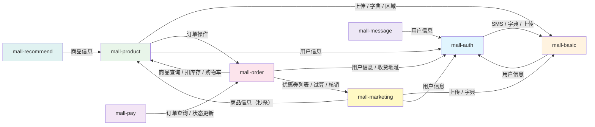
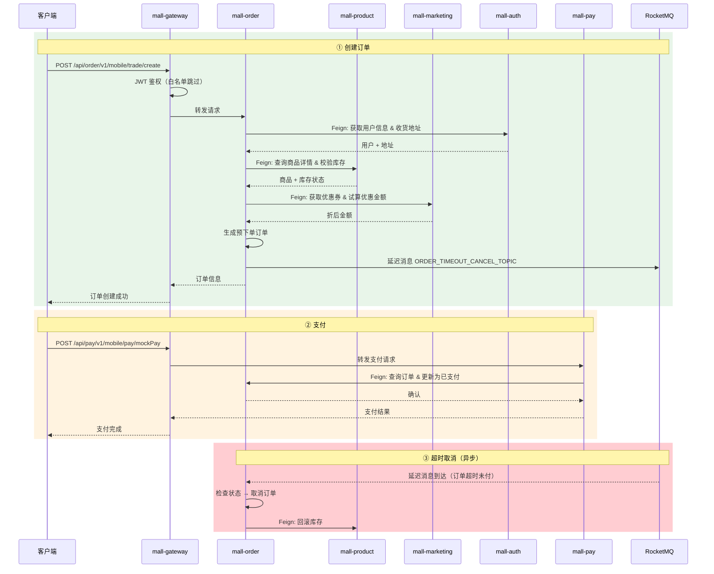
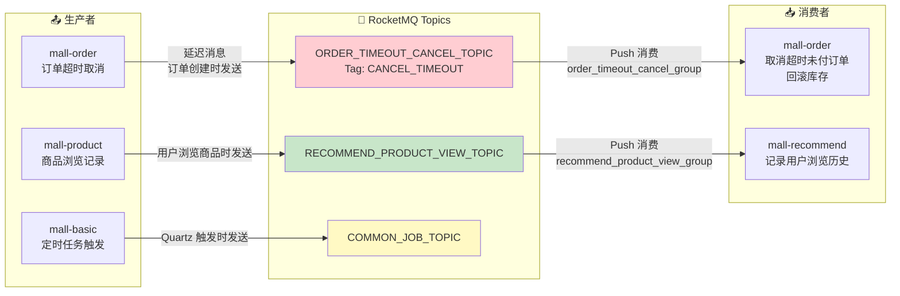
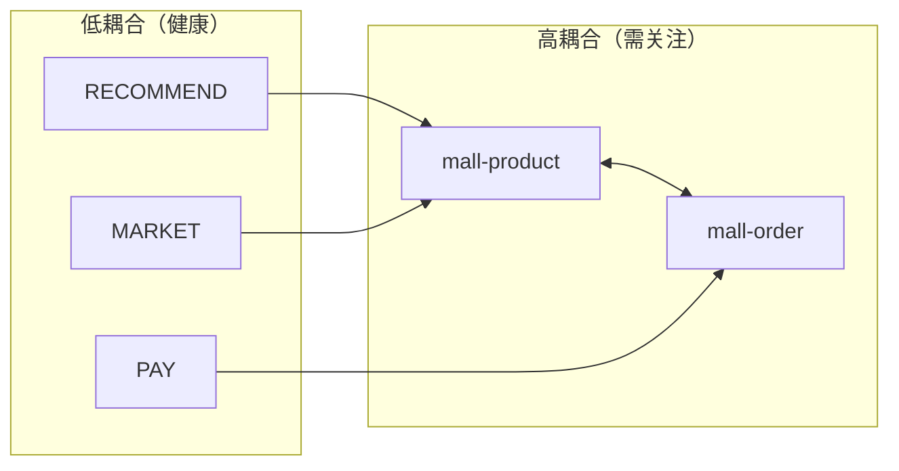

<p align="center">
  <h1 align="center">Mall Cloud</h1>
  <p align="center">基于 Spring Cloud Alibaba 微服务架构的 B2C 电商平台</p>
</p>

<p align="center">
  
  
  
  
  
</p>

---

## 📑 目录

- [项目简介](#项目简介)
- [功能概览](#功能概览)
- [项目结构](#项目结构)
- [系统架构](#系统架构)
  - [整体架构](#整体架构)
  - [服务依赖关系](#服务依赖关系)
  - [核心流程：下单 → 支付](#核心流程下单--支付)
  - [异步解耦：消息队列](#异步解耦消息队列)
- [网关路由](#网关路由)
- [基础设施](#基础设施)
- [数据库设计](#数据库设计)
- [快速开始](#快速开始)
- [设计要点](#设计要点)

---

## 项目简介

`Mall Cloud` 是一套基于 **Spring Cloud Alibaba** 全家桶的 B2C 电商微服务系统，完整覆盖商品、订单、营销、支付、推荐、消息推送等电商核心业务域。

**核心特性：**

- 🚪 统一 API 网关，JWT 鉴权 + Sentinel 流控
- 🔐 RBAC 权限模型（用户 → 角色 → 菜单 / 部门）
- 📦 18 个 Maven 模块，7 个独立业务服务 + 7 个 Feign 客户端
- 🔄 MySQL + Elasticsearch 双写，ShardingSphere 分库分表
- ⚡ RocketMQ 延迟消息驱动订单超时取消，异步解耦浏览记录采集
- 🔗 认证 SDK 自动透传用户上下文，Feign 调用零侵入
- 🧠 Ollama AI 对话集成
- 💰 支付宝沙箱支付 + 阿里云短信

---

## 功能概览

| 业务域 | 服务 | 核心能力 |
|--------|------|---------|
| 🔐 认证授权 | `mall-auth` | 登录注册、RBAC 权限（用户/角色/菜单/部门/岗位）、Caffeine 本地缓存 |
| 🏗️ 基础服务 | `mall-basic` | 字典管理、行政区域、文件上传（MinIO）、短信（阿里云 SMS）、敏感词过滤、AI 对话（Ollama）、Quartz 定时任务 |
| 🛒 商品中心 | `mall-product` | 商品 CRUD、分类/品牌/属性体系、MySQL+ES 双写搜索、购物车、首页管理（轮播图/公告/推荐） |
| 📋 订单交易 | `mall-order` | 下单→支付→发货→收货→评价 全生命周期、退货退款、ES 订单搜索、**分库分表（8库）** |
| 🎫 营销中心 | `mall-marketing` | 优惠券发放/领取/核销、秒杀商品、优惠金额试算 |
| 💰 支付服务 | `mall-pay` | 支付宝沙箱支付、二维码生成（ZXing）、**无数据库**（纯 Feign 调用） |
| 📊 智能推荐 | `mall-recommend` | 商品推荐（Mahout）、收藏管理、浏览历史、**分库分表（8库，按 user_id）** |
| 💬 消息推送 | `mall-message` | WebSocket + STOMP 实时推送、通知管理、**分库分表（8库，按 to_user_id）** |

---

## 项目结构

```
mall_cloud/
├── mall-common/                   公共模块
│   ├── 实体基类 (BaseEntity / EsBaseEntity / 分页)
│   ├── 工具类 (雪花 ID / Token / MD5 / Excel / Redis)
│   ├── 全局响应包装 (GlobalApiResultHandler)
│   ├── 全局异常处理 (GlobalExceptionHandler)
│   └── 敏感词脱敏 (CustomMaskService)
│
├── mall-gateway/                  网关层
│   └── Spring Cloud Gateway + AuthFilter (JWT) + CORS + Sentinel
│
├── mall-auth/                     认证服务
│   ├── mall-auth-client/          Feign 客户端
│   └── mall-auth-api-starter/     认证 SDK（自动注入拦截器 + Feign 鉴权透传）
│
├── mall-basic/                    基础服务
│   └── mall-basic-client/         Feign 客户端
│
├── mall-product/                  商品服务
│   └── mall-product-client/       Feign 客户端
│
├── mall-order/                    订单服务
│   └── mall-order-client/         Feign 客户端
│
├── mall-pay/                      支付服务
│   └── mall-pay-client/           Feign 客户端
│
├── mall-marketing/                营销服务
│   └── mall-marketing-client/     Feign 客户端
│
├── mall-recommend/                推荐服务
├── mall-message/                  消息推送服务
└── docs/                          项目文档
```

> [!NOTE]
> 每个 `*-client` 模块定义该服务的 Feign 接口，供其他服务引入。业务配置全部托管在 Nacos 配置中心，本地 `bootstrap.yml` 仅配置 Nacos 地址和 namespace。

---

## 系统架构

### 整体架构

```mermaid
graph TB
    subgraph 客户端["🌐 客户端"]
        WEB[Web 端]
        MOBILE[移动端]
    end

    subgraph 网关层["🚪 网关层"]
        GW[mall-gateway<br/>Spring Cloud Gateway<br/>JWT 鉴权 · CORS · Sentinel 流控]
    end

    subgraph 业务服务层["⚙️ 业务服务层"]
        AUTH[mall-auth<br/>认证 & RBAC 权限]
        BASIC[mall-basic<br/>基础服务]
        PRODUCT[mall-product<br/>商品服务]
        ORDER[mall-order<br/>订单服务 · 分库分表]
        PAY[mall-pay<br/>支付服务]
        MARKET[mall-marketing<br/>营销服务]
        RECOMMEND[mall-recommend<br/>推荐服务 · 分库分表]
        MESSAGE[mall-message<br/>消息推送 · WebSocket · 分库分表]
    end

    subgraph 中间件层["💾 中间件层"]
        NACOS[(Nacos<br/>注册 & 配置中心)]
        REDIS[(Redis + Redisson<br/>缓存 & 分布式锁)]
        MYSQL[(MySQL 8.x<br/>多库 + 分库分表)]
        ES[(Elasticsearch 7.17<br/>商品 / 订单 / 秒杀搜索)]
        MONGO[(MongoDB<br/>文档存储)]
        ROCKETMQ[RocketMQ<br/>异步消息队列]
        MINIO[MinIO<br/>文件 / 图片存储]
        SENTINEL[Sentinel<br/>流量监控]
    end

    subgraph 外部服务["☁️ 外部服务"]
        ALIPAY[支付宝沙箱]
        ALISMS[阿里云 SMS]
        OLLAMA[Ollama AI]
    end

    subgraph SDK["🔗 认证透传 SDK"]
        AUTH_SDK[mall-auth-api-starter<br/>AuthApiInterceptor → FillUserUtil<br/>FeignAuthInterceptor → 透传 JWT]
    end

    WEB --> GW
    MOBILE --> GW

    GW -- "路由转发" --> AUTH
    GW -- "路由转发" --> BASIC
    GW -- "路由转发" --> PRODUCT
    GW -- "路由转发" --> ORDER
    GW -- "路由转发" --> PAY
    GW -- "路由转发" --> MARKET
    GW -- "路由转发" --> RECOMMEND
    GW -- "路由转发" --> MESSAGE

    AUTH_SDK -. "自动注入 所有业务服务" .-> AUTH
    AUTH_SDK -.-> BASIC
    AUTH_SDK -.-> PRODUCT
    AUTH_SDK -.-> ORDER
    AUTH_SDK -.-> PAY
    AUTH_SDK -.-> MARKET
    AUTH_SDK -.-> RECOMMEND
    AUTH_SDK -.-> MESSAGE

    AUTH --- MYSQL
    AUTH --- REDIS
    BASIC --- MYSQL
    BASIC --- REDIS
    BASIC --- MONGO
    BASIC --- MINIO
    BASIC --- ALISMS
    BASIC --- OLLAMA
    PRODUCT --- MYSQL
    PRODUCT --- REDIS
    PRODUCT --- ES
    PRODUCT --- MONGO
    ORDER --- MYSQL
    ORDER --- REDIS
    ORDER --- ES
    ORDER --- ROCKETMQ
    PAY --- ALIPAY
    MARKET --- MYSQL
    MARKET --- REDIS
    MARKET --- ES
    RECOMMEND --- MYSQL
    RECOMMEND --- REDIS
    RECOMMEND --- ROCKETMQ
    MESSAGE --- MYSQL
    MESSAGE --- REDIS

    GW -. "服务发现 · 配置拉取" .-> NACOS
    AUTH -.-> NACOS
    BASIC -.-> NACOS
    PRODUCT -.-> NACOS
    ORDER -.-> NACOS
    PAY -.-> NACOS
    MARKET -.-> NACOS
    RECOMMEND -.-> NACOS
    MESSAGE -.-> NACOS

    GW -. "流控规则" .-> SENTINEL
```



### 服务依赖关系

> 实线箭头 = 编译期引入 `*-client` 模块 + 运行时 OpenFeign 调用。
> 每次调用自动透传 JWT，下游通过 `AuthApiInterceptor` 还原用户信息。



<details>
<summary><b>📊 依赖关系矩阵</b></summary>

| 服务 ↓ \ 被调方 → | auth | basic | product | order | marketing |
|:---|:---:|:---:|:---:|:---:|:---:|
| **mall-auth** | — | ✅ SMS/字典/上传 | — | — | — |
| **mall-basic** | ✅ 用户信息 | — | — | — | — |
| **mall-product** | ✅ 用户信息 | ✅ 字典/区域 | — | ✅ 订单操作 | — |
| **mall-order** | ✅ 用户/地址 | — | ✅ 商品/库存/购物车 | — | ✅ 优惠券 |
| **mall-pay** | — | — | — | ✅ 订单状态 | — |
| **mall-marketing** | ✅ 用户信息 | ✅ 上传/字典 | ✅ 商品信息 | — | — |
| **mall-recommend** | — | — | ✅ 商品信息 | — | — |
| **mall-message** | ✅ 用户信息 | — | — | — | — |

</details>

### 核心流程：下单 → 支付



### 异步解耦：消息队列



> [!IMPORTANT]
> **同步（Feign）vs 异步（RocketMQ）的取舍：**
> - 需要**即时响应**（查商品、扣库存、算优惠）→ 同步 Feign 调用，强一致性链路
> - 允许**最终一致**（超时取消、浏览记录、定时任务）→ 异步 RocketMQ，服务间通过 Topic 解耦
> - `mall-product` ↔ `mall-order` 之间存在**双向同步调用**，属于业务耦合，后续可考虑将订单状态变更改为异步事件


---

## 网关路由

| 路径前缀 | 转发目标 | 备注 |
|----------|----------|------|
| `/api/basic/**` | `lb://mall-basic-api` | 基础服务 |
| `/api/auth/**` | `lb://mall-auth-api` | 认证服务 |
| `/api/product/**` | `lb://mall-product-api` | 商品服务 |
| `/api/marketing/**` | `lb://mall-marketing-api` | 营销服务 |
| `/api/order/**` | `lb://mall-order-api` | 订单服务 |
| `/api/pay/**` | `lb://mall-pay-api` | 支付服务 |
| `/api/recommend/**` | `lb://mall-recommend-api` | 推荐服务 |
| `/api/message/ws**` | `lb:ws://mall-message-api` | WebSocket 连接 |
| `/api/message/**` | `lb://mall-message-api` | 消息服务 |

**JWT 白名单（无需 Token）：**

```
/api/auth/v1/web/user/getCode
/api/auth/v1/web/user/login
/api/auth/v1/web/user/loginByPhone
/api/auth/v1/mobile/user/register
```

---

## 基础设施

启动前确保以下服务已就绪：

| 服务 | 地址 | 说明 |
|------|------|------|
| Nacos | `117.72.88.11:8848` | 注册中心 & 配置中心 |
| Redis | `117.72.88.11:6379` | 缓存 & Redisson 分布式锁 |
| MySQL | `localhost:3306` | 多实例（见下方数据库设计） |
| Elasticsearch | `117.72.88.11:9200` | 商品 / 订单 / 秒杀搜索 |
| MongoDB | `117.72.88.11:27017` | 文件元数据 / 文档存储 |
| RocketMQ | `117.72.88.11:9876` | 异步消息（延迟消息推量约 0.1 QPS） |
| MinIO | `117.72.88.11:9002` | 文件 / 图片对象存储 |
| Sentinel | `localhost:9903` | 流量监控 Dashboard |
| Ollama | `localhost:11434` | AI 对话（deepseek-r1:8b） |
| 支付宝沙箱 | `openapi-sandbox.dl.alipaydev.com` | 开发测试支付 |
| 阿里云 SMS | `dysmsapi.aliyuncs.com` | 短信验证码 |

---

## 数据库设计

### 单库业务

| 数据库 | 所属服务 |
|--------|----------|
| `mall_auth` | 认证服务 |
| `mall_basic` | 基础服务 |
| `mall_product` | 商品服务 |
| `mall_marketing` | 营销服务 |

### 分库分表（ShardingSphere-JDBC）

| 数据库 | 服务 | 分片策略 | 分片键 |
|--------|------|---------|--------|
| `mall_trade_0` ~ `mall_trade_7` | 订单服务 | 订单表 8×32 / 订单项 8×256 / 地址 8×32 | `id` / `order_id` |
| `mall_message_0` ~ `mall_message_7` | 消息服务 | 8 库 × 64 表 | `to_user_id` |
| `mall_recommend_0` ~ `mall_recommend_7` | 推荐服务 | 收藏 8×16 / 浏览历史 8×64 | `user_id` |

> [!WARNING]
> 分库分表的建表 SQL 统一放在 `mall-order/src/main/resources/sql/mall_trade_sharding.sql`（约 408 KB），**务必通过脚本批量初始化，严禁逐表手动创建**。

---

## 快速开始

### 第零步：配置文件准备

> [!IMPORTANT]
> 出于安全考虑，所有服务的 `application.yml` 已被 `.gitignore` 排除，仓库中仅提供 `.template` 模板文件。
> **启动前必须将模板复制为实际配置文件：**

```bash
# 在项目根目录 mall_cloud_server/ 下执行以下命令，将模板复制为实际配置文件
for dir in mall-gateway mall-auth mall-basic mall-product mall-order mall-pay mall-marketing mall-recommend mall-message; do
  cp "$dir/src/main/resources/application.yml.template" "$dir/src/main/resources/application.yml"
done
```

然后编辑各服务的 `application.yml`，将模板中的占位符替换为你自己的实际配置：

| 占位符 | 说明 |
|--------|------|
| `your_mysql_password` | MySQL 数据库密码 |
| `your_redis_host` / `your_redis_password` | Redis 地址和密码 |
| `your_nacos_host` / `your_nacos_password` | Nacos 地址和密码 |
| `your_jwt_secret_here` | JWT 签名密钥（请使用足够长度的随机字符串） |
| `your_elasticsearch_password` | Elasticsearch 密码 |
| `your_rocketmq_host` | RocketMQ NameServer 地址 |
| `your_mongodb_host` / `your_mongodb_password` | MongoDB 地址和密码 |
| `your_minio_host` / `your_minio_secret_key` | MinIO 地址和密钥 |
| `your_alipay_app_id` / `your_alipay_private_key` / `your_alipay_public_key` | 支付宝沙箱应用配置 |
| `your_aliyun_access_key_id` / `your_aliyun_access_key_secret` | 阿里云 SMS AccessKey |
| `your_alipay_notify_url` | 支付宝异步通知回调地址 |

### 环境检查

| 依赖 | 版本要求 | 检查命令 |
|------|---------|---------|
| JDK | 17+ | `java -version` |
| Maven | 3.8+ | `mvn -v` |
| MySQL | 8.x | `mysql -u root -p -e "SELECT VERSION()"` |
| Nacos | 2.x | 浏览器打开 `http://117.72.88.11:8848/nacos` |
| Redis | 6+ | `redis-cli -h 117.72.88.11 -p 6379 PING` |
| RocketMQ | 5.x | NameServer `117.72.88.11:9876` 可连通 |
| Elasticsearch | 7.17 | `curl http://117.72.88.11:9200` |
| MongoDB | 5+ | `mongosh 117.72.88.11:27017 --eval "db.version()"` |
| MinIO | — | 浏览器打开 `http://117.72.88.11:9002` |

### 第一步：初始化数据库

```sql
-- 1. 创建单库
CREATE DATABASE IF NOT EXISTS mall_auth    DEFAULT CHARACTER SET utf8mb4;
CREATE DATABASE IF NOT EXISTS mall_basic   DEFAULT CHARACTER SET utf8mb4;
CREATE DATABASE IF NOT EXISTS mall_product DEFAULT CHARACTER SET utf8mb4;
CREATE DATABASE IF NOT EXISTS mall_marketing DEFAULT CHARACTER SET utf8mb4;

-- 2. 创建分库（订单 8 库）
CREATE DATABASE IF NOT EXISTS mall_trade_0 DEFAULT CHARACTER SET utf8mb4;
CREATE DATABASE IF NOT EXISTS mall_trade_1 DEFAULT CHARACTER SET utf8mb4;
CREATE DATABASE IF NOT EXISTS mall_trade_2 DEFAULT CHARACTER SET utf8mb4;
CREATE DATABASE IF NOT EXISTS mall_trade_3 DEFAULT CHARACTER SET utf8mb4;
CREATE DATABASE IF NOT EXISTS mall_trade_4 DEFAULT CHARACTER SET utf8mb4;
CREATE DATABASE IF NOT EXISTS mall_trade_5 DEFAULT CHARACTER SET utf8mb4;
CREATE DATABASE IF NOT EXISTS mall_trade_6 DEFAULT CHARACTER SET utf8mb4;
CREATE DATABASE IF NOT EXISTS mall_trade_7 DEFAULT CHARACTER SET utf8mb4;

-- 3. 创建分库（消息 8 库）
CREATE DATABASE IF NOT EXISTS mall_message_0 DEFAULT CHARACTER SET utf8mb4;
-- ... 依此类推至 mall_message_7

-- 4. 创建分库（推荐 8 库）
CREATE DATABASE IF NOT EXISTS mall_recommend_0 DEFAULT CHARACTER SET utf8mb4;
-- ... 依此类推至 mall_recommend_7
```

```bash
# 5. 初始化分库分表（订单服务 —— 约 408KB 建表脚本）
#     在 MySQL 客户端中执行：
mysql -u root -p < mall-order/src/main/resources/sql/mall_trade_sharding.sql
```

> [!WARNING]
> 分库分表建表脚本非常大，务必用 `source` 或 `<` 重定向批量执行，**严禁逐表手动创建**。消息库和推荐库的建表 SQL 同样需要在对应库下执行。

### 第二步：确认 Nacos 配置

业务配置全部托管在 Nacos，本地只保留 bootstrap 骨架。启动前确认以下 Nacos 配置项存在且正确：

```
Namespace: mall
Group:     mall-cloud

配置列表（每个服务一个 YAML）：
  mall-auth-dev.yaml         mall-basic-dev.yaml
  mall-product-dev.yaml      mall-order-dev.yaml
  mall-pay-dev.yaml           mall-marketing-dev.yaml
  mall-recommend-dev.yaml    mall-message-dev.yaml
  mall-gateway-dev.yaml
```

> 至少需要保证各配置中的 **数据库连接串**、**Redis 地址**、**RocketMQ NameServer** 指向你的实际环境。

### 第三步：构建项目

```bash
# 在项目根目录 mall_cloud/ 下执行

# 方案 A：一次性全量构建（推荐首次）
mvn clean package -DskipTests

# 方案 B：仅构建修改过的模块（增量）
mvn clean package -DskipTests -pl mall-gateway -am

# 方案 C：IDEA 内构建
# 右侧 Maven 面板 → mall_cloud → Lifecycle → clean → package
```

构建产物位于各模块的 `target/` 目录下，如 `mall-gateway/target/mall-gateway.jar`。

### 第四步：启动服务

**启动必须遵循以下顺序，否则 Feign 客户端注册会出现找不到服务的报错。**

```bash
# ───── 阶段 ①：网关（必须第一个启动）─────
java -jar mall-gateway/target/mall-gateway.jar

# ───── 阶段 ②：基础服务（可并行启动）─────
java -jar mall-auth/target/mall-auth.jar &
java -jar mall-basic/target/mall-basic.jar &

# ───── 阶段 ③：业务服务（按依赖先后启动）─────
java -jar mall-product/target/mall-product.jar &      # 被 order/marketing/recommend 依赖
java -jar mall-order/target/mall-order.jar &           # 被 pay/product 依赖
java -jar mall-pay/target/mall-pay.jar &               # 依赖 order
java -jar mall-marketing/target/mall-marketing.jar &   # 依赖 product
java -jar mall-recommend/target/mall-recommend.jar &   # 依赖 product
java -jar mall-message/target/mall-message.jar &       # 依赖 auth
```

<details>
<summary><b>IDEA 内启动（开发调试推荐）</b></summary>

每个服务模块下找到 `*Application.java` 主类，右键 → Run：

| 服务 | 主类 | 模块目录 |
|------|------|---------|
| Gateway | `GateWayApplication` | `mall-gateway` |
| Auth | `AuthApplication` | `mall-auth` |
| Basic | `BasicApplication` | `mall-basic` |
| Product | `ProductApplication` | `mall-product` |
| Order | `OrderApplication` | `mall-order` |
| Pay | `PayApplication` | `mall-pay` |
| Marketing | `MarketingApplication` | `mall-marketing` |
| Recommend | `RecommendApplication` | `mall-recommend` |
| Message | `MessageApplication` | `mall-message` |

启动顺序同上：Gateway → Auth/Basic → Product → Order/Pay/Marketing → Recommend/Message

</details>

### 第五步：验证服务

```bash
# 1. 检查 Nacos 注册状态
#    浏览器打开 http://117.72.88.11:8848/nacos → 服务管理 → 服务列表
#    确认以下 9 个服务均在"健康实例"列表中：
#      mall-gateway / mall-auth-api / mall-basic-api / mall-product-api
#      mall-order-api / mall-pay-api / mall-marketing-api
#      mall-recommend-api / mall-message-api

# 2. 验证网关健康检查
curl http://localhost:8080/actuator/health

# 3. 获取短信验证码（白名单接口，无需 Token）
curl -X POST http://localhost:8080/api/auth/v1/web/user/getCode \
  -H "Content-Type: application/json" \
  -d '{"phone": "13800138000"}'

# 4. 验证需要鉴权的接口（会返回 401 说明鉴权链正常工作）
curl http://localhost:8080/api/product/v1/product/list

# 5. 测试 WebSocket 连接
#     浏览器控制台：
#     const ws = new WebSocket('ws://localhost:8080/api/message/ws');
#     ws.onopen = () => console.log('WebSocket 连接成功');
```

### 端口总览

| 服务 | 端口 | 配置来源 | Nacos 服务名 |
|------|------|----------|-------------|
| Gateway | 8080 | 本地 application.yml | `mall-gateway` |
| Auth | — | Nacos 配置中心 | `mall-auth-api` |
| Basic | — | Nacos 配置中心 | `mall-basic-api` |
| Product | — | Nacos 配置中心 | `mall-product-api` |
| Order | 8026 | 本地 application.yml | `mall-order-api` |
| Pay | 8027 | 本地 application.yml | `mall-pay-api` |
| Recommend | 8028 | 本地 application.yml | `mall-recommend-api` |
| Message | 8029 | 本地 application.yml | `mall-message-api` |
| Marketing | — | Nacos 配置中心 | `mall-marketing-api` |

### 常见启动问题

<details>
<summary><b>Q: 报 feign.FeignException$ServiceUnavailable</b></summary>

原因：目标服务未注册到 Nacos，或 Feign 客户端配置的 serviceId 不匹配。

排查：
```bash
# 确认目标服务已在 Nacos 注册
curl http://117.72.88.11:8848/nacos/v1/ns/instance/list?serviceName=mall-product-api
```
检查 Feign 客户端注解中的 `name` / `value` 是否与 Nacos 服务名一致。

</details>

<details>
<summary><b>Q: 报 ShardingSphere 数据源找不到</b></summary>

原因：分库分表的 8 个库未全部创建。

排查：
```sql
SHOW DATABASES LIKE 'mall_trade_%';  -- 应该有 8 个
SHOW DATABASES LIKE 'mall_message_%'; -- 应该有 8 个
SHOW DATABASES LIKE 'mall_recommend_%'; -- 应该有 8 个
```
确保每个库都已执行建表脚本。

</details>

<details>
<summary><b>Q: Nacos 能注册但无法拉取配置</b></summary>

检查配置是否已导入 Nacos 控制台：`http://117.72.88.11:8848/nacos`

- namespace 必须是 `mall`
- group 必须是 `mall-cloud`
- dataId 必须匹配各服务的 `spring.application.name` + `-dev.yaml`

</details>

<details>
<summary><b>Q: 前端跨域被拦截</b></summary>

Gateway 已配置全局 CORS（允许所有 Origin）。如果仍然报跨域，检查：

1. 请求是否走的是 Gateway 端口（8080），而不是直连后端服务端口
2. 请求头中的 `Origin` 是否被网关正确响应

</details>

---

## 设计要点

**认证链路**

```
客户端 → Gateway (JWT 校验) → 业务服务 (AuthApiInterceptor 提取用户)
                                    ↓ Feign 调用
                               FeignAuthInterceptor 透传 JWT → 下游服务
```

- `mall-auth-api-starter` 自动装配拦截器，业务代码通过 `FillUserUtil` 获取当前用户
- Feign 调用无需手动传参，链路自动保持用户上下文

**数据一致性**

| 场景 | 策略 |
|------|------|
| MySQL ↔ ES 双写 | 商品写入 MySQL 后同步索引至 ES，兜底通过定时任务对账 |
| 订单状态流转 | 同步更新，辅以 RocketMQ 延迟消息处理超时取消 |
| 浏览记录采集 | 异步 RocketMQ，允许短暂延迟，不阻塞用户浏览 |

**服务耦合**



- `mall-product` 与 `mall-order` 存在双向同步依赖，是当前架构中耦合度最高的点
- 建议方向：将订单状态变更（支付、发货、签收）改为 RocketMQ 事件广播，product 侧异步消费去解耦

**配置管理**

```
本地 bootstrap.yml  →  Nacos 配置中心  →  业务 YAML 全部在 Nacos 托管
     (仅含地址)          (namespace: mall)        (可在 Nacos 控制台热更新)
```

**日志 & 链路追踪**

- `mall-common` 和 `mall-gateway` 集成了 **Apache SkyWalking**（`apm-toolkit-trace`）
- Feign 调用自动接续 TraceId，可在 SkyWalking UI 查看完整调用链

---

## License

内部项目，仅供学习参考。

---

> 在线查看此文档可获得最佳体验（Mermaid 图表自动渲染）。本地 IDE 需安装 Mermaid 插件。
