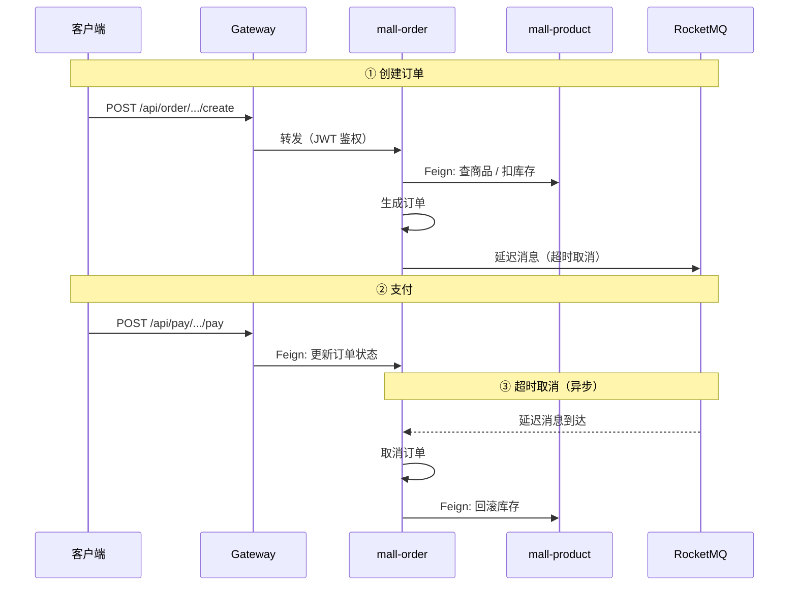

<p align="center">
  <h1 align="center">Mall Cloud</h1>
  <p align="center">基于 Spring Cloud Alibaba 微服务架构的 B2C 电商平台</p>
</p>

<p align="center">
  
  
  
  
  
</p>

---

> **项目评价：** 这是一套完整的微服务脚手架，覆盖了 Spring Cloud Alibaba 全家桶的集成实践，对学习微服务架构有很高的参考价值。但**离生产可用还有较大距离**——业务逻辑设计不够严谨（订单状态机缺失、鉴权链路不完整、数据同步机制不透明），更适合作为**学习项目**而非直接上线。详见[已知问题](#已知问题)。
>
> > 坦白说，这个项目给我的感觉是"大厂技术栈堆砌"，把 Spring Cloud Alibaba、ShardingSphere、RocketMQ、ES、SkyWalking 能塞的全塞上了，但核心业务反而经不起推敲。库存不扣、Gateway 不拦人、数据同步不存在——这些都是最基础的东西。面试看到技术栈列表确实唬人，但深问两句就露馅。说白了就是**技术服务于简历，而不是服务于业务**。作为脚手架参考价值很高，但要上线还得重写一遍业务逻辑。 —— 来自某位填坑填了一天的开发者

---

## 📑 目录

- [项目简介](#项目简介)
- [项目结构](#项目结构)
- [系统架构](#系统架构)
  - [整体架构](#整体架构)
  - [服务依赖关系](#服务依赖关系)
  - [核心流程：下单 → 支付](#核心流程下单--支付)
  - [异步解耦：消息队列](#异步解耦消息队列)
- [前端开发指南](#前端开发指南)
- [网关路由](docs/网关路由.md)
- [基础设施](#基础设施)
- [数据库设计](docs/数据库设计.md)
- [快速开始](docs/快速开始.md)
- [设计要点](#设计要点)
- [注意事项](#注意事项)
- [已知问题](#已知问题)
- [多仓库拆分方案](docs/仓库拆分方案.md)
- [Nacos 配置指南](docs/Nacos配置指南.md)

---

## 项目简介

`Mall Cloud` 是一套基于 **Spring Cloud Alibaba** 全家桶的 B2C 电商微服务系统，完整覆盖商品、订单、营销、支付、推荐、消息推送等电商核心业务域。

**核心特性：**

- 🚪 统一 API 网关，JWT 鉴权 + Sentinel 流控
- 🔐 RBAC 权限模型（用户 → 角色 → 菜单 / 部门）
- 📦 21 个 Maven 模块，12 个独立部署微服务 + 7 个 Feign 客户端 + 1 个认证 SDK
- 📄 Swagger 3 三层分组（📱 mobile / ⚙️ admin / 🔗 internal），各服务文档独立展示
- 🎯 BFF 层统一前端入口，重写前端只需看 BFF 文档
- 🔄 MySQL + Elasticsearch 双写，ShardingSphere 分库分表
- ⚡ RocketMQ 延迟消息驱动订单超时取消，异步解耦浏览记录采集
- 🔗 认证 SDK 自动透传用户上下文，Feign 调用零侵入
- 🧠 Ollama AI 对话集成
- 💰 支付宝沙箱支付 + 阿里云短信

---

## 🖥️ 前端开发指南

### 接口调用约定

| 项目 | 说明 |
|------|------|
| **前端统一入口** | `http://localhost:8080`（Gateway 端口） |
| **管理后台（Web）** | → `mall-admin-bff（8090 BFF）` |
| **移动端（小程序）** | → `mall-mobile-bff（8091 BFF）` |
| **BFF 路径前缀** | `/api/admin/**` 和 `/api/mobile/**` |
| **认证方式** | `Authorization: Bearer {token}`（登录后获取） |

> **前端重写只看 BFF 文档**：`mall-admin-bff/doc.html` 和 `mall-mobile-bff/doc.html` 聚合了所有前端需要的接口，底层微服务文档（auth、product、order 等）仅限后端调试使用。

### 认证流程

```
① C 端用户 → POST /api/mobile/v1/auth/login  （走 BFF 层）
    BFF → Feign → mall-customer 客户服务
    → 返回 { "token": "eyJhbGciOi..." }

② Admin 用户 → POST /api/admin/v1/auth/login  （走 BFF 层）
    BFF → Feign → mall-admin 管理服务
    → 返回 { "token": "eyJhbGciOi..." }

③ 后续请求 Header：
   Authorization: Bearer eyJhbGciOi...

④ Token 过期 → 接口返回 401 → 跳转登录页
```

### API 文档入口

每个服务独立提供 Knife4j 文档页面，BFF 服务为前端统一入口：

| 服务 | Knife4j 页面 | OpenAPI 地址 | 适用前端 |
|------|-------------|-------------|---------|
| **mall-admin-bff** 🆕 | `http://localhost:8090/doc.html` | `http://localhost:8080/api/admin/v3/api-docs` | **管理后台**（Web） |
| **mall-mobile-bff** 🆕 | `http://localhost:8091/doc.html` | `http://localhost:8080/api/mobile/v3/api-docs` | **移动端**（小程序） |
| mall-admin | `http://localhost:8030/doc.html` | `http://localhost:8080/api/admin-api/v3/api-docs` | 内部 |
| mall-customer | `http://localhost:8025/doc.html` | `http://localhost:8080/api/customer/v3/api-docs` | 内部 |
| mall-basic | `http://localhost:8022/doc.html` | `http://localhost:8080/api/basic/v3/api-docs` | 内部 |
| mall-product | `http://localhost:8023/doc.html` | `http://localhost:8080/api/product/v3/api-docs` | 内部 |
| mall-order | `http://localhost:8026/doc.html` | `http://localhost:8080/api/order/v3/api-docs` | 内部 |
| mall-pay | `http://localhost:8027/doc.html` | `http://localhost:8080/api/pay/v3/api-docs` | 内部 |
| mall-marketing | `http://localhost:8024/doc.html` | `http://localhost:8080/api/marketing/v3/api-docs` | 内部 |
| mall-recommend | `http://localhost:8028/doc.html` | `http://localhost:8080/api/recommend/v3/api-docs` | 内部 |
| mall-message | `http://localhost:8029/doc.html` | `http://localhost:8080/api/message/v3/api-docs` | 内部 |

> **BFF 是前端唯一需要关注的文档**，聚合了对应前端所需的所有接口。后端微服务文档仅用于内部调试。

### 常见问题

| 问题 | 排查 |
|------|------|
| 接口返回 401 | Token 过期或未传 `Authorization` Header |
| 接口返回 403 | 该接口不在白名单中，需先登录 |
| 接口返回 503 | 目标服务未启动，确认 Nacos 服务列表状态 |
| 跨域报错 | 确认请求走的是 `localhost:8080`（Gateway），而非直连服务端口 |

---

| 业务域 | 服务 | 核心能力 |
|--------|------|---------|
| 👑 Admin 管理 | `mall-admin` | Admin 登录/注册、用户管理、RBAC 权限（用户/角色/菜单/部门/岗位）、JWT 黑名单、Caffeine 本地缓存 |
| 👤 客户中心 | `mall-customer` | C 端注册登录、会员信息管理 |
| 🏗️ 基础服务 | `mall-basic` | 字典管理、行政区域、文件上传（MinIO）、短信（阿里云 SMS）、敏感词过滤、AI 对话（Ollama）、Quartz 定时任务 |
| 🛒 商品中心 | `mall-product` | 商品 CRUD、分类/品牌/属性体系、MySQL+ES 双写搜索、购物车、首页管理（轮播图/公告/推荐） |
| 📋 订单交易 | `mall-order` | 下单→支付→发货→收货→评价 全生命周期、退货退款、ES 订单搜索、**分库分表（8库）** |
| 🎫 营销中心 | `mall-marketing` | 优惠券发放/领取/核销、秒杀商品、优惠金额试算 |
| 💰 支付服务 | `mall-pay` | 支付宝沙箱支付、二维码生成（ZXing）、**无数据库**（纯 Feign 调用） |
| 📊 智能推荐 | `mall-recommend` | 商品推荐（Mahout）、收藏管理、浏览历史、**分库分表（8库，按 user_id）** |
| 💬 消息推送 | `mall-message` | WebSocket + STOMP 实时推送、通知管理、**分库分表（8库，按 to_user_id）** |

---

## 项目结构

```
mall_cloud_server/
├── mall-common/                   基础设施核心（工具类、统一响应、异常处理、自动配置）
│   ├── 实体基类 (BaseEntity / 分页)
│   ├── 工具类 (雪花 ID / Token / MD5 / Excel)
│   ├── 全局响应包装 & 异常处理
│   ├── Redis 工具类 + Token 校验（自动配置）
│   ├── 雪花算法分布式 ID（自动配置）
│   ├── 敏感词脱敏（自动配置）
│   ├── 敏感词校验注解 / AOP
│   ├── 自定义校验注解 (手机号/金额)
│   └── MyBatis 基类 (BaseMapper / BaseService / UserInterceptor)
│
├── mall-gateway/                  网关层
│   └── Spring Cloud Gateway + JWT 校验 + CORS + Sentinel
│
├── mall-auth-api-starter/         认证 SDK（JWT 解析、用户上下文透传）
│
├── mall-basic/                    基础服务（字典、短信、文件、Quartz）
├── mall-basic-client/             基础服务 Feign 接口 & DTO
│
├── mall-admin/                    Admin 业务服务（用户/RBAC/收货地址）
├── mall-admin-client/             Admin 业务服务 Feign 接口 & DTO
├── mall-admin-bff/                【BFF】管理后台聚合（8090）
│
├── mall-customer/                 C 端客户服务（注册/登录/会员信息）
├── mall-customer-client/          C 端客户服务 Feign 接口 & DTO
├── mall-mobile-bff/               【BFF】移动端聚合（8091）
│
├── mall-product/                  商品服务（商品、分类、品牌、购物车、ES 搜索）
├── mall-product-client/           商品服务 Feign 接口 & DTO
│
├── mall-order/                    订单服务（订单、退货、分库分表）
├── mall-order-client/             订单服务 Feign 接口 & DTO
│
├── mall-pay/                      支付服务（支付宝对接，无数据库）
├── mall-pay-client/               支付服务 Feign 接口 & DTO
│
├── mall-marketing/                营销服务（优惠券、秒杀）
├── mall-marketing-client/         营销服务 Feign 接口 & DTO
│
├── mall-recommend/                推荐服务（Mahout）
├── mall-message/                  消息推送（WebSocket）
│
├── docs/                          项目文档
│   ├── frontend-api-mapping.md   前端 API ↔ 后端微服务映射手册
│   ├── gateway-routes.md          网关路由与白名单
│   ├── quick-start.md             快速开始
│   ├── database-design.md         数据库设计
│   ├── nacos-config-guide.md      Nacos 配置指南
│   ├── repo-split-plan.md         多仓库拆分方案
│   └── superpowers/              设计文档与实施计划
```

> [!NOTE]
> `mall-admin-bff` 和 `mall-mobile-bff` 是 BFF（Backend For Frontend）层，为各前端提供聚合接口和统一文档入口，**前端重写只需看这两者的文档**。每个 `*-client` 模块定义该服务的 Feign 接口，供其他服务引入。业务配置全部托管在 Nacos 配置中心。
>
> 每个业务模块在 `controller/internal/` 包下存放仅供微服务间 Feign 调用的接口，URL 以 `/v1/internal/` 开头，与前端接口物理隔离。

---

## 系统架构

### 整体架构

```
客户端 (Web / Mobile)
        │
        ▼
  ┌──────────────────────────┐
  │  mall-gateway  (8080)    │
  │  JWT · CORS · Sentinel   │
  └──────────────────────────┘
        │
        ▼
  ┌──────────────────────────────────────────────────────┐
  │  BFF 聚合层（前端唯一入口，按页面聚合数据）            │
  │  ├── mall-admin-bff  (8090) — 管理后台 Web 端        │
  │  │   └── 聚合：用户编辑页/商品编辑页/订单管理         │
  │  └── mall-mobile-bff (8091) — 移动端小程序           │
  │      └── 已聚合：首页/商品详情/下单预览               │
  └──────────────────────────────────────────────────────┘
        │
        ▼
  ┌──────────────────────────────────────────────┐
  │  9 个业务微服务（每服务 3 层 Swagger 分组）    │
  │  ├── 📱 mobile — 前端接口（经 BFF 转发）      │
  │  ├── ⚙️ admin  — 管理后台接口（经 BFF 转发）   │
  │  └── 🔗 internal — Feign 内部接口            │
  │                                             │
  │  admin / customer / basic        │
  │  product / order / pay / marketing          │
  │  recommend / message                        │
  └──────────────────────────────────────────────┘
        │
        ▼
  ┌──────────────────────────┐
  │  中间件 & 外部服务         │
  │  Nacos · Redis · MySQL   │
  │  ES · MongoDB · RocketMQ │
  │  MinIO · 支付宝 · 阿里云   │
  └──────────────────────────┘
```

各服务使用的中间件详见[基础设施](#基础设施)。所有服务通过 Nacos 注册发现，Feign 调用自动透传 JWT 用户上下文。

### 服务依赖关系

> 实线箭头 = 编译期引入 `*-client` 模块 + 运行时 OpenFeign 调用。
> 每次调用自动透传 JWT，下游通过 `AuthApiInterceptor` 还原用户信息。

| 调用方 ↓ / 被调方 → | admin | basic | product | order | marketing |
|:---|:---:|:---:|:---:|:---:|:---:|
| **mall-admin** | — | SMS/字典/上传 | — | — | — |
| **mall-customer** | — | SMS | — | — | — |
| **mall-basic** | 用户信息 | — | — | — | — |
| **mall-product** | 用户信息 | 字典/区域 | — | — | — |
| **mall-order** | 用户/地址 | — | 商品/库存/购物车 | — | 优惠券 |
| **mall-pay** | — | — | — | 订单状态 | — |
| **mall-marketing** | 用户信息 | 上传/字典 | 商品信息 | — | — |
| **mall-recommend** | — | — | 商品信息 | — | — |
| **mall-message** | 用户信息 | — | — | — | — |

### 核心流程：下单 → 支付



### 异步解耦：消息队列

| 生产者 | Topic | 消费者 | 用途 |
|--------|-------|--------|------|
| mall-order | `ORDER_TIMEOUT_CANCEL_TOPIC` | mall-order | 延迟消息，取消超时未付订单 |
| mall-product | `RECOMMEND_PRODUCT_VIEW_TOPIC` | mall-recommend | 记录用户浏览历史 |

> [!IMPORTANT]
> **同步（Feign）vs 异步（RocketMQ）的取舍：**
> - 需要**即时响应**（查商品、扣库存、算优惠）→ 同步 Feign 调用，强一致性链路
> - 允许**最终一致**（超时取消、浏览记录、定时任务）→ 异步 RocketMQ，服务间通过 Topic 解耦
> - `mall-product` ↔ `mall-order` 之间存在**双向同步调用**，属于业务耦合，后续可考虑将订单状态变更改为异步事件

---

## 网关路由

网关统一入口 `http://localhost:8080`，按路径前缀转发到各微服务。

路由表包含 11 条转发规则（包括 BFF、业务服务、WebSocket），JWT 白名单共 37 个无需 Token 的路径，配置在 Nacos `mall-gateway-dev.yaml` 的 `gateway.filter.noAuth` 中。

> 详见 [docs/网关路由.md](docs/网关路由.md)

---

## 基础设施

启动前确保以下服务已就绪：

| 服务 | 地址 | 说明 |
|------|------|------|
| Nacos | `<your-server-ip>:8848` | 注册中心 & 配置中心 |
| Redis | `<your-server-ip>:6379` | 缓存（Spring Data Redis / Lettuce） |
| MySQL | `localhost:3306` | 多实例（见下方数据库设计） |
| Elasticsearch | `<your-server-ip>:9200` | 商品 / 订单 / 秒杀搜索 |
| MongoDB | `<your-server-ip>:27017` | 文件元数据 / 文档存储 |
| RocketMQ | `<your-server-ip>:9876` | 异步消息（延迟消息推量约 0.1 QPS） |
| MinIO | `<your-server-ip>:9002` | 文件 / 图片对象存储 |
| Sentinel | `localhost:9903` | 流量监控 Dashboard |
| Ollama | `localhost:11434` | AI 对话（deepseek-r1:8b） |
| 支付宝沙箱 | `openapi-sandbox.dl.alipaydev.com` | 开发测试支付 |
| 阿里云 SMS | `dysmsapi.aliyuncs.com` | 短信验证码 |

---

## 数据库设计

项目包含 9 个数据库，其中 3 个服务使用了 ShardingSphere 分库分表（订单、推荐、消息各 8 库）。

| 服务 | 数据库 | 分片策略 |
|------|--------|---------|
| mall-admin | `mall_auth` | 单库 |
| mall-order | `mall_trade_0~7` | 8 库 × 32/256 表 |
| mall-recommend | `mall_recommend_0~7` | 8 库 × 16/64 表 |
| mall-message | `mall_message_0~7` | 8 库 × 64 表 |

> 详见 [docs/数据库设计.md](docs/数据库设计.md)

---

## 快速开始

**启动顺序（严格按以下顺序）：**

```
外部依赖（先确保以下中间件已启动）
  │
  ├── Nacos       → 必须第一个启动（服务注册/配置中心）
  ├── MySQL       → 所有数据库已初始化
  ├── Redis       → 缓存 + 雪花算法 workerId
  ├── RocketMQ    → 延迟消息（订单超时取消）
  ├── Elasticsearch → 商品/订单搜索
  └── MongoDB     → 基本服务依赖
        │
        ▼
微服务启动顺序（按层启动，同层可并行）
  │
  ├── ① mall-gateway     → GatewayApplication      网关入口
  ├── ① mall-basic       → BasicApplication        基础服务（字典/短信/文件）
  ├── ① mall-admin       → AdminApplication        Admin 业务（登录/RBAC）
  ├── ① mall-customer    → CustomerApplication     C 端客户（注册/登录）
  ├── ② mall-product     → ProductApplication      商品服务
  ├── ③ mall-order       → OrderApplication        订单服务
  ├── ③ mall-marketing   → MarketingApplication    营销服务
  ├── ③ mall-pay         → PayApplication          支付服务
  ├── ④ mall-recommend   → RecommendApplication    推荐服务
  ├── ④ mall-message     → MessageApplication      消息推送
  ├── ⑤ mall-admin-bff   → AdminBffApplication     【BFF】管理后台聚合
  └── ⑤ mall-mobile-bff  → MobileBffApplication    【BFF】移动端聚合
```

> 详见 [docs/快速开始.md](docs/快速开始.md) —— 包含配置文件准备、环境检查、数据库初始化、Nacos 配置确认、四种启动方式（IDEA / Maven 命令行 / JAR 包 / 一键脚本）、端口总览、验证步骤

---

## 注意事项

### rocketmq-spring-boot-starter 版本兼容性

项目使用 `rocketmq-spring-boot-starter:2.1.1`（2020 年发布），其自动配置仅通过 `spring.factories` 注册。该机制在 Spring Boot 3.x 中仍受支持，但属于**已弃用**行为。该 Starter 的自动配置依赖 `@ConditionalOnProperty(prefix="rocketmq", value={"name-server","producer.group"})`——只有两个属性同时存在时才会创建 `RocketMQTemplate` Bean。

各服务的 RocketMQ 现状：

| 服务 | RocketMQ Bean 来源 | 说明 |
|------|-------------------|------|
| mall-order | 自定义 `RocketMQConfig.java` 手动 `@Bean` | 不依赖自动配置，始终可用 |
| mall-product | Starter 自动配置 | 需 Nacos 上配齐 `name-server` + `producer.group` |
| mall-basic | 无（`MqHelper` 已改为 `ObjectProvider` 懒加载） | 无 RocketMQ 配置也不报错，优雅跳过 |

### tokenSecret（JWT 密钥）多服务一致性

各服务的 `mall.mgt.tokenSecret` 须使用**同一个密钥**，否则 JWT 验签会失败。该值在 Nacos 上统一配置，修改时需同步更新所有 dataId。

### Config 与 Discovery 的 group 需分别配置

`spring.cloud.nacos.config.group` 仅影响配置中心分组，不继承给服务发现。`spring.cloud.nacos.discovery.group` 需单独声明，否则服务注册到 `DEFAULT_GROUP`。

### 组件包扫描范围

每个服务必须将 `@SpringBootApplication(scanBasePackages)` 和 `@EnableFeignClients(basePackages)` 限定到自身模块及实际调用的 Feign 客户端包，**禁止使用 `"cn.net.mall"` 全量扫描**。

全量扫描会导致：
- 加载不需要的 bean（如无 Redis 依赖时加载 `RedisUtil` 导致启动失败）
- **无法拆分为独立仓库**（拆库后 classpath 上只有自身模块，全量扫描扫不到其他服务的类）

| 服务 | 组件扫描 | Feign 扫描 |
|------|----------|------------|
| mall-gateway | `cn.net.mall.gateway` | — |
| mall-admin | `cn.net.mall.admin` | `cn.net.mall.basic`, `cn.net.mall.admin.client` |
| mall-customer | `cn.net.mall.customer` | `cn.net.mall.basic`, `cn.net.mall.customer.client` |
| mall-basic | `cn.net.mall.basic` | `cn.net.mall.admin.client` |
| mall-product | `cn.net.mall.product` | `cn.net.mall.basic`, `cn.net.mall.admin.client` |
| mall-marketing | `cn.net.mall.marketing` | `cn.net.mall.basic`, `cn.net.mall.admin.client`, `cn.net.mall.product.client` |
| mall-order | `cn.net.mall.order` | `cn.net.mall.order`, `cn.net.mall.product.client`, `cn.net.mall.marketing.client`, `cn.net.mall.admin.client` |
| mall-pay | `cn.net.mall.pay` | `pay`, `order.client` |
| mall-recommend | `cn.net.mall.recommend` | `cn.net.mall.product.client`, `cn.net.mall.recommend.support` |
| mall-message | `cn.net.mall.message` | `cn.net.mall.message`, `cn.net.mall.admin.client` |
| mall-admin-bff | `cn.net.mall.admin` | `cn.net.mall.admin.client`, `cn.net.mall.basic.client`, `cn.net.mall.product.client`, `cn.net.mall.marketing.client`, `cn.net.mall.order.client`, `cn.net.mall.pay.client` |
| mall-mobile-bff | `cn.net.mall.mobile` | `cn.net.mall.admin.client`, `cn.net.mall.basic.client`, `cn.net.mall.customer.client`, `cn.net.mall.product.client`, `cn.net.mall.marketing.client`, `cn.net.mall.order.client`, `cn.net.mall.pay.client` |

---

### API 文档（Knife4j + Swagger 3 三层分组）

每个服务提供 Swagger 3 / Knife4j 文档，按三层分组：

| 分组 | 含义 | 使用者 |
|------|------|--------|
| 📱 mobile | 移动端前端接口 | 小程序（经 BFF 转发） |
| ⚙️ admin | 管理后台接口 | 管理后台（经 BFF 转发） |
| 🔗 internal | 内部微服务 Feign 接口 | **后端开发**调试微服务间调用 |

**前端开发者只需关注 BFF 文档：**

| 服务 | Knife4j 地址 | 适用前端 |
|------|-------------|---------|
| **mall-admin-bff** | **`http://localhost:8090/doc.html`** | **管理后台 Web** |
| **mall-mobile-bff** | **`http://localhost:8091/doc.html`** | **移动端小程序** |

**后端开发者各服务文档（三层分组）：**

| 服务 | Knife4j 地址 | 三层分组 |
|------|-------------|---------|
| mall-admin | `http://localhost:8030/doc.html` | ⚙️ admin / 🔗 internal |
| mall-customer | `http://localhost:8025/doc.html` | 📱 mobile / 🔗 internal |
| mall-basic | `http://localhost:8022/doc.html` | 📱 mobile / ⚙️ admin / 🔗 internal |
| mall-product | `http://localhost:8023/doc.html` | 📱 mobile / ⚙️ admin / 🔗 internal |
| mall-order | `http://localhost:8026/doc.html` | 📱 mobile / 🔗 internal |
| mall-pay | `http://localhost:8027/doc.html` | 📱 mobile / 🔗 internal |
| mall-marketing | `http://localhost:8024/doc.html` | ⚙️ admin / 🔗 internal |
| mall-message | `http://localhost:8029/doc.html` | ⚙️ admin |
| mall-recommend | `http://localhost:8028/doc.html` | 📱 mobile / ⚙️ admin |

> **BFF 是前端唯一需要关注的文档入口**，聚合了对应前端所需的所有接口。底层微服务的 `mobile/admin` 分组仅经 BFF 透传调用，`internal` 分组仅用于后端 Feign 调试。访问 `/doc.html` 使用 Knife4j 增强界面（推荐）。

### 常见启动问题

<details>
<summary><b>Q: 报 feign.FeignException$ServiceUnavailable</b></summary>

原因：目标服务未注册到 Nacos，或 Feign 客户端配置的 serviceId 不匹配。

排查：
```bash
# 确认目标服务已在 Nacos 注册
curl http://<your-server-ip>:8848/nacos/v1/ns/instance/list?serviceName=mall-product-api
```
检查 Feign 客户端注解中的 `name` / `value` 是否与 Nacos 服务名一致。

</details>

<details>
<summary><b>Q: 报 ShardingSphere 数据源找不到</b></summary>

原因：分库分表的 8 个库未全部创建。

排查：
```sql
SHOW DATABASES LIKE 'mall_trade_%';  -- 应该有 8 个
SHOW DATABASES LIKE 'mall_message_%'; -- 应该有 8 个
SHOW DATABASES LIKE 'mall_recommend_%'; -- 应该有 8 个
```
确保每个库都已执行建表脚本。

</details>

<details>
<summary><b>Q: Nacos 能注册但无法拉取配置</b></summary>

检查配置是否已导入 Nacos 控制台：`http://<your-server-ip>:8848/nacos`

- namespace 必须是 `mall`
- group 必须是 `mall-cloud`
- dataId 必须匹配各服务的 `spring.application.name` + `-dev.yaml`

</details>

<details>
<summary><b>Q: 前端跨域被拦截</b></summary>

Gateway 已配置全局 CORS（允许所有 Origin）。如果仍然报跨域，检查：

1. 请求是否走的是 Gateway 端口（8080），而不是直连后端服务端口
2. 请求头中的 `Origin` 是否被网关正确响应

</details>

---

## 设计要点

**认证链路**

```
客户端 → Gateway (JWT 校验) → 业务服务 (AuthApiInterceptor 提取用户)
                                    ↓ Feign 调用
                               FeignAuthInterceptor 透传 JWT → 下游服务
```

- `mall-auth-api-starter` 自动装配拦截器，业务代码通过 `FillUserUtil` 获取当前用户
- Feign 调用无需手动传参，链路自动保持用户上下文

**数据一致性**

| 场景 | 策略 |
|------|------|
| MySQL ↔ ES 双写 | 商品写入 MySQL 后同步索引至 ES，兜底通过定时任务对账 |
| 订单状态流转 | 同步更新，辅以 RocketMQ 延迟消息处理超时取消 |
| 浏览记录采集 | 异步 RocketMQ，允许短暂延迟，不阻塞用户浏览 |

**配置管理**

所有服务的业务配置托管在 Nacos 配置中心，本地只保留 Nacos 连接信息。通过环境变量切换环境。

> 详见 [docs/Nacos配置指南.md](docs/Nacos配置指南.md) —— 包含数据 ID 清单、环境切换、创建指南、配置文件示例

**日志 & 链路追踪**

- **SkyWalking Java Agent** 附加在 JVM 启动参数中，自动拦截所有服务的 HTTP/Feign/JDBC 调用，无需 Maven 依赖即可实现分布式链路追踪
- `apm-toolkit` 系列依赖（`apm-toolkit-trace`、`apm-toolkit-logback-1.x`）仅用于日志中输出 TraceId 和 gRPC 日志上报，不影响核心追踪能力
- `mall-gateway`、`mall-admin`、`mall-basic`、`mall-product` 显式引入 toolkit，其余服务依赖 agent 自动追踪

---

## 已知问题

项目从单体拆分而来，虽已完成微服务基础骨架改造，但仍存在以下遗留问题。

---

### ✅ 已修复

| # | 问题 | 修复内容 |
|---|------|---------|
| 1 | **双向服务依赖** | 移除 `mall-product` 对 `mall-order-client` 的编译期依赖，现为单向：`mall-order → mall-product` |
| 2 | **公共 DTO 变更爆炸** | 每个 client 模块声明独立版本号，通过根 POM 属性管控 |
| 3 | **scanBasePackages 扫全量** | 限缩到各自模块包，共享 bean 通过 `AutoConfiguration.imports` + `MallCommonAutoConfiguration` 按需加载 |
| 5 | **缺少事务补偿机制** | 下单先扣库存（`reduceStockBatch`），订单创建失败时发送 `STOCK_ROLLBACK_TOPIC` 消息由 mall-product 异步回滚库存。⚠️ 补偿消费者 `StockRollbackConsumer` 使用了 `@RocketMQMessageListener`，触发了 `DefaultRocketMQListenerContainer` 初始化，引入 RocketMQ 5.x 兼容问题（见第 6 条） |
| 6 | **`rocketmq-spring-boot-starter:2.1.1` 与 Alibaba BOM 的 RocketMQ 版本冲突** | `spring-cloud-alibaba-dependencies:2023.0.1.0` 的 BOM 将 `rocketmq.version` 锁定为 `5.1.4`，但 starter `2.1.1` 的代码引用了 4.x 才有的 `MessageModel` 类（5.x 已移除）。无 `@RocketMQMessageListener` 的服务不受影响（如原项目），一旦有消息监听容器创建即报 `ClassNotFoundException`。修复：在根 POM `dependencyManagement` 中统一锁定 `rocketmq-client`、`rocketmq-common`、`rocketmq-acl`、`rocketmq-remoting` 全部为 `4.9.4` 版本 |

---

### ❌ 悬而未决

详见 [docs/架构改进建议.md](docs/架构改进建议.md)，当前主要问题：

| 优先级 | 问题数 | 核心 |
|--------|:------:|------|
| P0 | 4 | JWT 查 Redis、库存回滚、敏感信息、.idea 清理 |
| P1 | 6 | 零测试、无异常处理、BFF 缺 scanBasePackages、缺 template、Feign 无超时 |
| P2 | 8 | 用户表未分离、认证不全、同步不明确、DTO 缺 @Schema、缺 client 模块 |
| P3 | 3 | Maven Wrapper、启动脚本、Docker 环境 |

---

## 多仓库拆分方案

当前为单仓库（Monorepo），适合 1-2 个团队协作。若团队规模扩大，可按以下方案拆分。

**方案一（10 仓库）：** 每个团队独立负责一个服务 + client JAR，通过 Nexus/Artifactory 发布版本。版本管理规则：加字段 → 小版本，改/删字段 → 大版本。

**方案二（3 仓库）：** 将耦合紧密的服务放在同一仓库，降低版本协调成本：`mall-foundation`（common/gateway/admin）、`mall-business`（basic/product/order/pay/marketing）、`mall-enhancement`（recommend/message）。

> 详见 [docs/仓库拆分方案.md](docs/仓库拆分方案.md)

---

> 在线查看此文档可获得最佳体验（Mermaid 图表自动渲染）。本地 IDE 需安装 Mermaid 插件。
>
> 相关文档：`docs/前端接口映射.md` — 前端 API 与后端微服务完整映射手册
