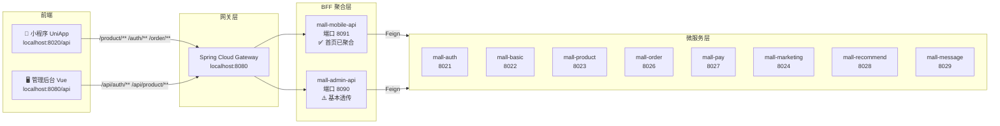

# 前端 API 调用与后端微服务映射手册

> 日期：2026-06-30（v2 — 已通过 grep 逐端验证）
> 目的：梳理两个前端项目调用的所有 API，明确每个接口对应的后端微服务和 Controller，为 BFF 聚合优化提供依据

---

## ⚠️ 已发现的接口不匹配问题

经过 grep 验证后端代码，发现以下前端调用的接口在后端不存在：

| # | 前端调用路径 | 前端项目 | 问题 |
|---|------------|---------|------|
| 1 | `/recommend/v1/mobile/recommend/favoriteStatus?productId=` | 小程序 | ❌ 后端不存在，Mall-Recommend 无此端点 |
| 2 | `/recommend/v1/mobile/recommend/addOrCancelFavorites` | 小程序 | ❌ 后端在 mall-product 的 MobileProductController 中，不是 recommend 服务 |
| 3 | `api/auth/v1/role/level` | 管理后台 | ❌ 后端 RoleController 无此端点 |
| 4 | `auth/online` | 管理后台 | ❌ 不属于本项目，来自另一个管理系统（ELADMIN） |
| 5 | `api/logs` / `api/monitor` / `api/deploy` 等 | 管理后台 | ❌ 属于运维/监控子系统，不在此项目 |

---

## 1. 架构概览

---

## 2. 小程序端 (UniApp) — 已验证 API 清单

**所有接口已通过 grep 后端代码确认路径映射。**

### 2.1 首页 — 4 个请求

| 前端页面 | 调用 URL | 方法 | 后端 Class | 后端方法 | @RequestMapping | 备注 |
|---------|----------|------|-----------|----------|----------------|------|
| 首页 | `/product/v1/mobile/category/getCategoryByParentId?parentId=0` | GET | MobileCategoryController | `getCategoryByParentId()` | `@RequestMapping("/v1/mobile/category")` | 一级分类导航 |
| 首页 | `/product/v1/mobile/index/getIndexCarouselImageList` | GET | MobileIndexController | `getIndexCarouselImageList()` | `@RequestMapping("/v1/mobile/index")` | 轮播图 |
| 首页 | `/product/v1/mobile/index/getIndexProductList?type=1` | GET | MobileIndexController | `getIndexProductList()` | `@RequestMapping("/v1/mobile/index")` | 推荐商品 |
| 首页 | `/product/v1/mobile/index/getIndexNoticeList` | GET | MobileIndexController | `getIndexNoticeList()` | `@RequestMapping("/v1/mobile/index")` | 公告通知 |

> **现状：** mall-mobile-api 的 `MobileHomeController` 已聚合这 4 个接口为 1 个 `GET /index`

### 2.2 商品分类 — 2 个请求

| 前端页面 | 调用 URL | 方法 | 后端 Class | 后端方法 | @RequestMapping |
|---------|----------|------|-----------|----------|----------------|
| 分类页 | `/product/v1/mobile/category/getCategoryByParentId?parentId=0` | GET | MobileCategoryController | `getCategoryByParentId()` | `@RequestMapping("/v1/mobile/category")` |
| 分类页 | `/product/v1/mobile/category/getCategoryByParentId?parentId={id}` | GET | MobileCategoryController | `getCategoryByParentId()` | 同上 |

### 2.3 商品列表/搜索 — 2 个请求

| 前端页面 | 调用 URL | 方法 | 后端 Class | 后端方法 | @RequestMapping |
|---------|----------|------|-----------|----------|----------------|
| 商品列表 | `/product/v1/mobile/product/searchProduct` | POST | MobileProductController | `searchProduct()` | `@RequestMapping("/v1/mobile/product")` |
| 商品列表 | `/product/v1/mobile/product/addShoppingCart` | POST | MobileProductController | `addShoppingCart()` | 同上 |

### 2.4 商品详情 — 4 个请求 + 1 个缺失

| 前端页面 | 调用 URL | 方法 | 后端 Class | 后端方法 | @RequestMapping |
|---------|----------|------|-----------|----------|----------------|
| 商品详情 | `/product/v1/mobile/product/getDetail?productId={id}` | GET | MobileProductController | `getDetail()` | `@RequestMapping("/v1/mobile/product")` |
| 商品详情 | `/product/v1/mobile/product/searchProductComment` | POST | MobileProductController | `searchProductComment()` | 同上 |
| 商品详情 | ~~`/recommend/v1/mobile/recommend/favoriteStatus`~~ | GET | — | ❌ **不存在** | — |
| 商品详情 | `/product/v1/mobile/product/addOrCancelFavorites` | POST | MobileProductController | `addOrCancelFavorites()` | 注意：实际在 product 服务 |
| 商品详情 | `/product/v1/mobile/product/addShoppingCart` | POST | MobileProductController | `addShoppingCart()` | 同上 |

> ⚠️ `favoriteStatus` 接口在后端不存在，前端调了会 404。如需实现需在 RecommendController 或 ProductFavoritesService 添加。

### 2.5 购物车 — 3 个请求

| 前端页面 | 调用 URL | 方法 | 后端 Class | 后端方法 | @RequestMapping |
|---------|----------|------|-----------|----------|----------------|
| 购物车 | `/product/v1/mobile/product/getShoppingCartProduct` | POST | MobileProductController | `getShoppingCartProduct()` | `@RequestMapping("/v1/mobile/product")` |
| 购物车 | `/product/v1/mobile/product/updateShoppingCart` | POST | MobileProductController | `updateShoppingCart()` | 同上 |
| 购物车 | `/product/v1/mobile/product/deleteShoppingCart` | POST | MobileProductController | `deleteShoppingCart()` | 同上 |

### 2.6 下单 — 2 个请求

| 前端页面 | 调用 URL | 方法 | 后端 Class | 后端方法 | @RequestMapping |
|---------|----------|------|-----------|----------|----------------|
| 创建订单 | `/order/v1/mobile/trade/confirm` | POST | OrderController | `confirm()` | `@RequestMapping("/v1/mobile/trade")` |
| 创建订单 | `/order/v1/mobile/trade/submit` | POST | OrderController | `submit()` | 同上 |

### 2.7 订单列表/详情 — 7 个请求

| 前端页面 | 调用 URL | 方法 | 后端 Class | 后端方法 | @RequestMapping |
|---------|----------|------|-----------|----------|----------------|
| 订单列表 | `/order/v1/mobile/trade/search` | POST | OrderController | `search()` | `@RequestMapping("/v1/mobile/trade")` |
| 订单列表 | `/order/v1/mobile/trade/delete` | POST | OrderController | `delete()` | 同上 |
| 订单列表 | `/order/v1/mobile/trade/cancel` | POST | OrderController | `cancel()` | 同上 |
| 订单列表 | `/order/v1/mobile/trade/delivery` | POST | OrderController | `delivery()` | 同上 |
| 订单列表 | `/order/v1/mobile/trade/confirmReceive` | POST | OrderController | `confirmReceive()` | 同上 |
| 订单详情 | `/order/v1/mobile/trade/getDetail/{code}` | GET | OrderController | `getDetail()` | 同上 |
| 订单详情 | `/order/v1/mobile/trade/getUserOrderTradeCount` | GET | OrderController | `getUserOrderTradeCount()` | 同上 |

### 2.8 评价 — 3 个请求

| 前端页面 | 调用 URL | 方法 | 后端 Class | 后端方法 | @RequestMapping |
|---------|----------|------|-----------|----------|----------------|
| 评价页 | `/order/v1/mobile/trade/getDetail/{code}` | GET | OrderController | `getDetail()` | `@RequestMapping("/v1/mobile/trade")` |
| 评价页 | `/order/v1/mobile/trade/evaluate` | POST | OrderController | `evaluate()` | 同上 |
| 评价详情 | `/order/v1/mobile/trade/getProductCommentByTradeCode/{code}` | GET | OrderController | `getProductCommentByTradeCode()` | 同上 |

### 2.9 退款 — 3 个请求

| 前端页面 | 调用 URL | 方法 | 后端 Class | 后端方法 | @RequestMapping |
|---------|----------|------|-----------|----------|----------------|
| 退款 | `/order/v1/mobile/trade/getTradeItem` | POST | OrderController | `getTradeItem()` | `@RequestMapping("/v1/mobile/trade")` |
| 退款 | `/order/v1/mobile/trade/return/apply` | POST | ReturnController | `apply()` | `@RequestMapping("/v1/mobile/trade/return")` |
| 退款详情 | `/order/v1/mobile/trade/return/detail/{code}` | GET | ReturnController | `detail()` | 同上 |

### 2.10 支付 — 1 个请求

| 前端页面 | 调用 URL | 方法 | 后端 Class | 后端方法 | @RequestMapping |
|---------|----------|------|-----------|----------|----------------|
| 支付 | `/pay/v1/mobile/pay/mockPay` | POST | PayController | `mockPay()` | `@RequestMapping("/v1/mobile/pay")` |

### 2.11 用户/认证 — 10 个请求

| 前端页面 | 调用 URL | 方法 | 后端 Class | 后端方法 | @RequestMapping |
|---------|----------|------|-----------|----------|----------------|
| 登录 | `/auth/v1/web/user/getCode` | GET | WebUserController | `getCode()` | `@RequestMapping("/v1/web/user")` |
| 登录 | `/auth/v1/web/user/login` | POST | WebUserController | `login()` | 同上 |
| 登录 | `/auth/v1/web/user/loginByPhone` | POST | WebUserController | `loginByPhone()` | 同上 |
| 注册 | `/auth/v1/web/user/register` | POST | MobileUserController | `register()` | `@RequestMapping("/v1/mobile/user")` |
| 用户中心 | `/auth/v1/web/user/getUserDetail` | GET | WebUserController | `getUserDetail()` | `@RequestMapping("/v1/web/user")` |
| 用户中心 | `/auth/v1/web/user/logout` | POST | WebUserController | `logout()` | 同上 |
| 修改资料 | `/auth/v1/web/user/updateUser` | POST | WebUserController | `updateUser()` | 同上 |
| 修改头像 | `/auth/v1/user/updateAvatar` | POST | UserController | `updateAvatar()` | `@RequestMapping("/v1/user")` |
| 换绑手机 | `/basic/v1/mobile/sms/sendSmsCode` | POST | MobileSmsController | `sendSmsCode()` | `@RequestMapping("/v1/mobile/sms")` |
| 换绑手机 | `/auth/v1/mobile/user/bindPhone` | POST | MobileUserController | `bindPhone()` | `@RequestMapping("/v1/mobile/user")` |

### 2.12 收货地址 — 6 个请求

| 前端页面 | 调用 URL | 方法 | 后端 Class | 后端方法 | @RequestMapping |
|---------|----------|------|-----------|----------|----------------|
| 地址列表 | `/auth/v1/mobile/deliveryAddress/getUserDeliveryAddressList` | GET | MobileDeliveryAddressController | `getUserDeliveryAddressList()` | `@RequestMapping("/v1/mobile/deliveryAddress")` |
| 设为默认 | `/auth/v1/mobile/deliveryAddress/setDefaultDeliveryAddress` | POST | MobileDeliveryAddressController | `setDefaultDeliveryAddress()` | 同上 |
| 地址详情 | `/auth/v1/mobile/deliveryAddress/getDetail?id=` | GET | MobileDeliveryAddressController | `getDetail()` | 同上 |
| 保存地址 | `/auth/v1/mobile/deliveryAddress/save` | POST | MobileDeliveryAddressController | `save()` | 同上 |
| 删除地址 | `/auth/v1/mobile/deliveryAddress/deleteByIds` | POST | MobileDeliveryAddressController | `deleteByIds()` | 同上 |
| 省市区 | `/mobile/v1/area/getAreaByParentId?parentId=` | GET | MobileAreaController | `queryByParentId()` | `@RequestMapping("/v1/mobile/area")` |

### 2.13 优惠券 — 3 个请求

| 前端页面 | 调用 URL | 方法 | 后端 Class | 后端方法 | @RequestMapping |
|---------|----------|------|-----------|----------|----------------|
| 优惠券 | `/marketing/v1/coupon/getObtainableCouponList` | GET | CouponController | `getObtainableCouponList()` | `@RequestMapping("/v1/coupon")` |
| 优惠券 | `/marketing/v1/coupon/getUserCouponList` | GET | CouponController | `getUserCouponList()` | 同上 |
| 优惠券 | `/marketing/v1/coupon/receiveCoupon` | POST | CouponController | `receiveCoupon()` | 同上 |

### 2.14 其他 — 3 个请求

| 前端页面 | 调用 URL | 方法 | 后端 Class | 后端方法 | @RequestMapping |
|---------|----------|------|-----------|----------|----------------|
| 通知列表 | `/product/v1/mobile/index/searchIndexNoticeByPage` | POST | MobileIndexController | `searchIndexNoticeByPage()` | `@RequestMapping("/v1/mobile/index")` |
| 通知详情 | `/product/v1/mobile/index/getIndexNoticeDetail?id=` | GET | MobileIndexController | `getIndexNoticeDetail()` | 同上 |
| WebSocket | `/message/ws` | WS | — | — | mall-message 服务 |

---

## 3. 管理后台 (Vue) — 已验证 API 清单

### 3.1 系统管理 — 用户（10 个请求）

| 前端页面 | 调用 URL | 方法 | 后端 Class | 后端方法 | @RequestMapping |
|---------|----------|------|-----------|----------|----------------|
| 登录 | `/api/auth/v1/web/user/login` | POST | WebUserController | `login()` | `@RequestMapping("/v1/web/user")` |
| 登录 | `/api/auth/v1/web/user/getCode` | POST | WebUserController | `getCode()` | 同上 |
| 获取用户信息 | `/api/auth/v1/web/user/info` | GET | WebUserController | `info()` | 同上 |
| 退出 | `/api/auth/v1/web/user/logout` | POST | WebUserController | `logout()` | 同上 |
| 用户分页 | `api/auth/v1/user/searchByPage` | POST | UserController | `searchByPage()` | `@RequestMapping("/v1/user")` |
| 新增用户 | `api/auth/v1/user/insert` | POST | UserController | `insert()` | 同上 |
| 编辑用户 | `api/auth/v1/user/update` | POST | UserController | `update()` | 同上 |
| 删除用户 | `api/auth/v1/user/deleteByIds` | POST | UserController | `deleteByIds()` | 同上 |
| 重置密码 | `api/auth/v1/user/resetPwd` | POST | UserController | `resetPwd()` | 同上 |

### 3.2 系统管理 — 角色/菜单/部门/岗位

| 前端页面 | 调用 URL | 方法 | 后端 Class | 后端方法 | @RequestMapping |
|---------|----------|------|-----------|----------|----------------|
| 角色分页 | `api/auth/v1/role/searchByPage` | POST | RoleController | `searchByPage()` | `@RequestMapping("/v1/role")` |
| 角色全部 | `api/auth/v1/role/all` | GET | RoleController | `all()` | 同上 |
| 角色等级 | ~~`api/auth/v1/role/level`~~ | GET | — | ❌ **不存在** | — |
| 菜单分页 | `api/auth/v1/menu/searchByPage` | POST | MenuController | `searchByPage()` | `@RequestMapping("/v1/menu")` |
| 菜单树 | `api/auth/v1/menu/getMenu` | POST | MenuController | `getMenu()` | 同上 |
| 菜单树(前端用) | `api/auth/v1/menu/getMenuTree` | GET | MenuController | `getMenuTree()` | 同上 |
| 子菜单 | `api/auth/v1/menu/getChild?id=` | GET | MenuController | `getChild()` | 同上 |
| 部门分页 | `api/auth/v1/dept/searchByPage` | POST | DeptController | `searchByPage()` | `@RequestMapping("/v1/dept")` |
| 部门树 | `api/auth/v1/dept/searchByTree` | POST | DeptController | `searchByTree()` | 同上 |
| 岗位分页 | `api/auth/v1/job/searchByPage` | POST | JobController | `searchByPage()` | `@RequestMapping("/v1/job")` |

### 3.3 商品管理

| 前端页面 | 调用 URL | 方法 | 后端 Class | 后端方法 | @RequestMapping |
|---------|----------|------|-----------|----------|----------------|
| 商品分页 | `/api/product/v1/product/searchByPage` | POST | ProductController | `searchByPage()` | `@RequestMapping("/v1/product")` |
| 商品详情 | `/api/product/v1/product/findById?id=` | GET | ProductController | `findById()` | 同上 |
| 商品新增 | `/api/product/v1/product/insert` | POST | ProductController | `insert()` | 同上 |
| 商品编辑 | `/api/product/v1/product/update` | POST | ProductController | `update()` | 同上 |
| 商品删除 | `/api/product/v1/product/deleteByIds` | POST | ProductController | `deleteByIds()` | 同上 |
| 分类分页 | `/api/product/v1/category/searchByPage` | POST | CategoryController | `searchByPage()` | `@RequestMapping("/v1/category")` |
| 分类树 | `/api/product/v1/category/searchByTree` | POST | CategoryController | `searchByTree()` | 同上 |
| 品牌分页 | `/api/product/v1/brand/searchByPage` | POST | BrandController | `searchByPage()` | `@RequestMapping("/v1/brand")` |
| 轮播图 | `/api/product/v1/indexCarouselImage/searchByPage` | POST | IndexCarouselImageController | `searchByPage()` | `@RequestMapping("/v1/indexCarouselImage")` |
| 公告 | `/api/product/v1/indexNotice/searchByPage` | POST | IndexNoticeController | `searchByPage()` | `@RequestMapping("/v1/indexNotice")` |
| 推荐商品 | `/api/product/v1/indexProduct/searchByPage` | POST | IndexProductController | `searchByPage()` | `@RequestMapping("/v1/indexProduct")` |
| 单位管理 | `/api/product/v1/unit/searchByPage` | POST | UnitController | `searchByPage()` | `@RequestMapping("/v1/unit")` |

### 3.4 订单管理

| 前端页面 | 调用 URL | 方法 | 后端 Class | 后端方法 | @RequestMapping |
|---------|----------|------|-----------|----------|----------------|
| 订单分页 | `v1/trade/searchByPage` | POST | OrderController | `searchByPage()` | `@RequestMapping("/v1/mobile/trade")` |
| 订单编辑 | `v1/trade/update` | POST | OrderController | `update()` | 同上 |
| 订单删除 | `v1/trade/deleteByIds` | POST | OrderController | `deleteByIds()` | 同上 |
| 发货 | `v1/trade/shippedByIds` | POST | — | ❌ **不存在** | — |

### 3.5 营销管理

| 前端页面 | 调用 URL | 方法 | 后端 Class | 后端方法 | @RequestMapping |
|---------|----------|------|-----------|----------|----------------|
| 优惠券分页 | `/api/marketing/v1/coupon/searchByPage` | POST | CouponController | `searchByPage()` | `@RequestMapping("/v1/coupon")` |
| 秒杀分页 | `/api/marketing/v1/seckillProduct/searchByPage` | POST | SeckillProductController | `searchByPage()` | `@RequestMapping("/v1/seckillProduct")` |
| 秒杀详情 | `/api/marketing/v1/seckillProduct/findById` | GET | SeckillProductController | `findById()` | 同上 |

### 3.6 基础数据

| 前端页面 | 调用 URL | 方法 | 后端 Class | 后端方法 | @RequestMapping |
|---------|----------|------|-----------|----------|----------------|
| 地区分页 | `/api/basic/v1/commonArea/searchByPage` | POST | CommonAreaController | `searchByPage()` | `@RequestMapping("/v1/commonArea")` |
| 字典分页 | `api/basic/v1/dict/searchByPage` | POST | CommonDictController | `searchByPage()` | `@RequestMapping("/v1/dict")` |
| 字典详情 | `api/basic/v1/dictDetail/searchDictDetail` | POST | CommonDictDetailController | `searchDictDetail()` | `@RequestMapping("/v1/dictDetail")` |
| 定时任务 | `api/basic/v1/commonJob/insert/update/deleteByIds` | POST | CommonJobController | CRUD | `@RequestMapping("/v1/commonJob")` |
| 图片管理 | `api/basic/v1/commonPhoto/searchByPage` | POST | CommonPhotoController | `searchByPage()` | `@RequestMapping("/v1/commonPhoto")` |
| 短信记录 | `api/basic/v1/commonSmsRecord/searchByPage` | POST | CommonSmsRecordController | `searchByPage()` | `@RequestMapping("/v1/commonSmsRecord")` |
| 图片上传 | `/api/basic/v1/image/batchUpload` | POST | UploadController | `batchUpload()` | `@RequestMapping("/v1/image")` |
| 头像上传 | `/api/basic/v1/image/upload` | POST | UploadController | `upload()` | 同上 |

### 3.7 不属于本项目的外部端点

这些路径在管理后台被调用，但后端不在本项目代码中，归属于其他子系统：

- `api/auth/v1/role/level` → ❌ 不存在
- `auth/online` → 在线用户管理（ELADMIN）
- `api/logs` / `api/logs/error` → 日志服务
- `api/monitor` → 服务器监控
- `api/jobs` → 定时任务（另一个）
- `api/app` / `api/database` / `api/deploy` → 运维部署
- `api/serverDeploy` → 服务器管理
- `api/deployHistory` → 部署历史
- `api/aliPay` / `api/email` → 支付宝/邮件工具
- `api/localStorage` / `api/qiNiuContent` → 文件存储
- `api/generator` / `api/genConfig` → 代码生成器

---

## 4. BFF 聚合现状

### 4.1 mall-mobile-api（端口 8091）

**✅ 已聚合：** `MobileHomeController.GET /index` — 一次调用聚合轮播图、分类、公告、推荐商品

**⚠️ 透传：** 其他所有接口都是直接 Feign 透传调用，未做聚合

### 4.2 mall-admin-api（端口 8090）

**✅ 新增聚合：**
- `GET /admin/v1/user/{id}/edit-data` — 用户信息 + 所有角色 + 部门树 + 所有岗位
- `GET /admin/v1/product/{id}/edit-data` — 商品详情 + 分类树（品牌/单位待补 Feign Client）

**⚠️ 其余透传：** 登录、用户 CRUD、收货地址等直接透传 auth 服务

### 4.3 BFF Swagger 文档

两个 BFF 服务已增加 Swagger3 文档：

| 服务 | 端口 | 文档地址 | 分组 |
|------|------|---------|------|
| mall-admin-api | 8090 | `/doc.html` | `admin-frontend` |
| mall-mobile-api | 8091 | `/doc.html` | `mobile-frontend` |

> 前端重写时，只需看这两个 BFF 服务的文档 + 底层的 `internal` 分组文档（Feign 接口说明）

### 4.3 优先聚合场景

| 优先级 | 页面 | 当前请求数 | 聚合后 | 涉及微服务 |
|--------|------|-----------|--------|-----------|
| P0 | 小程序商品详情 | 5次 | 1次 | product + recommend（favoriteStatus 缺失） |
| P0 | 小程序下单页 | 3次 | 1次 | order + auth(address) + marketing(coupon) |
| P1 | 管理后台商品编辑 | 5次 | 1次 | product + basic(image) |
| P1 | 小程序订单列表 | 5次 | 1次 | order |
| P2 | 管理后台用户编辑 | 4次 | 1次 | auth(user + role + dept + job) |
