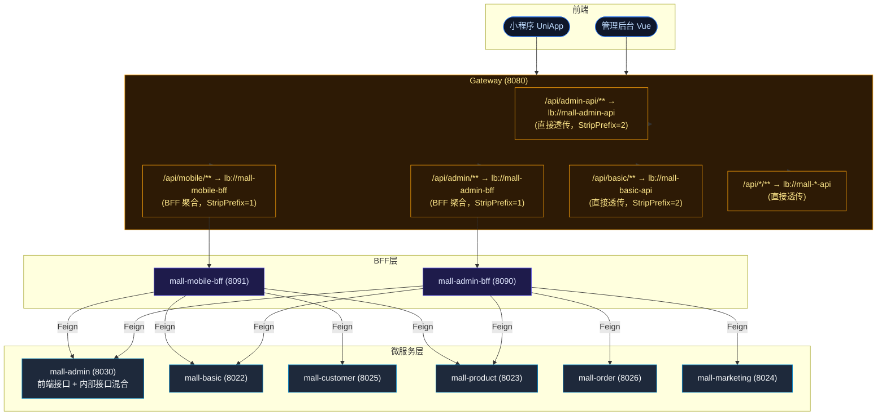

# BFF 层接口分类与响应格式治理方案

> 目的：理清 Gateway → BFF → 微服务之间的调用关系，统一响应格式
> 日期：2026-07-07

---

## 一、架构现状



---

## 二、Gateway 路由分类

### 2.1 经 BFF 的路由（需 ApiResult 包装）

| 路由前缀 | StripPrefix | 转发目标 | 说明 |
|----------|:----------:|----------|------|
| `/api/admin/**` | 1 | `lb://mall-admin-bff` | 管理后台 BFF |
| `/api/mobile/**` | 1 | `lb://mall-mobile-bff` | 移动端 BFF |

### 2.2 直通微服务的路由（裸 DTO，不走 BFF）

| 路由前缀 | StripPrefix | 转发目标 | 说明 |
|----------|:----------:|----------|------|
| `/api/admin-api/**` | 2 | `lb://mall-admin-api` | 直接调用 admin 原生接口 |
| `/api/basic/**` | 2 | `lb://mall-basic-api` | 基础服务 |
| `/api/customer/**` | 2 | `lb://mall-customer-api` | C 端用户 |
| `/api/product/**` | 2 | `lb://mall-product-api` | 商品服务 |
| `/api/marketing/**` | 2 | `lb://mall-marketing-api` | 营销服务 |
| `/api/order/**` | 2 | `lb://mall-order-api` | 订单服务 |
| `/api/pay/**` | 2 | `lb://mall-pay-api` | 支付服务 |
| `/api/recommend/**` | 2 | `lb://mall-recommend-api` | 推荐服务 |
| `/api/message/**` | 2 | `lb://mall-message-api` | 消息服务 |

> ⚠️ **问题：** `/api/admin-api/**` 直通路由的存在意味着管理后台可以跳过 BFF 直接调用 admin 原生接口。
> 这些原生接口的响应格式不一致（有的返回 ApiResult，有的返回裸 DTO）。

---

## 三、微服务响应格式现状

### 3.1 mall-admin（auth 模块）

| 控制器 | 路径 | 是否被 BFF 调用 | 当前返回类型 | 外部直接可用？ |
|--------|------|:--------------:|------------|:-----------:|
| `WebUserController` | `/v1/web/user/*` | ✅ Feign 调用 | 裸 DTO | ✅ Gateway 直通 |
| `UserController` | `/v1/user/*` | ✅ BFF Feign | 裸 DTO | ✅ Gateway 直通 |
| `MenuController` | `/v1/menu/*` | ✅ BFF Feign | 裸 DTO | ✅ Gateway 直通 |
| `DeptController` | `/v1/dept/*` | ✅ BFF Feign | 裸 DTO | ✅ Gateway 直通 |
| `RoleController` | `/v1/role/*` | ✅ BFF Feign | 裸 DTO | ✅ Gateway 直通 |
| `Internal*Controller` | `/v1/internal/*` | Feign 内部调用 | 裸 DTO | ❌ 内部专用 |

### 3.2 mall-basic / product / marketing / order / customer

| 服务 | 控制器路径 | 是否被 BFF 调用 | 当前返回类型 |
|------|----------|:--------------:|------------|
| basic | `/v1/*` | ✅ 部分 Feign | 裸 DTO |
| product | `/v1/*` | ✅ 部分 Feign | 裸 DTO |
| marketing | `/v1/*` | ✅ 部分 Feign | 裸 DTO |
| order | `/v1/mobile/trade/*` | ✅ 部分 Feign | 裸 DTO |
| customer | `/v1/mobile/user/*` | ✅ Feign | 裸 DTO |

> 这些微服务的 Controller 返回裸 DTO，因为之前有 `GlobalApiResultHandler` 统一包装。
> 但 `GlobalApiResultHandler` 只对路径含 `/v1` 的请求生效，不在 `/v1` 下的不包装。

---

## 四、BFF 各控制器调用关系

### 4.1 mall-admin-bff

| BFF 控制器 | 对应 Feign | 调用的微服务 | 说明 |
|-----------|-----------|------------|------|
| `AdminAuthController` | `UserFeignClient` | admin | 登录/用户/验证码 |
| `AdminSystemController` | `RoleFeignClient` `MenuFeignClient` `DeptFeignClient` `JobFeignClient` | admin | 系统管理 CRUD |
| `AdminUserController` | `UserFeignClient` `DeliveryAddressFeignClient` | admin | 用户管理 |
| `AdminProductController` | `ProductFeignClient` | product | 商品 CRUD |
| `AdminProductExtraController` | `ProductFeignClient` | product | 属性/分组/轮播 |
| `AdminProductManagerController` | `ProductFeignClient` | product | 分类/品牌/单位 |
| `AdminBasicController` | `BasicFeignClient` | basic | 字典/图片/敏感词 |
| `AdminCommonController` | `BasicFeignClient` | basic | 公共接口 |
| `AdminOrderController` | `OrderFeignClient` | order | 订单/退货 |
| `AdminMarketingController` | `MarketingFeignClient` | marketing | 优惠券/秒杀 |
| `AdminShoppingController` | `*FeignClient` | admin/product | 购物车/评价/收藏 |
| `AdminDashboardController` | `*FeignClient` | admin | 仪表盘统计 |

### 4.2 mall-mobile-bff

| BFF 控制器 | 对应 Feign | 调用的微服务 |
|-----------|-----------|------------|
| `MobileAuthController` | `MemberFeignClient` `SmsFeignClient` | customer + basic |
| `MobileHomeController` | `ProductFeignClient` | product |
| `MobileProductDetailController` | `ProductFeignClient` | product |
| `MobileCartController` | `*FeignClient` | product |
| `MobileOrderController` | `OrderFeignClient` | order |
| `MobileCouponController` | `MarketingFeignClient` | marketing |
| `MobileCheckoutController` | `*FeignClient` | order |
| `MobileUserController` | `*FeignClient` | customer |

---

## 五、响应格式治理规则

### 5.1 核心原则

```
BFF 对外（前端）→ 必须 ApiResult<T> 包装  ✅
微服务对内（Feign 调用）→ 必须裸 DTO 返回  ✅
同一接口不能既被前端直接调又被 Feign 调  ✅
```

### 5.2 治理措施

| 措施 | 说明 |
|------|------|
| **BFF 全部返回 `ApiResult<T>`** | 前端调 BFF 时收到统一 `{code, message, data: {...}}` |
| **微服务去除 `GlobalApiResultHandler` 自动包装** | 否则 Feign 收到的是 `ApiResult<DTO>`，每层都要拆包 |
| **微服务 Controller 保持裸 DTO** | Feign 直接反序列化成目标类型 |
| **削除直通路由** | 前端一律走 BFF，不走 `/api/admin-api/**` 这种直通路由 |

### 5.3 需要修改的路由

```yaml
# Gateway 路由中应该删除以下直通路由（前端统一走 BFF）
# mall-admin-api  → 前端走 /api/admin/***，不走 /api/admin-api/**
```

### 5.4 微服务层响应格式现状

| 服务 | 控制器路径 | 是否有 @RestControllerAdvice 包装 | 当前响应类型 |
|------|----------|:-------------------------------:|:----------:|
| **BFF** | `/admin/v1/*` `/mobile/v1/*` | 无（路径不含 /v1 前缀） | 手动 ApiResult |
| admin | `/v1/web/user/*` | ✅ GlobalApiResultHandler 自动包装 | 前端看到的是 ApiResult |
| admin | `/v1/internal/*` | ✅ 同上 | ❌ Feign 收到 ApiResult，要拆包 |
| basic | `/v1/*` | ✅ 同上 | 同上问题 |
| customer | `/v1/*` | ✅ 同上 | 同上问题 |

> ⚠️ **发现一个隐藏问题：** `GlobalApiResultHandler` 对所有含 `/v1` 的路径自动包裹 `ApiResult`。
> 这意味着微服务的 Feign 内部接口（`/v1/internal/*`）也被包裹了！
> 但 Feign 客户端期望的是裸 DTO，这里存在隐蔽的序列化不匹配。

---

## 六、改造步骤

### Step 1：BFF 控制器返回值改为 `ApiResult<T>`

```java
// 改前
public TokenDTO login(@Valid @RequestBody UserLoginDTO dto) {
    return userFeignClient.login(dto);
}

// 改后
public ApiResult<TokenDTO> login(@Valid @RequestBody UserLoginDTO dto) {
    return ApiResultUtil.success(userFeignClient.login(dto));
}
```

**涉及：** mall-admin-bff 全部 12 个 Controller、mall-mobile-bff 全部 8 个 Controller

### Step 2：`GlobalApiResultHandler` 排除 `/v1/internal/**`

`GlobalApiResultHandler` 的 `matchUrl()` 方法加判断：

```java
private boolean matchUrl(String uri) {
    if (uri == null || uri.isEmpty()) return false;
    if (uri.contains("/v1/internal/")) return false;  // Feign 内部接口不包装
    return uri.contains("/v1");
}
```

### Step 3：削除 Gateway 直通路由

```yaml
# Gateway 配置中删除以下路由，前端统一走 BFF
routes:
  - id: mall-admin-api
    uri: lb://mall-admin-api
    predicates:
      - Path=/api/admin-api/**
    # ↑ 删掉这一整段
```

### Step 4：微服务 Controller 返回值全部改为裸 DTO（去掉遗留的 ApiResult 手动包装）

部分老 Controller 可能手动返回了 `ApiResult`，需要改为裸 DTO。

---

## 七、治理前后对比

```
治理前：
前端 → Gateway
  ├─ /api/admin/v1/auth/login → BFF → Feign → admin(v1/web/user/login)
  │                                               └─ 返回 ApiResult(tokenDTO) ❌
  │  BFF 收到 ApiResult 后拆 data，再返回给前端
  │  Swagger 显示 TokenDTO（缺失 ApiResult 包装层）
  │
  └─ /api/admin-api/v1/menu/searchByPage → admin 直通
                                                  └─ GlobalApiResultHandler 包装
                                                     前端收到 ApiResult(menuDTO) ✅ 但不统一

治理后：
前端 → Gateway
  └─ /api/admin/v1/system/menu/page → BFF
      BFF 返回 ApiResult<List<MenuDTO>>  ✅ Swagger 显示完整结构
      GlobalApiResultHandler 不拦截 BFF（路径无 /v1）
      Feign 调用内部时不受影响
```
