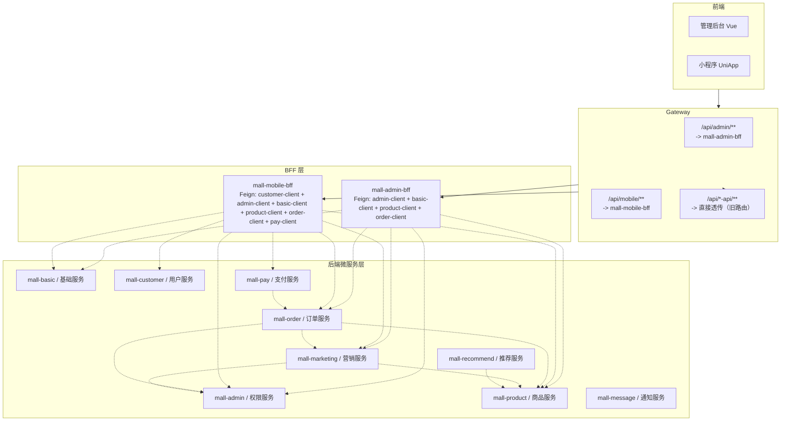

# 接口分类与治理方案

> 目的：对所有微服务 Controller 接口进行 A/B/C 三类分类，识别混合调用（C 类）并给出拆分建议
> 日期：2026-07-08

---

## 一、分类标准

| 类别 | 定义 | 路径特征 | 示例 |
|------|------|----------|------|
| **A类** | 前端接口（走 BFF） | 不带 `/internal/`，由 BFF 模块通过 Feign 调用 | `/v1/web/user/login`、`/v1/menu/searchByPage` |
| **B类** | 内部 Feign 调用（微服务互调） | 带 `/internal/`，仅供其他微服务的 Feign Client 调用 | `/v1/internal/user/findByIds` |
| **C类** | 混合调用（前端 + 内部都在调） | 同一个 Controller 方法既被 BFF 调，也被其他微服务调 | **需拆分为独立接口** |

---

## 二、调用关系总览



### 微服务间 Feign 调用矩阵

| 调用方 | 被调用方 | 调用的接口 |
|--------|----------|------------|
| **mall-order** | mall-product-api | `/v1/internal/product/findByIds`、`/v1/internal/product/findDetailById`、`/v1/internal/product/reduceStockBatch`、`/v1/internal/shoppingCart/findByIds`、`/v1/internal/shoppingCart/getShoppingCartProduct`、`/v1/productPhoto/findByProductIds` |
| **mall-order** | susan-mall-marketing | `/v1/internal/coupon/calculateOrderPrice`、`/v1/internal/coupon/useCoupons`、`/v1/coupon/getUserCouponList`、`/v1/coupon/getObtainableCouponList` |
| **mall-order** | mall-admin-api | 收货地址 `DeliveryAddressFeignClient.getUserDeliveryAddressList()` 等 |
| **mall-marketing** | mall-product-api | `/v1/internal/product/findByIds` |
| **mall-marketing** | mall-admin-api | `/v1/internal/user/findByIds` |
| **mall-pay** | mall-order-api | `/v1/internal/trade/getDetailByCode/{code}`、`/v1/internal/trade/getTrade/{code}`、`/v1/mobile/trade/getDetail/{id}` |
| **mall-recommend** | mall-product-api | `/v1/internal/product/findByIds`、`/v1/productViewRecord/searchByPage`、`/v1/productViewRecord/searchList`、`/v1/mobile/index/*`、`/v1/product/searchFromES` |
| **mall-mobile-bff** | mall-customer-api | `/v1/mobile/user/register`、`/v1/mobile/user/login`、`/v1/mobile/user/loginByPhone`、`/v1/mobile/user/logout`、`/v1/mobile/user/getCode` |
| **mall-mobile-bff** | mall-admin-api | `/v1/web/user/getUserDetail`、`/v1/web/user/updateUser`、收货地址 `/v1/mobile/deliveryAddress/*` |
| **mall-mobile-bff** | mall-basic-api | `/v1/internal/sms/sendSmsCode`、`/v1/internal/commonArea/queryByParentId`、`/v1/image/upload` |
| **mall-mobile-bff** | mall-product-api | `/v1/internal/product/findByIds`、`/v1/internal/shoppingCart/getShoppingCartProduct`、`/v1/mobile/product/*`、`/v1/shoppingCart/*`、`/v1/mobile/category/*`、`/v1/mobile/index/*` |
| **mall-mobile-bff** | mall-order-api | `/v1/mobile/trade/*`、`/v1/internal/trade/getDetailByCode/{code}`、`/v1/internal/trade/create` |
| **mall-mobile-bff** | susan-mall-pay | `/v1/mobile/pay/mockPay`、`/v1/mobile/pay/createQrCode` |
| **mall-mobile-bff** | mall-marketing-api | `/v1/coupon/*`、`/v1/internal/coupon/*` |
| **mall-admin-bff** | mall-admin-api | `/v1/web/user/*`、`/v1/internal/user/*`、`/v1/menu/*`、`/v1/dept/*`、`/v1/role/*`、`/v1/job/*`、`/v1/mobile/deliveryAddress/*` |
| **mall-admin-bff** | mall-basic-api | `/v1/commonJob/*`、`/v1/commonJobLog/*`、`/v1/commonPhoto/*`、`/v1/commonSensitiveWord/*`、`/v1/commonArea/*`、`/v1/dict/*`、`/v1/dictDetail/*`、`/v1/commonSmsRecord/*`、`/v1/image/upload` |
| **mall-admin-bff** | mall-product-api | `/v1/product/*`、`/v1/mobile/product/*`、`/v1/mobile/category/*`、`/v1/shoppingCart/*`、`/v1/attribute/*`、`/v1/brand/*`、`/v1/category/*`、`/v1/unit/*`、`/v1/productGroup/*`、`/v1/productComment/*`、`/v1/productFavorites/*`、`/v1/productViewRecord/*` |
| **mall-admin-bff** | mall-marketing-api | `/v1/coupon/*`、`/v1/seckillProduct/*`、`/v1/couponUserProvide/*`、`/v1/couponUserReceive/*` |
| **mall-admin-bff** | mall-order-api | `/v1/mobile/trade/*`、`/v1/tradeDeliveryAddress/*`、`/v1/trade/return/*` |
| **mall-admin-bff** | mall-message-api | `/v1/message/notify/*` |

---

## 三、按微服务模块分类详情

### 3.1 mall-admin（权限服务）

APPConstant: `ADMIN_SERVICE_NAME = "mall-admin-api"`

该服务包含前端管理端接口（走 BFF）和内部 Feign 接口（被其他微服务调用）。

#### 3.1.1 WebUserController — A类

`@RestController @RequestMapping("/v1/web/user")`

| 方法 | 路径 | 调用来源 | 分类 |
|------|------|----------|:----:|
| getCode | GET /v1/web/user/getCode | mall-admin-bff (UserFeignClient) | **A** |
| getUserDetail | GET /v1/web/user/getUserDetail | mall-admin-bff / mall-mobile-bff | **A** |
| login | POST /v1/web/user/login | mall-admin-bff (UserFeignClient) | **A** |
| loginByPhone | POST /v1/web/user/loginByPhone | mall-admin-bff (UserFeignClient) | **A** |
| logout | POST /v1/web/user/logout | mall-admin-bff (UserFeignClient) | **A** |
| getUserInfo | GET /v1/web/user/info | mall-admin-bff (UserFeignClient) | **A** |
| resetPassword | POST /v1/web/user/resetPassword | mall-admin-bff (UserFeignClient) | **A** |
| updateUser | POST /v1/web/user/updateUser | mall-admin-bff / mall-mobile-bff | **A** |
| onlineUsers | GET /v1/web/user/onlineUsers | mall-admin-bff (UserFeignClient) | **A** |
| bindPhone | POST /v1/web/user/bindPhone | mall-admin-bff (UserFeignClient) | **A** |
| register | POST /v1/web/user/register | mall-admin-bff (UserFeignClient) | **A** |

#### 3.1.2 UserController（auth包） — A类

`@RestController @RequestMapping("/v1/user")`

| 方法 | 路径 | 调用来源 | 分类 |
|------|------|----------|:----:|
| findById | GET /v1/user/findById | mall-admin-bff（ProductFeignClient 中的 findById） | **A** |
| searchByPage | POST /v1/user/searchByPage | 暂无 Feign 调用发现 | **A** |
| insert | POST /v1/user/insert | 暂无 Feign 调用发现 | **A** |
| update | POST /v1/user/update | 暂无 Feign 调用发现 | **A** |
| deleteById | POST /v1/user/deleteByIds | 暂无 Feign 调用发现 | **A** |
| resetPwd | POST /v1/user/resetPwd | 暂无 Feign 调用发现 | **A** |

#### 3.1.3 MenuController（auth包） — A类

`@RestController @RequestMapping("/v1/menu")`

| 方法 | 路径 | 调用来源 | 分类 |
|------|------|----------|:----:|
| searchByPage | POST /v1/menu/searchByPage | mall-admin-bff (MenuFeignClient) | **A** |
| getMenuTree | GET /v1/menu/getMenuTree | mall-admin-bff (MenuFeignClient) | **A** |
| getMenu | POST /v1/menu/getMenu | mall-admin-bff (MenuFeignClient) | **A** |
| insert | POST /v1/menu/insert | mall-admin-bff (MenuFeignClient) | **A** |
| update | POST /v1/menu/update | mall-admin-bff (MenuFeignClient) | **A** |
| deleteByIds | POST /v1/menu/deleteByIds | mall-admin-bff (MenuFeignClient) | **A** |
| findById | GET /v1/menu/findById | 暂无 Feign 调用发现 | **A** |
| getChild | GET /v1/menu/getChild | 暂无 Feign 调用发现 | **A** |

#### 3.1.4 DeptController（auth包） — A类

`@RestController @RequestMapping("/v1/dept")`

| 方法 | 路径 | 调用来源 | 分类 |
|------|------|----------|:----:|
| searchByPage | POST /v1/dept/searchByPage | mall-admin-bff (DeptFeignClient) | **A** |
| searchByTree | POST /v1/dept/searchByTree | mall-admin-bff (DeptFeignClient) | **A** |
| insert | POST /v1/dept/insert | mall-admin-bff (DeptFeignClient) | **A** |
| update | POST /v1/dept/update | mall-admin-bff (DeptFeignClient) | **A** |
| deleteByIds | POST /v1/dept/deleteByIds | mall-admin-bff (DeptFeignClient) | **A** |
| findById | GET /v1/dept/findById | 暂无 Feign 调用发现 | **A** |

#### 3.1.5 RoleController（auth包） — A类

`@RestController @RequestMapping("/v1/role")`

| 方法 | 路径 | 调用来源 | 分类 |
|------|------|----------|:----:|
| searchByPage | POST /v1/role/searchByPage | mall-admin-bff (RoleFeignClient) | **A** |
| all | GET /v1/role/all | mall-admin-bff (RoleFeignClient) | **A** |
| insert | POST /v1/role/insert | mall-admin-bff (RoleFeignClient) | **A** |
| update | POST /v1/role/update | mall-admin-bff (RoleFeignClient) | **A** |
| deleteByIds | POST /v1/role/deleteByIds | mall-admin-bff (RoleFeignClient) | **A** |
| findById | GET /v1/role/findById | 暂无 Feign 调用发现 | **A** |

#### 3.1.6 RoleDeptController / RoleMenuController / UserRoleController / UserAvatarController / JobController（auth包） — A类

均为管理端权限 CRUD 接口，路径 `/v1/roleDept/*`、`/v1/roleMenu/*`、`/v1/userRole/*`、`/v1/userAvatar/*`、`/v1/job/*`。全部由 mall-admin-bff 通过 Feign 调用，**分类均为 A**。

> **注意**：JobController 定义在 mall-admin（auth）中，但 mall-basic 也有 CommonJobController。两者是不同的实体（岗位 vs 定时任务）。

#### 3.1.7 内部Controller（`controller/internal` 包） — B类

| Controller | 方法 | 路径 | 调用来源 | 分类 |
|------------|------|------|----------|:----:|
| **UserInternalController** | findByIds | POST /v1/internal/user/findByIds | mall-order / mall-marketing / mall-recommend | **B** |
| | findByPhone | GET /v1/internal/user/findByPhone | mall-admin-bff | **B** |
| | updateAvatar | POST /v1/internal/user/updateAvatar | mall-admin-bff / mall-mobile-bff | **B** |
| | testLogin | POST /v1/internal/user/testLogin | mall-admin-bff | **B** |
| **DeptInternalController** | searchByTree | POST /v1/internal/dept/searchByTree | mall-admin-bff | **B** |
| **RoleInternalController** | all | GET /v1/internal/role/all | mall-admin-bff | **B** |
| **JobInternalController** | all | GET /v1/internal/job/all | mall-admin-bff | **B** |
| **DeliveryAddressInternalController** | findByIds | POST /v1/internal/deliveryAddress/findByIds | mall-order | **B** |

#### 3.1.8 MobileDeliveryAddressController — C类

`@RestController @RequestMapping("/v1/mobile/deliveryAddress")`

| 方法 | 路径 | BFF 调用 | 内部 Feign 调用 | 分类 |
|------|------|----------|-----------------|:----:|
| setDefaultDeliveryAddress | POST /v1/mobile/deliveryAddress/setDefaultDeliveryAddress | mall-admin-bff (DeliveryAddressFeignClient) / mall-mobile-bff | — | **A** |
| getUserDeliveryAddressList | GET /v1/mobile/deliveryAddress/getUserDeliveryAddressList | mall-admin-bff / mall-mobile-bff | mall-order | **C** |
| getDetail | GET /v1/mobile/deliveryAddress/getDetail | mall-admin-bff / mall-mobile-bff | — | **A** |
| deleteByIds | POST /v1/mobile/deliveryAddress/deleteByIds | mall-admin-bff / mall-mobile-bff | mall-order | **C** |
| save | POST /v1/mobile/deliveryAddress/save | mall-admin-bff / mall-mobile-bff | mall-order | **C** |

> **拆分建议**：
> - `getUserDeliveryAddressList`、`deleteByIds`、`save` 三个方法被 BFF 和 order 服务同时调用
> - 建议为 order 服务创建独立的 internal 接口（如 `/v1/internal/deliveryAddress/getList`、`/v1/internal/deliveryAddress/delete`），使用专门的 DTO 参数

#### 3.1.9 TestController — A类

`@RestController @RequestMapping("/v1/test")` — testOpenFeign，仅测试用。

### 3.2 mall-basic（基础服务）

APPConstant: `BASIC_SERVICE_NAME = "mall-basic-api"`

#### 3.2.1 Common*Controller — A类

所有 `Common*Controller` 管理端 CRUD 接口均由 mall-admin-bff 通过对应 FeignClient 调用：

| Controller | 路径前缀 | 调用来源 | 分类 |
|------------|----------|----------|:----:|
| CommonAreaController | /v1/commonArea/* | mall-admin-bff (AreaFeignClient) | **A** |
| CommonDictController | /v1/dict/* | mall-admin-bff (DictFeignClient) | **A** |
| CommonDictDetailController | /v1/dictDetail/* | mall-admin-bff (DictDetailFeignClient) | **A** |
| CommonJobController | /v1/commonJob/* | mall-admin-bff (JobFeignClient) | **A** |
| CommonJobLogController | /v1/commonJobLog/* | mall-admin-bff (JobLogFeignClient) | **A** |
| CommonPhotoController | /v1/commonPhoto/* | mall-admin-bff (PhotoFeignClient) | **A** |
| CommonPhotoGroupController | /v1/commonPhotoGroup/* | mall-admin-bff (PhotoGroupFeignClient) | **A** |
| CommonSensitiveWordController | /v1/commonSensitiveWord/* | mall-admin-bff (SensitiveWordFeignClient) | **A** |
| CommonSmsRecordController | /v1/commonSmsRecord/* | mall-admin-bff (SmsRecordFeignClient) | **A** |

#### 3.2.2 UploadController — 混合A类

| 方法 | 路径 | 调用来源 | 分类 |
|------|------|----------|:----:|
| imageUpload | POST /v1/image/upload | mall-admin-bff / mall-mobile-bff (UploadFeignClient) | **A** |
| fileUpload | POST /v1/file/upload | — | **A** |
| batchUpload | POST /v1/image/batchUpload | — | **A** |

#### 3.2.3 MobileSmsController — A类

`POST /v1/mobile/sms/sendSmsCode` — 由移动端短信验证码接口，暂无明确 Feign 调用发现。

#### 3.2.4 MobileAreaController — A类

`GET /v1/mobile/area/queryByParentId` — 移动端区域查询。

#### 3.2.5 内部Controller（`controller/internal` 包） — B类

| Controller | 方法 | 路径 | 调用来源 | 分类 |
|------------|------|------|----------|:----:|
| **SmsInternalController** | sendSmsCode | POST /v1/internal/sms/sendSmsCode | mall-mobile-bff (SmsFeignClient) | **B** |
| **SmsRecordInternalController** | findSmsRecord | POST /v1/internal/smsRecord/findSmsRecord | mall-admin-bff (SmsRecordFeignClient) | **B** |
| **AreaInternalController** | queryByParentId | GET /v1/internal/commonArea/queryByParentId | mall-mobile-bff (AreaFeignClient) | **B** |
| | findById | GET /v1/internal/commonArea/findById | mall-admin-bff (UserFeignClient 等) | **B** |
| **DictInternalController** | queryDictDetail | GET /v1/internal/dict/queryDictDetail | mall-admin-bff (DictFeignClient) | **B** |

#### 3.2.6 AiController — 暂无映射方法

占位控制器，无任何 Mapping 方法。

#### 3.2.7 C类识别

mall-basic 中暂无不带 `/internal/` 但同时被 BFF 和微服务内部调用的接口。所有内部接口都有 `/internal/` 路径前缀。

### 3.3 mall-product（商品服务）

APPConstant: `PRODUCT_SERVICE_NAME = "mall-product-api"`

#### 3.3.1 Product*Controller / Attribute*Controller / BrandController / CategoryController 等管理端CRUD — A类

`@RestController @RequestMapping("/v1/product")` 等路径前缀，均由 mall-admin-bff 通过 ProductFeignClient / CategoryFeignClient / BrandFeignClient 等调用。

| Controller | 调用来源 | 分类 |
|------------|----------|:----:|
| ProductController | mall-admin-bff、mall-recommend | **A** |
| AttributeController | mall-admin-bff | **A** |
| AttributeValueController | mall-admin-bff | **A** |
| BrandController | mall-admin-bff | **A** |
| CategoryController | mall-admin-bff | **A** |
| IndexCarouselImageController | mall-admin-bff | **A** |
| IndexNoticeController | mall-admin-bff | **A** |
| IndexProductController | mall-admin-bff | **A** |
| ProductAttributeController | mall-admin-bff | **A** |
| ProductGroupController | mall-admin-bff | **A** |
| UnitController | mall-admin-bff | **A** |
| ShoppingCartController | mall-admin-bff | **A** |

#### 3.3.2 Mobile*Controller（移动端接口） — 混合A类

| Controller | 方法 | 路径 | BFF 调用 | 内部 Feign 调用 | 分类 |
|------------|------|------|----------|-----------------|:----:|
| **MobileProductController** | searchProduct | POST /v1/mobile/product/searchProduct | mall-mobile-bff | — | **A** |
| | getDetail | GET /v1/mobile/product/getDetail | mall-mobile-bff | mall-order (ProductFeignClient) | **C** |
| | addOrCancelFavorites | POST /v1/mobile/product/addOrCancelFavorites | mall-mobile-bff | — | **A** |
| | searchProductComment | POST /v1/mobile/product/searchProductComment | mall-mobile-bff | — | **A** |
| | saveProductComment | POST /v1/mobile/product/saveProductComment | mall-mobile-bff | — | **A** |
| | addProductComments | POST /v1/mobile/product/addProductComments | mall-mobile-bff | — | **A** |
| | getShoppingCartProduct | POST /v1/mobile/product/getShoppingCartProduct | mall-mobile-bff | mall-order (ProductFeignClient) | **C** |
| | addShoppingCart | POST /v1/mobile/product/addShoppingCart | mall-mobile-bff | — | **A** |
| | updateShoppingCart | POST /v1/mobile/product/updateShoppingCart | mall-mobile-bff | — | **A** |
| | deleteShoppingCart | POST /v1/mobile/product/deleteShoppingCart | mall-mobile-bff | — | **A** |
| **MobileCategoryController** | getCategoryByParentId | GET /v1/mobile/category/getCategoryByParentId | mall-mobile-bff / mall-admin-bff | mall-order (ProductFeignClient) | **C** |
| **MobileIndexController** | getIndexCarouselImageList | GET /v1/mobile/index/getIndexCarouselImageList | mall-mobile-bff | mall-recommend (IndexFeignClient) | **C** |
| | getIndexProductList | GET /v1/mobile/index/getIndexProductList | mall-mobile-bff | mall-recommend (IndexFeignClient) | **C** |
| | getIndexNoticeList | GET /v1/mobile/index/getIndexNoticeList | mall-mobile-bff | mall-recommend (IndexFeignClient) | **C** |
| | searchIndexNoticeByPage | POST /v1/mobile/index/searchIndexNoticeByPage | mall-mobile-bff | — | **A** |
| | getIndexNoticeDetail | GET /v1/mobile/index/getIndexNoticeDetail | mall-mobile-bff | — | **A** |

#### 3.3.3 内部Controller（`controller/internal` 包） — B类

| Controller | 方法 | 路径 | 调用来源 | 分类 |
|------------|------|------|----------|:----:|
| **ProductInternalController** | findByIds | POST /v1/internal/product/findByIds | mall-order / mall-marketing / mall-recommend / mall-admin-bff | **B** |
| | findDetailById | GET /v1/internal/product/findDetailById | mall-order / mall-admin-bff | **B** |
| | reduceStockBatch | POST /v1/internal/product/reduceStockBatch | mall-order | **B** |
| **ShoppingCartInternalController** | findShoppingCartByIds | POST /v1/internal/shoppingCart/findByIds | mall-order | **B** |
| | getShoppingCartProduct | POST /v1/internal/shoppingCart/getShoppingCartProduct | mall-order | **B** |

#### 3.3.4 C类接口 — 需要拆分

以下接口不带 `/internal/` 路径，但被 BFF **和** 微服务内部同时调用：

| Controller | 方法 | 路径 | 混合调用方 | 拆分建议 |
|------------|------|------|-----------|----------|
| MobileProductController | getDetail | GET /v1/mobile/product/getDetail | BFF + order | 创建 `/v1/internal/product/getDetail` |
| MobileProductController | getShoppingCartProduct | POST /v1/mobile/product/getShoppingCartProduct | BFF + order | 已存在 `/v1/internal/shoppingCart/getShoppingCartProduct`，确认 order 用后者 |
| MobileCategoryController | getCategoryByParentId | GET /v1/mobile/category/getCategoryByParentId | BFF + order | 创建 `/v1/internal/category/getByParentId` |
| MobileIndexController | getIndexCarouselImageList | GET /v1/mobile/index/getIndexCarouselImageList | BFF + recommend | 创建 `/v1/internal/index/getCarouselImageList` |
| MobileIndexController | getIndexProductList | GET /v1/mobile/index/getIndexProductList | BFF + recommend | 创建 `/v1/internal/index/getProductList` |
| MobileIndexController | getIndexNoticeList | GET /v1/mobile/index/getIndexNoticeList | BFF + recommend | 创建 `/v1/internal/index/getNoticeList` |
| ProductViewRecordController | searchByPage | POST /v1/productViewRecord/searchByPage | mall-admin-bff + recommend | 创建 `/v1/internal/productViewRecord/searchByPage` |
| ProductViewRecordController | searchList | POST /v1/productViewRecord/searchList | mall-admin-bff + recommend | 创建 `/v1/internal/productViewRecord/searchList` |
| ShoppingCartController.addShoppingCart | addShoppingCart | POST /v1/shoppingCart/addShoppingCart | BFF + order（ProductFeignClient） | 创建 `/v1/internal/shoppingCart/add` |
| ShoppingCartController.updateShoppingCart | updateShoppingCart | POST /v1/shoppingCart/updateShoppingCart | BFF + order（ProductFeignClient） | 创建 `/v1/internal/shoppingCart/update` |
| ShoppingCartController.deleteShoppingCart | deleteShoppingCart | POST /v1/shoppingCart/deleteShoppingCart | BFF + order（ProductFeignClient） | 创建 `/v1/internal/shoppingCart/delete` |

> **注意**：ProductFeignClient 是一个巨型的 Feign Client，同时包含了一批管理端 CRUD 接口和内部服务调用接口。建议将其拆分为：
> - `ProductManageFeignClient`：管理端用（/v1/product/* CRUD）
> - `ProductInternalFeignClient`：内部服务用（/v1/internal/product/*）

#### 3.3.5 InitJobController — 初始化用

`/init/initIndexJob`、`/init/syncProductToES`、`/init/initRecommendProduct` — 系统启动或管理端手动触发。

### 3.4 mall-marketing（营销服务）

APPConstant: `MARKETING_SERVICE_NAME = "mall-marketing-api"`

#### 3.4.1 CouponController — 混合A类（BFF & 内部）

| 方法 | 路径 | BFF 调用 | 内部 Feign 调用 | 分类 |
|------|------|----------|-----------------|:----:|
| searchByPage | POST /v1/coupon/searchByPage | mall-admin-bff | — | **A** |
| insert | POST /v1/coupon/insert | mall-admin-bff | — | **A** |
| update | POST /v1/coupon/update | mall-admin-bff | — | **A** |
| deleteByIds | POST /v1/coupon/deleteByIds | mall-admin-bff | — | **A** |
| getObtainableCouponList | GET /v1/coupon/getObtainableCouponList | mall-mobile-bff | mall-order | **C** |
| getUserCouponList | GET /v1/coupon/getUserCouponList | mall-mobile-bff | mall-order | **C** |
| receiveCoupon | POST /v1/coupon/receiveCoupon | mall-mobile-bff | — | **A** |
| findById | GET /v1/coupon/findById | — | — | **A** |

> **注意**：mall-order 模块中有两个 MarketingFeignClient：
> - 旧版在 `mall-order/src/.../client/` 指向 `susan-mall-marketing`（硬编码）
> - 新版在 `mall-marketing-client` 模块指向 `MARKETING_SERVICE_NAME` 常量

#### 3.4.2 CouponUserProvideController / CouponUserReceiveController / SeckillProductController — A类

普通管理端 CRUD，由 mall-admin-bff 调用。

#### 3.4.3 CouponInternalController — B类

| 方法 | 路径 | 调用来源 | 分类 |
|------|------|----------|:----:|
| calculateOrderPrice | POST /v1/internal/coupon/calculateOrderPrice | mall-order | **B** |
| useCoupons | POST /v1/internal/coupon/useCoupons | mall-order | **B** |

#### 3.4.4 C类接口 — 需要拆分

| Controller | 方法 | 路径 | 混合调用方 | 拆分建议 |
|------------|------|------|-----------|----------|
| CouponController | getObtainableCouponList | GET /v1/coupon/getObtainableCouponList | BFF + order | 为 order 创建 `/v1/internal/coupon/getObtainableList` |
| CouponController | getUserCouponList | GET /v1/coupon/getUserCouponList | BFF + order | 为 order 创建 `/v1/internal/coupon/getUserCouponList` |

### 3.5 mall-order（订单服务）

APPConstant: `ORDER_SERVICE_NAME = "mall-order-api"`

#### 3.5.1 OrderController（mobile包） — 混合A类

| 方法 | 路径 | BFF 调用 | 内部 Feign 调用 | 分类 |
|------|------|----------|-----------------|:----:|
| search | POST /v1/mobile/trade/search | mall-mobile-bff / mall-admin-bff | — | **A** |
| submit | POST /v1/mobile/trade/submit | mall-mobile-bff | — | **A** |
| confirm | POST /v1/mobile/trade/confirm | mall-mobile-bff | — | **A** |
| detail | GET /v1/mobile/trade/detail/{id} | mall-mobile-bff | mall-pay | **C** |
| update | POST /v1/mobile/trade/update | mall-mobile-bff / mall-admin-bff | — | **A** |
| delete | POST /v1/mobile/trade/delete | mall-mobile-bff / mall-admin-bff | — | **A** |
| cancel | POST /v1/mobile/trade/cancel | mall-mobile-bff | — | **A** |
| confirmReceive | POST /v1/mobile/trade/confirmReceive | mall-mobile-bff | — | **A** |
| evaluate | POST /v1/mobile/trade/evaluate | mall-mobile-bff | — | **A** |
| getDetail | GET /v1/mobile/trade/getDetail/{code} | mall-mobile-bff | — | **A** |
| getUserOrderCount | GET /v1/mobile/trade/getUserOrderCount | mall-mobile-bff | — | **A** |
| getUserOrderTradeCount | GET /v1/mobile/trade/getUserOrderTradeCount | mall-mobile-bff | — | **A** |
| getTradeItem | POST /v1/mobile/trade/getTradeItem | mall-mobile-bff | — | **A** |
| getProductCommentByTradeCode | GET /v1/mobile/trade/getProductCommentByTradeCode/{code} | — | — | **A** |
| delivery | POST /v1/mobile/trade/delivery | — | — | **A** |

#### 3.5.2 ReturnController（mobile包） — A类

| 方法 | 路径 | 调用来源 | 分类 |
|------|------|----------|:----:|
| apply | POST /v1/mobile/trade/return/apply | mall-mobile-bff | **A** |
| search | POST /v1/mobile/trade/return/search | mall-mobile-bff | **A** |
| detail | GET /v1/mobile/trade/return/detail/{code} | mall-mobile-bff | **A** |

#### 3.5.3 OrderInternalController — B类

| 方法 | 路径 | 调用来源 | 分类 |
|------|------|----------|:----:|
| create | POST /v1/internal/trade/create | mall-mobile-bff | **B** |
| getDetailByCode | GET /v1/internal/trade/getDetailByCode/{code} | mall-pay | **B** |
| getTrade | GET /v1/internal/trade/getTrade/{code} | mall-pay | **B** |

> **注意**：`create` 虽在 internal 路径下，却被 mall-mobile-bff 通过 OrderFeignClient 调用。这是合理的 BFF 对后端服务的调用，internal 路径仅表示不直接对前端暴露。

#### 3.5.4 mall-order 中的 C 类接口

| Controller | 方法 | 路径 | 混合调用方 | 拆分建议 |
|------------|------|------|-----------|----------|
| OrderController | detail | GET /v1/mobile/trade/detail/{id} | BFF + pay | 为 pay 创建 `/v1/internal/trade/getDetailById/{id}`（pay 已用 getDetailByCode，确认是否可替换） |

### 3.6 mall-customer（用户服务）

服务名: `mall-customer-api`

**CustomerController** — A类（移动端认证）

| 方法 | 路径 | 调用来源 | 分类 |
|------|------|----------|:----:|
| login | POST /v1/mobile/user/login | mall-mobile-bff | **A** |
| loginByPhone | POST /v1/mobile/user/loginByPhone | mall-mobile-bff | **A** |
| register | POST /v1/mobile/user/register | mall-mobile-bff | **A** |
| logout | POST /v1/mobile/user/logout | mall-mobile-bff | **A** |
| getCode | GET /v1/mobile/user/getCode | mall-mobile-bff | **A** |

### 3.7 mall-pay（支付服务）

#### 3.7.1 PayController（mobile包） — A类

| 方法 | 路径 | 调用来源 | 分类 |
|------|------|----------|:----:|
| mockPay | POST /v1/mobile/pay/mockPay | mall-mobile-bff | **A** |
| doPay | POST /v1/mobile/pay/doPay | — | **A** |
| createQrCode | POST /v1/mobile/pay/createQrCode | mall-mobile-bff | **A** |

#### 3.7.2 PayInternalController — 预留

暂无方法，为内部 Feign 接口预留。

### 3.8 mall-message（通知服务）

#### 3.8.1 MessageNotifyController — A类

| 方法 | 路径 | 调用来源 | 分类 |
|------|------|----------|:----:|
| searchByPage | POST /v1/message/notify/searchByPage | mall-admin-bff | **A** |
| pushToAll | POST /v1/message/notify/push/all | mall-admin-bff | **A** |
| pushToUser | POST /v1/message/notify/push/user | mall-admin-bff | **A** |
| findById | GET /v1/message/notify/findById | mall-admin-bff | **A** |
| insert | POST /v1/message/notify/insert | mall-admin-bff | **A** |
| update | POST /v1/message/notify/update | mall-admin-bff | **A** |
| deleteByIds | POST /v1/message/notify/deleteByIds | mall-admin-bff | **A** |
| testPush | GET /v1/message/notify/test/push | — | **A** |

### 3.9 mall-recommend（推荐服务）

#### 3.9.1 RecommendController（mobile包） — A类

| 方法 | 路径 | 调用来源 | 分类 |
|------|------|----------|:----:|
| recommendProduct | GET /v1/mobile/recommend/recommendProduct | — | **A** |
| recommendByItem | GET /v1/mobile/recommend/byItem | — | **A** |
| recommendByUser | GET /v1/mobile/recommend/byUser | — | **A** |

#### 3.9.2 ProductViewRecordController（mobile包） — A类

| 方法 | 路径 | 调用来源 | 分类 |
|------|------|----------|:----:|
| searchByPage | POST /mobile/v1/productViewRecord/searchByPage | mall-admin-bff（AdminShoppingController） | **A** |
| searchList | POST /mobile/v1/productViewRecord/searchList | mall-admin-bff（AdminShoppingController） | **A** |

> **注意**：后两个方法路径不一致（`/mobile/v1/` 而非 `/v1/mobile/`）。

---

## 四、C 类接口汇总（需拆分的混合调用）

### 4.1 完整清单

| 序号 | 模块 | 当前 Controller | 方法 | 当前路径 | 混合调用方 | 建议新路径(internal) |
|:----:|------|----------------|------|---------|-----------|---------------------|
| 1 | mall-admin | MobileDeliveryAddressController | getUserDeliveryAddressList | GET /v1/mobile/deliveryAddress/getUserDeliveryAddressList | BFF + order | GET /v1/internal/deliveryAddress/getList |
| 2 | mall-admin | MobileDeliveryAddressController | deleteByIds | POST /v1/mobile/deliveryAddress/deleteByIds | BFF + order | POST /v1/internal/deliveryAddress/delete |
| 3 | mall-admin | MobileDeliveryAddressController | save | POST /v1/mobile/deliveryAddress/save | BFF + order | POST /v1/internal/deliveryAddress/save |
| 4 | mall-product | MobileProductController | getDetail | GET /v1/mobile/product/getDetail | BFF + order | GET /v1/internal/product/getDetail |
| 5 | mall-product | MobileCategoryController | getCategoryByParentId | GET /v1/mobile/category/getCategoryByParentId | BFF + order | GET /v1/internal/category/getByParentId |
| 6 | mall-product | MobileIndexController | getIndexCarouselImageList | GET /v1/mobile/index/getIndexCarouselImageList | BFF + recommend | GET /v1/internal/index/carouselList |
| 7 | mall-product | MobileIndexController | getIndexProductList | GET /v1/mobile/index/getIndexProductList | BFF + recommend | GET /v1/internal/index/productList |
| 8 | mall-product | MobileIndexController | getIndexNoticeList | GET /v1/mobile/index/getIndexNoticeList | BFF + recommend | GET /v1/internal/index/noticeList |
| 9 | mall-product | ProductViewRecordController | searchByPage | POST /v1/productViewRecord/searchByPage | admin-bff + recommend | POST /v1/internal/productViewRecord/searchByPage |
| 10 | mall-product | ProductViewRecordController | searchList | POST /v1/productViewRecord/searchList | admin-bff + recommend | POST /v1/internal/productViewRecord/searchList |
| 11 | mall-product | ShoppingCartController | addShoppingCart | POST /v1/shoppingCart/addShoppingCart | BFF + order | POST /v1/internal/shoppingCart/add |
| 12 | mall-product | ShoppingCartController | updateShoppingCart | POST /v1/shoppingCart/updateShoppingCart | BFF + order | POST /v1/internal/shoppingCart/update |
| 13 | mall-product | ShoppingCartController | deleteShoppingCart | POST /v1/shoppingCart/deleteShoppingCart | BFF + order | POST /v1/internal/shoppingCart/delete |
| 14 | mall-marketing | CouponController | getObtainableCouponList | GET /v1/coupon/getObtainableCouponList | BFF + order | GET /v1/internal/coupon/obtainableList |
| 15 | mall-marketing | CouponController | getUserCouponList | GET /v1/coupon/getUserCouponList | BFF + order | GET /v1/internal/coupon/userList |
| 16 | mall-order | OrderController | detail | GET /v1/mobile/trade/detail/{id} | BFF + pay | 确认 pay 使用 getDetailByCode 后移除 |

### 4.2 拆分原则

1. **前端用接口保留在原 Controller**，路径不变（如 `/v1/mobile/product/getDetail`）
2. **内部调用迁移到对应的 InternalController**，路径统一加 `/v1/internal/`
3. **Feign Client 端指向新 internal 路径**，BFF 仍指向原路径
4. 拆分完成后，原路径的 Controller 可考虑添加 `@PreAuthorize` 或 `@PermitAll` 等安全注解

---

## 五、架构改进方案

### 5.1 当前架构问题

1. **Feign 客户端边界模糊**
   - `ProductFeignClient` 同时管理端 CRUD、移动端接口和内部服务接口
   - 一个 Feign Client 承载过多职责

2. **ForwardController 透传绕过 BFF**
   - 两个 BFF 的 ForwardController 将 `/auth/**`、`/basic/**` 等路径直接透传到后端服务
   - 导致部分前端请求不经 BFF 聚合，直连后端

3. **Gateway 还有直接透传路由**
   - `/api/*-api/**` 规则直接透传到后端服务（StripPrefix=2）
   - 作为旧路由与 BFF 新路由共存

4. **路径不统一**
   - mall-recommend 的 ProductViewRecordController 路径是 `/mobile/v1/` 而非 `/v1/mobile/`
   - 部分接口路径命名无规律

### 5.2 分阶段治理建议

#### 第一阶段：清理 C 类接口（2-3天）

对第 4 章中列出的 16 个 C 类接口逐一拆分：
1. 在对应的 `*InternalController` 中新增 internal 方法
2. 修改 Feign Client 中的端点为 internal 路径
3. BFF 侧保持原调用路径不变

#### 第二阶段：重构 Feign 客户端（2-3天）

| 大型 Feign Client | 拆分为 |
|-------------------|--------|
| ProductFeignClient | ProductInternalFeignClient（internal 接口）+ ProductManageFeignClient（管理端 CRUD）+ ProductMobileFeignClient（移动端接口） |
| OrderFeignClient | OrderInternalFeignClient + OrderFeignClient（移动端接口）+ OrderManageFeignClient（管理端 CRUD）|
| MarketingFeignClient | MarketingInternalFeignClient + MarketingFeignClient（移动端接口）+ MarketingManageFeignClient（管理端 CRUD）|

#### 第三阶段：消除 ForwardController 透传（1天）

1. 移除两个 BFF 的 ForwardController
2. 将所有透传请求改为显式的 Feign 调用或 BFF 聚合接口
3. 更新 Gateway 路由，去掉 `/api/*-api/**` 直接透传规则

#### 第四阶段：统一 Gateway 路由（1天）

最终 Gateway 路由规则：

| 路由目标 | 前缀 |
|----------|------|
| mall-admin-bff | `/api/admin/**` |
| mall-mobile-bff | `/api/mobile/**` |
| 其他微服务 | 不直接暴露，均通过 BFF 访问 |

### 5.3 建议的架构模式

```
前端请求
    │
    ▼
Gateway (仅两套路由)
    │
    ├── /api/admin/** → mall-admin-bff
    │                        │
    │                        ├── Feign → mall-admin-api（管理端权接口）
    │                        ├── Feign → mall-basic-api
    │                        ├── Feign → mall-product-api（管理端 CRUD）
    │                        ├── Feign → mall-order-api（管理端）
    │                        ├── Feign → mall-marketing-api（管理端）
    │                        └── Feign → mall-message-api
    │
    └── /api/mobile/** → mall-mobile-bff
                            │
                            ├── Feign → mall-customer-api
                            ├── Feign → mall-admin-api（用户/地址）
                            ├── Feign → mall-basic-api（短信/地区/上传）
                            ├── Feign → mall-product-api（商品/搜索）
                            ├── Feign → mall-order-api（订单）
                            ├── Feign → mall-marketing-api（优惠券）
                            └── Feign → mall-pay-api

微服务间调用（Feign 走 /v1/internal/* 路径）
    │
    ├── mall-order → ProductInternalFeignClient
    ├── mall-order → MarketingInternalFeignClient
    ├── mall-order → DeliveryAddressInternalFeignClient
    ├── mall-marketing → ProductInternalFeignClient
    ├── mall-marketing → UserInternalFeignClient
    ├── mall-pay → OrderInternalFeignClient
    └── mall-recommend → ProductInternalFeignClient
```

### 5.4 关键原则

1. **每个 Controller 一端职责**：一个 Controller 要么全是 A/B/C 中的一类，不含混合
2. **路径可以表明用途**：`/v1/internal/*` 标识仅内部调用，`/v1/mobile/*` 标识移动端，`/v1/web/*` 标识管理后台
3. **一个 Feign Client 只服务一个域**：BFF 用、管理端用、内部服务调用分别用不同的 Feign Client

---

## 六、附录

### 6.1 服务名常量

| 服务 | 常量名 | 实际值 |
|------|--------|--------|
| mall-admin | ADMIN_SERVICE_NAME | mall-admin-api |
| mall-basic | BASIC_SERVICE_NAME | mall-basic-api |
| mall-product | PRODUCT_SERVICE_NAME | mall-product-api |
| mall-marketing | MARKETING_SERVICE_NAME | mall-marketing-api |
| mall-order | ORDER_SERVICE_NAME | mall-order-api |
| mall-customer | （硬编码） | mall-customer-api |
| mall-pay | （硬编码） | susan-mall-pay |
| mall-message | （硬编码） | mall-message-api |

### 6.2 统计总览

| 模块 | 总 Controller 数 | 总端点 | A类 | B类 | C类（待拆） |
|------|:----------------:|:------:|:---:|:---:|:----------:|
| mall-admin | 17 | 65 | 56 | 8 | 1 (4端点C) |
| mall-basic | 17 | 52 | 47 | 5 | 0 |
| mall-product | 20 | 96 | 87 | 5 | 4 (9端点C) |
| mall-marketing | 5 | 25 | 23 | 2 | 1 (2端点C) |
| mall-order | 3 | 22 | 19 | 3 | 1 (1端点C) |
| mall-customer | 1 | 5 | 5 | 0 | 0 |
| mall-pay | 2 | 3 | 3 | 0 | 0 |
| mall-message | 1 | 8 | 8 | 0 | 0 |
| mall-recommend | 3 | 6 | 6 | 0 | 0 |
| **合计** | **69** | **282** | **254** | **23** | **7 (16端点C)** |
