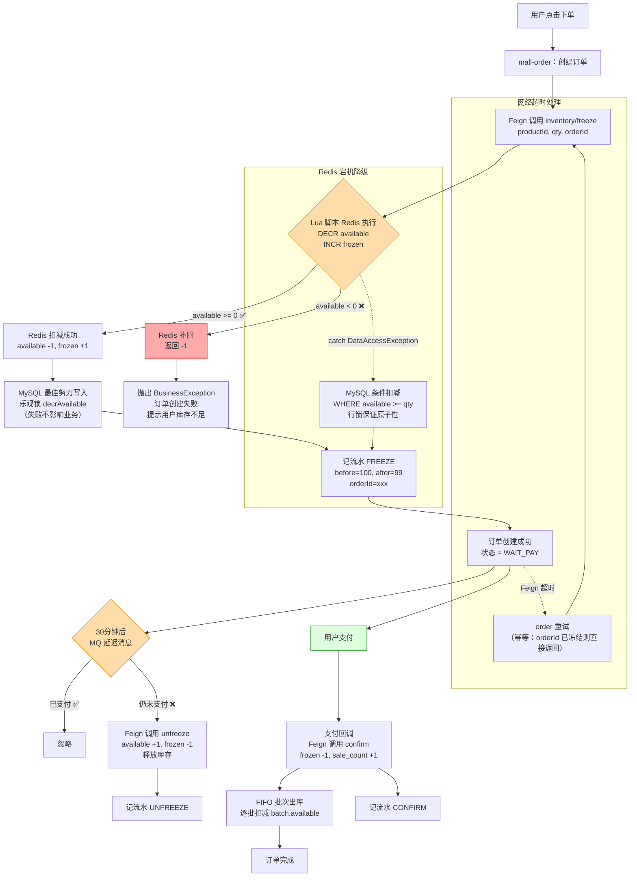

# 库存系统设计方案

## 背景

当前 `mall-product` 服务的 `product` 表同时承担了商品信息和库存数据，导致：

- 高频扣库存操作与低频商品编辑互相锁行
- 没有冻结库存机制，下单即扣 `remain_quantity`，未支付订单虚占库存
- 无库存流水，超卖或数据不一致时无法追溯
- 无法支撑高并发秒杀场景

目标：将库存拆为独立微服务，引入冻结-确认-释放三段式库存模型，配合 Redis 原子扣减 + Caffeine 本地缓存 + MQ 超时释放 + 定时对账兜底。

---

## 一、架构

### 1.1 微服务边界

```
┌──────────────────────────────────────────────────────────┐
│                      mall-order                          │
│  下单 → Feign 冻结 → 创建订单 → 支付回调 → 确认扣减       │
│  取消订单 → Feign 释放 → 超时 MQ 释放                    │
└───────────────────────┬──────────────────────────────────┘
                        │ POST /inventory/freeze
                        │ POST /inventory/confirm
                        │ POST /inventory/unfreeze
                        ▼
┌──────────────────────────────────────────────────────────┐
│                    mall-inventory（新增）                  │
│                                                          │
│  Redis DECR 原子扣减                                       │
│  Caffeine 本地缓存（热点商品 200ms TTL）                    │
│  批次追踪（FIFO出库）                                       │
│  定时对账兜底                                              │
│  库存变动流水                                              │
└───────────────────────┬──────────────────────────────────┘
                        │
                        ▼
┌──────────────────────────────────────────────────────────┐
│              cloud_mall_inventory（新库）                  │
│  inventory（库存主表）                                      │
│  inventory_batch（批次）                                   │
│  inventory_log（变动流水）                                  │
└──────────────────────────────────────────────────────────┘

┌──────────────────────────────────────────────────────────┐
│                    mall-product                            │
│  不再管理库存字段，只卖商品信息                             │
│  product 表的 quantity/remain_quantity/sale_count 保留     │
│  但管理端不再提供编辑入口，仅库存驱动的读取                  │
└──────────────────────────────────────────────────────────┘

┌──────────────────────────────────────────────────────────┐
│                    mall-admin-bff                          │
│  商品编辑页 → 不再显示库存字段                              │
│  引入库存管理页 → 调 inventory 的入库/盘点接口              │
└──────────────────────────────────────────────────────────┘
```

### 1.2 新增模块

| 模块 | 说明 | 脚手架 |
|------|------|--------|
| `mall-inventory` | 库存微服务，独立部署，单库 | 新建 |
| `mall-inventory-client` | Feign 接口 + DTO | 新建 |
| `cloud_mall_inventory` | 独立数据库，单库不分片 | 新建 |

### 1.3 表设计

库存服务共 3 张表，**不需要从 `cloud_mall_product` 迁移任何现有表**。`product` 表原有的 `quantity`、`remain_quantity`、`sale_count` 三个字段保留但不再提供管理端编辑入口，由库存服务接管。

```sql
-- 库存主表（一个 SKU 一条记录）
CREATE TABLE `inventory` (
    `id`            bigint       NOT NULL  PRIMARY KEY,
    `product_id`    bigint       NOT NULL  COMMENT '商品/SKU ID',
    `quantity`      int          NOT NULL  DEFAULT 0  COMMENT '总入库量',
    `frozen`        int          NOT NULL  DEFAULT 0  COMMENT '已冻结未支付',
    `available`     int          NOT NULL  DEFAULT 0  COMMENT '可用库存',
    `sale_count`    int          NOT NULL  DEFAULT 0  COMMENT '已售数量',
    `version`       int          NOT NULL  DEFAULT 0  COMMENT '乐观锁',
    `create_time`   datetime(3)  NOT NULL,
    `update_time`   datetime(3)  NOT NULL,
    UNIQUE KEY `uk_product_id` (`product_id`)
) ENGINE=InnoDB DEFAULT CHARSET=utf8mb4 COMMENT='商品库存';

-- 批次表（每批入库一条记录）
CREATE TABLE `inventory_batch` (
    `id`            bigint       NOT NULL  PRIMARY KEY,
    `product_id`    bigint       NOT NULL  COMMENT '商品/SKU ID',
    `batch_no`      varchar(64)  NOT NULL  COMMENT '批次号（如 PO20260701-001）',
    `quantity`      int          NOT NULL  COMMENT '这批入库总量',
    `available`     int          NOT NULL  COMMENT '这批剩余数量',
    `supplier`      varchar(128)          COMMENT '供应商',
    `purchase_price` decimal(10,2)        COMMENT '采购单价',
    `warehouse`     varchar(64)           COMMENT '仓库/库位',
    `inbound_time`  datetime(3)  NOT NULL COMMENT '入库时间',
    `expire_time`   datetime(3)           COMMENT '过期时间（保质期商品）',
    `status`        tinyint      NOT NULL  DEFAULT 1  COMMENT '1=正常 2=已出完 3=已报废',
    UNIQUE KEY `uk_batch_no` (`batch_no`),
    KEY `idx_product_id` (`product_id`),
    KEY `idx_inbound_time` (`inbound_time`),
    KEY `idx_expire_time` (`expire_time`)
) ENGINE=InnoDB DEFAULT CHARSET=utf8mb4 COMMENT='库存批次';

-- 库存变动流水
CREATE TABLE `inventory_log` (
    `id`            bigint       NOT NULL  PRIMARY KEY,
    `product_id`    bigint       NOT NULL  COMMENT '商品/SKU ID',
    `batch_id`      bigint                 COMMENT '关联批次ID（可为空）',
    `type`          varchar(32)  NOT NULL  COMMENT 'INBOUND/OUTBOUND/FREEZE/UNFREEZE/CONFIRM/RETURN/SCRAP',
    `quantity`      int          NOT NULL  COMMENT '变动数量',
    `before_val`    int          NOT NULL  COMMENT '变动前值',
    `after_val`     int          NOT NULL  COMMENT '变动后值',
    `order_id`      bigint                 COMMENT '关联订单ID',
    `remark`        varchar(255)           COMMENT '备注',
    `create_time`   datetime(3)  NOT NULL,
    INDEX `idx_product_id` (`product_id`),
    INDEX `idx_order_id` (`order_id`),
    INDEX `idx_batch_id` (`batch_id`),
    INDEX `idx_type` (`type`)
) ENGINE=InnoDB DEFAULT CHARSET=utf8mb4 COMMENT='库存变动流水';
```

**数据迁移（一次性）：**

```sql
INSERT INTO inventory (product_id, quantity, frozen, available, sale_count)
SELECT id, quantity, 0, remain_quantity, sale_count
FROM product
WHERE is_del = 0;
```

```sql
-- 库存表（每个商品一条记录）
CREATE TABLE `inventory` (
    `id`            bigint       NOT NULL  PRIMARY KEY,
    `product_id`    bigint       NOT NULL  COMMENT '商品ID',
    `quantity`      int          NOT NULL  DEFAULT 0  COMMENT '总入库量',
    `frozen`        int          NOT NULL  DEFAULT 0  COMMENT '已冻结未支付',
    `available`     int          NOT NULL  DEFAULT 0  COMMENT '可用库存',
    `sale_count`    int          NOT NULL  DEFAULT 0  COMMENT '已售数量',
    `version`       int          NOT NULL  DEFAULT 0  COMMENT '乐观锁',
    `create_time`   datetime(3)  NOT NULL,
    `update_time`   datetime(3)  NOT NULL,
    UNIQUE KEY `uk_product_id` (`product_id`)
) ENGINE=InnoDB DEFAULT CHARSET=utf8mb4 COMMENT='商品库存';

-- 库存变动流水
CREATE TABLE `inventory_log` (
    `id`            bigint       NOT NULL  PRIMARY KEY,
    `product_id`    bigint       NOT NULL  COMMENT '商品ID',
    `type`          varchar(32)  NOT NULL  COMMENT 'INBOUND/OUTBOUND/FREEZE/UNFREEZE/CONFIRM/RETURN',
    `quantity`      int          NOT NULL  COMMENT '变动数量',
    `before_val`    int          NOT NULL  COMMENT '变动前值',
    `after_val`     int          NOT NULL  COMMENT '变动后值',
    `order_id`      bigint                 COMMENT '关联订单ID',
    `remark`        varchar(255)           COMMENT '备注',
    `create_time`   datetime(3)  NOT NULL,
    INDEX `idx_product_id` (`product_id`),
    INDEX `idx_order_id` (`order_id`),
    INDEX `idx_type` (`type`)
) ENGINE=InnoDB DEFAULT CHARSET=utf8mb4 COMMENT='库存变动流水';
```

### 1.4 Redis Key 设计

| Key | 类型 | 用途 |
|-----|------|------|
| `inv:available:{productId}` | String | 可用库存，DECR/INCR |
| `inv:frozen:{productId}` | String | 冻结库存 |
| `inv:hot:{productId}` | String | 热点标记（用于本地缓存） |

库存数据量小（单库单表），Redis 直接单 Key，不分片。

### 1.5 批次策略（FIFO）

出库时按**先进先出**（FIFO）原则从各批次扣减：

```
入库批次：
  batch_no=PO20260701-001  500件  available=500  ← 先入
  batch_no=PO20260715-002  300件  available=300  ← 后入

出库 400 件：
  → 先从 batch001 扣 400（available 500→100）
  → 如果 batch001 不够，再从 batch002 扣剩余部分
```

FIFO 由 Service 层控制，Redis 只维护总数，批次细节写 MySQL。

---

## 二、核心流程

### 2.1 下单冻结

```
┌──────────────────────────────────────────────────┐
│                  下单请求                          │
│  mall-order                                       │
└──────────────────────┬───────────────────────────┘
                       │
                       ▼
            ┌──────────────────────┐
            │  1. Redis DECR       │
            │     inv:available    │
            │     原子扣减可用库存  │
            └──────────┬───────────┘
                       │ 结果 < 0
                       ▼ 补回 + 返回库存不足
                       │ 结果 ≥ 0
                       ▼
            ┌──────────────────────┐
            │  2. Redis INCR       │
            │     inv:frozen       │
            │     增加冻结库存      │
            └──────────┬───────────┘
                       │
                       ▼
            ┌──────────────────────┐
            │  3. 写 inventory_log  │
            │     type=FREEZE       │
            └──────────┬───────────┘
                       │
                       ▼
            ┌──────────────────────┐
            │  4. 发 MQ 延迟消息     │
            │     30分钟超时释放     │
            └──────────┬───────────┘
                       │
                       ▼
            ┌──────────────────────┐
            │  5. 返回冻结成功      │
            │     订单=WAIT_PAY    │
            └──────────────────────┘
```

### 2.2 支付确认扣减

```
┌──────────────────────────────────────────────────┐
│                  支付回调                          │
│  mall-order                                       │
│  └─ 更新订单为 PAID                                │
└──────────────────────┬───────────────────────────┘
                       │ POST /inventory/confirm
                       ▼
            ┌──────────────────────┐
            │  1. Redis DECR       │
            │     inv:frozen       │
            └──────────┬───────────┘
                       │
                       ▼
            ┌──────────────────────┐
            │  2. 写 inventory_log  │
            │     type=CONFIRM     │
            └──────────────────────┘
```

### 2.3 超时释放（MQ 消费者）

```
┌──────────────────────────────────────────────────┐
│             MQ 延迟消息 30分钟到期                  │
└──────────────────────┬───────────────────────────┘
                       │
                       ▼
            ┌──────────────────────┐
            │  查订单状态           │
            │  已支付？→ 忽略       │
            │  未支付？→ 继续释放   │
            └──────────┬───────────┘
                       ▼
            ┌──────────────────────┐
            │  1. Redis INCR       │
            │     inv:available    │
            │  2. Redis DECR       │
            │     inv:frozen       │
            └──────────┬───────────┘
                       │
                       ▼
            ┌──────────────────────┐
            │  3. 写 inventory_log  │
            │     type=UNFREEZE    │
            └──────────────────────┘
```

### 2.4 取消/退货/入库

| 场景 | 操作 | Redis | 流水类型 | 批次 |
|------|------|-------|---------|:----:|
| 取消订单（未支付） | 释放冻结 | INCR available, DECR frozen | UNFREEZE | 不涉及 |
| 取消订单（已支付） | 全额回库 | INCR available, INCR quantity | REFUND | 回原批次 |
| 售后退货 | 回库 | INCR available, INCR quantity | RETURN | 回原批次 |
| 采购入库 | 新增批次 + 增加总数 | INCR available, INCR quantity | INBOUND | 新建批次 |

### 2.5 入库流程（含批次）

```
仓库入库
    │
    ▼
mall-inventory
    │
    ├─ 1. 创建批次记录 inventory_batch
    │      batch_no = PO{日期}-{序号}
    │      quantity = 500
    │      available = 500
    │      supplier = 供应商名称
    │      inbound_time = now()
    │
    ├─ 2. 更新 inventory 主表
    │      quantity +500
    │      available +500
    │
    ├─ 3. Redis INCR inv:available:{productId} 500
    │
    └─ 4. 记录流水 inventory_log（type=INBOUND, batch_id=batch.id）

### 2.6 出库扣减（FIFO）

```
确认扣减时（支付成功）：
    │
    ▼
    1. 查询 inventory_batch
       WHERE product_id = ? AND available > 0
       ORDER BY inbound_time ASC
       （先进先出）
    
    2. 逐批扣减
       第1批：available 500 → 需扣300 → available=200 ✓
       第2批：available 300 → 需扣300 → available=0 ✓
       （标记该批已出完 status=2）
    
    3. 更新 inventory 主表
       sale_count +600
    
    4. 记流水（含 batch_id）
```

---

## 三、缓存架构

### 3.1 三层降级

```
请求
  │
  ▼
┌──────────────┐   命中    ┌──────────────────┐
│ Caffeine     │ ───────→ │ 直接返回          │
│ 本地缓存      │          │（200ms TTL）       │
│ 仅热点商品    │          └──────────────────┘
└──────┬───────┘
       │ 未命中
       ▼
┌──────────────┐   命中    ┌──────────────────┐
│ Redis        │ ───────→ │ 原子 DECR 扣减    │
│ inv:available │          │ 回写本地缓存       │
│ 可选 1024 分片 │          └──────────────────┘
└──────┬───────┘
       │ Redis 不可用
       ▼
┌──────────────┐
│ MySQL 兜底    │
│ 乐观锁扣减    │
│ 性能下降      │
│ 功能正常      │
└──────────────┘
```

### 3.2 热点识别

```java
// 自动识别热点商品：最近 5 分钟请求量 TOP 100
// 命中热点的商品启用本地缓存 + Redis 分片
// 冷门商品直接走 Redis 单 Key，不浪费本地内存
```

---

## 四、对账与兜底

### 4.1 定时回写（每分钟）

```
扫描 Redis 所有 inventory Key
  ├─ SUM 各分片值
  ├─ 对比 MySQL available 字段
  │   ├─ 一致 → 跳过
  │   └─ 不一致 → 以 Redis 为准更新 MySQL
  └─ 超过阈值差异 → 告警
```

### 4.2 MQ 丢失兜底（每小时）

```
SELECT FROM inventory
WHERE frozen > 0
  AND frozen 超过 1 小时未变动
  且关联订单已取消 / 已支付

→ 补释放或补确认
```

### 4.3 初始化（服务启动）

```
服务启动时：
  SELECT product_id, available, frozen, quantity, sale_count
  FROM inventory
  → 写入 Redis
  → 加载热点商品到本地缓存
```

---

## 五、Feign 接口（mall-inventory-client）

```java
@FeignClient("mall-inventory")
public interface InventoryFeignClient {

    /** 冻结库存（下单时调用） */
    @PostMapping("/v1/inventory/freeze")
    RowsDTO freeze(@Valid @RequestBody InventoryFreezeDTO dto);

    /** 确认扣减（支付回调时调用） */
    @PostMapping("/v1/inventory/confirm")
    RowsDTO confirm(@Valid @RequestBody InventoryConfirmDTO dto);

    /** 释放冻结（取消订单时调用） */
    @PostMapping("/v1/inventory/unfreeze")
    RowsDTO unfreeze(@Valid @RequestBody InventoryUnfreezeDTO dto);

    /** 回库（退货完成时调用） */
    @PostMapping("/v1/inventory/return")
    RowsDTO returnStock(@Valid @RequestBody InventoryReturnDTO dto);

    /** 入库（采购/调拨） */
    @PostMapping("/v1/inventory/inbound")
    RowsDTO inbound(@Valid @RequestBody InventoryInboundDTO dto);

    /** 查询库存 */
    @GetMapping("/v1/inventory/{productId}")
    InventoryDTO getByProductId(@PathVariable Long productId);

    /** 批量查询库存 */
    @PostMapping("/v1/inventory/batch")
    List<InventoryDTO> getByProductIds(@RequestBody List<Long> productIds);
}
```

---

## 六、影响范围

| 模块 | 改动 |
|------|------|
| **新建 `mall-inventory`** | 库存服务 + 数据库 |
| **新建 `mall-inventory-client`** | Feign 接口 + DTO |
| **`mall-order`** | `reduceStock()` → 改为调用 inventory 冻结/确认/释放 |
| **`mall-product`** | 管理端不再编辑库存字段，保留读取 |
| **`mall-admin-bff`** | 商品编辑页移除库存字段，新增库存管理页 |
| **`mall-admin`** | 不变 |

---

## 八、订单→库存完整链路流程图



| 步骤 | 内容 | 预估 |
|:----:|------|:----:|
| 1 | 新建 mall-inventory + mall-inventory-client 模块脚手架 | 0.5天 |
| 2 | 建表 + MyBatis + Redis 配置 | 0.5天 |
| 3 | 核心冻结/确认/释放/入库接口+Service | 1天 |
| 4 | Caffeine 本地缓存 + Redis 分片 + 热点识别 | 1天 |
| 5 | MQ 延迟消息超时释放 | 0.5天 |
| 6 | 定时对账 + 兜底 | 0.5天 |
| 7 | mall-order 接入库存 Feign | 0.5天 |
| 8 | mall-product 清理库存字段编辑入口 | 0.5天 |
| 9 | BFF 商品编辑页调整 | 0.5天 |
| 10 | 联调 + 测试 | 1天 |
| | **总计** | **~6.5天** |
