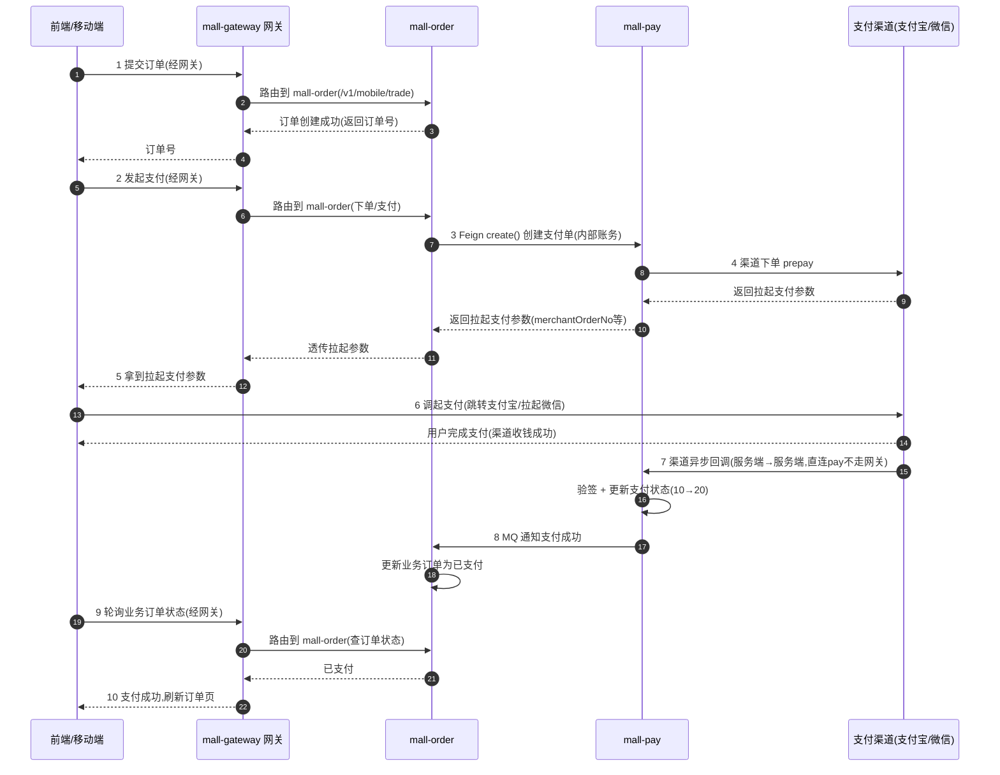

# 支付系统新手引导：从零看懂支付全流程与字段设计

> 本文档写给**从未接触过支付系统或聚合网关**的开发者。目标：读完能从容看懂 `mall-pay` 的代码、数据库、对账任务，知道每个环节发生了什么、每个字段为什么存在、每个渠道返回了什么。
>
> 配合阅读：`docs/37`（表结构定稿）、`docs/38`（代码结构）。本文不重复讲表怎么建，而是讲**流程怎么走、数据怎么流、字段有什么用**。

---

## 〇、先建立一个心智模型

支付系统本质就一句话：**把"用户的钱"变成"商家的钱"，并且让两边都能对上账。**

```
用户（C端） ──钱──► 支付渠道（支付宝/微信） ──钱──► 商家（我们）
                      │
                      │ 告诉两边"这笔钱成功了"
                      ▼
              我方支付服务（记录每一笔钱的来龙去脉）
```

支付系统做三件事：

1. **发起**：让渠道生成一笔待支付的交易（下单）
2. **确认**：渠道通知我们"用户付钱了"（回调）
3. **对账**：每天把渠道的记录和我们的记录对一遍，发现丢钱/多钱

下面的章节按这三件事展开。

---

## 一、支付总体流程（发起 → 确认 → 通知）

### 1.1 全景时序（含移动端/前端交互）

> 注意这里一共有**五个角色**：前端/移动端、网关（`mall-gateway`）、`mall-order`、`mall-pay`、支付渠道。**移动端 C 端请求先打网关**，网关路由到对应业务服务（`/v1/mobile/**` → 业务服务），**不经过 BFF**（BFF 只服务管理端 admin）。



> **⚠️ 支付链路没有 BFF 参与——这是本架构的关键原则。**
>
> **BFF（`mall-*-bff`）只服务管理端（admin）**，做多服务数据聚合；**移动端 C 端直接走各业务服务的 `/v1/mobile/*` 接口**（如 mall-order 的 `OrderController`），**不经过 BFF**。所以前端支付全程链路是 `前端 → 网关 → mall-order → mall-pay → 渠道`，**没有任何 BFF 节点**。
>
> 同时：前端**全程只感知业务订单**（我的订单付款了没、发货了没），**永远不直接查 `payOrderNo`/支付单**。`pay_order` 是**商户侧账务**，给对账、财务用的；C 端用户查自己的支付流水，直接在**支付宝/微信 App** 里看（用户与第三方之间的账），不需要我方暴露。`pay_order` 的查询接口只对 mall-order（Feign）和管理端开放。

> **网关角色说明**：前端**所有请求都先打 `mall-gateway`**，网关按路由转发到对应业务服务（如 `/v1/mobile/**` → `lb://mall-order`）。**唯一例外是渠道回调（第 7 步）**——渠道的 notify 直连 mall-pay（网关放行该路径），因为它是外部系统的服务端通知，不是前端请求。

**新手最容易困惑的点：第 7 步和第 9 步的关系。**

支付结果有**两条完全不同的通知通道**，新手必须分清：

| 通道 | 谁 → 谁 | 何时发生 | 前端能看到吗 |
|------|---------|---------|:---:|
| **渠道回调（第 7 步）** | 渠道 → mall-pay（服务端到服务端，直连不走网关） | 用户付完，渠道主动 POST 到 mall-pay | ❌ 前端看不到 |
| **前端轮询（第 9 步）** | 前端 → 网关 → mall-order | 用户付完，前端隔 2~3 秒轮询**业务订单状态** | ✅ 前端感知支付成功的方式（经订单状态间接感知） |

- 渠道回调是**服务端内部**的事，前端全程看不到——所以前端**不能等回调**，只能靠轮询
- mall-pay 收到回调后更新支付单 + MQ 通知 mall-order，mall-order 更新业务订单状态，**前端下一次轮询订单状态就查到"已支付"**
- 轮询超时（如 30 秒）还没查到 → 前端提示"支付结果确认中"，后台靠**主动查单**（见 1.4）兜底，不会卡死

**为什么前端发起支付要绕一圈（前端→网关→订单→支付→渠道）而不是直接调支付？**

因为**拉起支付需要的是"已经创建好的支付单 + 渠道返回的拉起参数"**。这笔支付单必须是 `mall-order` 的业务订单驱动创建的（订单先存在，才谈得上为它付钱），所以流程是：订单服务调支付服务创建支付单 → 支付服务去渠道下单拿拉起参数 → 一路透传回前端。前端只拿到最终结果（拉起支付参数），**不需要知道 `payOrderNo`、更不需要理解支付单**。而**前端到业务服务这一段所有请求都强制走网关**——这是本项目的架构约定（鉴权、路由、限流都在网关层统一做）。

### 1.2 第 1~2 步：下单 → 创建支付单

**发生了**：用户确认订单，mall-order 调 `PayFeignClient.create()` 让 mall-pay 创建一笔支付单。

**关键点**：支付单和业务订单是**两码事**。用户买了 3 件商品是一个"订单"（mall-order 管的），但对应的是 mall-pay 里的一条"支付单"（只管这次付了多少钱、用什么渠道付）。

**这一步在 `pay_order` 表写入的核心字段**：

| 字段 | 值 | 为什么存在 |
|------|-----|-----------|
| `pay_order_no` | 雪花ID（如 `1723000000000000001`） | 我方支付单的唯一编号，对外暴露给前端/业务方查 |
| `biz_order_no` | `TC202408010001` | **业务方订单号**——把支付单绑回 mall-order 的订单，日后追溯"这笔钱对应哪笔订单" |
| `biz_type` | `MALL_ORDER` | 区分业务方（商城/充值/订阅）。因为支付服务要被多个项目复用，用这个字段分账 |
| `channel_code` | `ALIPAY` / `WECHAT_MINI` | 用户选了哪个渠道付款 |
| `merchant_order_no` | 雪花派生（如 `M1723000000000001`） | **提交给渠道的订单号**。支付宝/微信要求商户订单号格式受限（微信 6-32 位字母数字），所以单独生成一个，渠道侧靠它识别这笔交易 |
| `user_id` | `10086` | 谁付的钱 |
| `total_amount` | `39900` | 应付金额（分） |
| `pay_amount` | `39900` | 实付金额（分）。初始=total，但渠道可能有优惠导致实付≠应付，回调时回填真实值 |
| `pay_status` | `10`（待支付） | 一开始都是待支付 |
| `expire_time` | 30分钟后 | 支付超时关闭的期限 |
| `channel_code` 等 | — | 其余字段初始为空，等回调回填 |

### 1.3 第 3 步：渠道下单（prepay）

**发生了**：mall-pay 把支付单信息提交给渠道，渠道返回"拉起支付"的参数。

**这是第一次接触"渠道返回的字段"，看两个渠道各返回什么：**

**支付宝**（`alipay.trade.app.pay`）返回的是一个**字符串 `orderStr`**——前端把它交给支付宝 SDK 就能拉起支付。它长这样：

```json
{
  "app_id": "20210011...",
  "method": "alipay.trade.app.pay",
  "biz_content": "{\"body\":\"...\",\"subject\":\"商城订单\",\"out_trade_no\":\"M1723...\",\"total_amount\":\"399.00\"}",
  "sign": "base64签名串...",
  "sign_type": "RSA2",
  "timestamp": "2026-08-03 10:00:00"
}
```

| 字段 | 作用 |
|------|------|
| `biz_content.out_trade_no` | **就是我们的 `merchant_order_no`**——支付宝侧记录的订单号 |
| `biz_content.total_amount` | 金额，注意支付宝是**元**（`399.00`），我们库里存的是分（`39900`），提交时除 100 |
| `sign` | 我方私钥签名——支付宝验签确认这单是我们发的 |
| `biz_content.subject` | 商品描述，用户付款时看到的 |

**微信**（`POST /v3/pay/transactions/jsapi`）返回的是一个 **`prepay_id`**，前端拿到后用 `prepay_id` + 再签一次名去调 `wx.requestPayment`：

```json
{ "prepay_id": "wx2610000000000000000000000000000000" }
```

| 字段 | 作用 |
|------|------|
| `prepay_id` | **微信预支付会话标识**，前端拉起支付必需；有效期 2 小时 |

**关键点**：`merchant_order_no` 是连接三方的**钥匙**——
- 我方 `pay_order` 表存了它
- 渠道账单/回调里带的 `out_trade_no`（支付宝）/`out_trade_no`（微信）就是它
- 对账时靠它匹配"渠道这笔"和"我方这笔"

### 1.4 第 5~6 步：用户支付 → 渠道异步回调

**发生了**：用户付完钱，支付宝/微信**异步通知**我们的回调地址（`/notify/alipay`、`/notify/wechat`）。渠道**不保证回调必达**，可能延迟几秒到几分钟，所以有主动查单兜底。

> **⚠️ 前端视角：回调对前端不可见。** 用户付完钱，前端能看到的只是"支付宝/微信告诉我支付成功"（SDK 的返回值），但**这个结果前端不能信任、也不能当最终状态**。前端必须隔几秒轮询一次 mall-order 的业务订单状态接口（`/v1/mobile/trade/...`，经网关），**轮询到订单状态变为"已支付"** 才刷新页面。
>
> 时序上：渠道回调（第 7 步）和前端轮询（第 9 步）是**并行的两条路**——回调是服务端之间的真相来源，轮询是前端感知真相的方式。前端轮询到订单状态变为"已支付"，说明 mall-pay 已经收到并处理了回调（或主动查单确认了）、并已 MQ 通知 mall-order 更新了订单状态。

**支付宝回调报文**（POST 到 notify_url）：

```json
{
  "out_trade_no": "M1723...",     // 商户订单号 = 我们的 merchant_order_no
  "trade_no": "202608032200...",  // 支付宝交易号（渠道侧唯一）
  "total_amount": "399.00",
  "receipt_amount": "399.00",     // 实际收款金额
  "trade_status": "TRADE_SUCCESS",// 交易状态
  "seller_id": "2088...",
  "notify_time": "2026-08-03 10:00:05"
}
```

**微信回调报文**（加密，需要解密）：

```json
{
  "out_trade_no": "M1723...",
  "transaction_id": "4200002...", // 微信支付订单号
  "trade_type": "JSAPI",
  "trade_state": "SUCCESS",
  "success_time": "2026-08-03T10:00:05+08:00",
  "amount": { "total": 39900, "payer_total": 39900, "currency": "CNY" }
}
```

**这一步我方要做的事（关键安全点）**：

| 动作 | 为什么 |
|------|--------|
| **验签** | 确认回调真的是支付宝/微信发的，不是伪造的。验签失败直接返回失败给渠道，渠道会重试 |
| **查幂等** | 渠道可能重复回调（网络重试），用 `merchant_order_no` 查 `pay_order`，已支付就标记"重复通知忽略" |
| **防重放** | 校验 `timestamp` 窗口 + `nonce` 去重，防止恶意重放历史报文 |
| **乐观锁更新** | `UPDATE ... WHERE version=? AND pay_status=10`，并发回调只有一条能成功 |

**回调后 `pay_order` 表回填的字段**：

| 字段 | 回填值 | 作用 |
|------|--------|------|
| `channel_trade_no` | 支付宝 `trade_no` / 微信 `transaction_id` | 渠道侧的交易号，对账时和渠道对账单上的"交易号"匹配 |
| `pay_status` | `20`（已支付） | 状态机流转 |
| `pay_amount` | 渠道实收（分） | 真实支付金额，可能 ≠ total_amount（渠道优惠） |
| `success_time` | 回调时间 | **对账窗口的锚点**——对账按它查"哪些单是这一天成功的" |
| `notify_count` / `notify_time` | 累加 | 记录回调次数，排查重复/延迟 |

### 1.5 第 7~8 步：通知业务方

**发生了**：支付单已确认成功，接下来要告诉 mall-order "你的订单用户付钱了"。

**关键设计**：不直接调 mall-order 的接口，而是**发 MQ 消息**（RocketMQ）。因为：
- 支付服务是叶子服务，不该反向依赖业务方（消除循环依赖）
- 业务方可能不止一个（商城/充值/订阅），各自消费自己的 Topic

**MQ 消息体 `PayNotifyMessage`**：

```json
{
  "payOrderNo": "1723000000000000001",
  "merchantOrderNo": "M1723...",
  "bizOrderNo": "TC202408010001",
  "bizType": "MALL_ORDER",
  "payAmount": 39900,
  "payStatus": 20,
  "channelCode": "ALIPAY",
  "successTime": "2026-08-03T10:00:05"
}
```

`pay_order.biz_notify_status` 字段跟踪通知状态：发送成功 → `1`；发送失败 → `2`，定时重推（1min/5min/15min/1h，最多 5 次）。

**mall-order 消费 MQ 后**：更新业务订单为已支付 → 扣减冻结库存。这就是**最终一致性**——不是强事务，靠消息 + 重推 + 对账兜底。

### 1.6 退款流程（简）

用户退货 → mall-order 调 `PayFeignClient.refund()` → mall-pay：

1. **审核判定**：按 `biz_order_no + user_id` 查 `pay_order`，**查得到 → 自动退款**；查不到 → 人工审核（防伪造退款）
2. 创建 `pay_refund` 记录
3. 调渠道退款接口，返回渠道退款单号 `channel_refund_no`
4. 回调/查单确认退款成功 → 更新 `pay_refund.refund_status` + 回填 `pay_order.refund_amount`（累计已退）
5. MQ 通知 mall-order 退款结果

**`pay_refund` 表的字段为什么这样设计**：

| 字段 | 作用 |
|------|------|
| `refund_no` | 我方退款单号（雪花），渠道退款单号 `channel_refund_no` 与之对应 |
| `refund_amount` / `refund_fee` | 退了多少 / 渠道扣了多少手续费（微信退款等比例退手续费，对账要用） |
| `audit_status` | 审核状态（自动=0 或人工审核流程） |
| `refund_status` | 退款单状态机（待处理→处理中→成功/失败） |
| `user_id` / `biz_order_no` / `biz_type` | **冗余自 pay_order**，让退款单能独立按用户/订单追溯，财务对得上 |
| `pay_order_id` / `pay_order_no` | 直连那笔支付单 |

**防超退的关键约束**：`已退金额 + 本次退款 ≤ pay_amount`，用乐观锁保证并发退款不会退超。

---

### 1.7 状态流转速查（业务订单 × 支付单）

> 新手最容易搞混：**业务订单状态和支付单状态是两张表、两套状态机**。
> - 业务订单管"交易履约"：已下单 → 已支付 → 已发货 → 已完成（`OrderStatusEnum`）
> - 支付单只管"收钱"：待支付 → 已支付 / 已关闭 / 支付失败（`pay_status`）
> 支付完成后业务订单继续走履约流程，支付单则到了终态（退款另走 `refund_status`）。

| 用户场景 | 业务订单 | 支付单 | 通俗解释 |
|---------|:---:|:---:|------|
| 下单成功 | 已下单(1) | 待支付(10) | 订单建好了，等你付钱 |
| 支付成功 | 已支付(2) | 已支付(20) | 钱收到，订单进入履约 |
| 中途打断（返回手势/杀进程） | 已下单(1) | 待支付(10) | 没付完，还能继续付 |
| 主动取消 / 订单超时 | 已取消(5) | 已关闭(30) | 你不付了，单子作废 |
| 支付单超时 | 已下单(1) | 已关闭(30) | 超时没付，自动关单，可重发 |
| **资金不足 / 风控拦截** | 已下单(1) | **支付失败(40)** | **你试了但没付成** |

> ⚠️ **新手必看：`已关闭(30)` vs `支付失败(40)` 的区别**
> - **已关闭** = 你**主动不付**（取消/返回）或**超时**——"不付了"
> - **支付失败** = 渠道**拒绝**（余额不足/风控）——"试了但没付成"
> 所以余额不足**不能**标成已关闭，要标 `40 支付失败`，业务订单保持已下单(1) 可重新发起。前端提示也完全不同："已取消" vs "支付失败，请重试"。

---

## 二、加密与签名机制（安全基石）

> 支付安全全靠**非对称加密（RSA）+ 签名（SHA256withRSA）+ 对称加密（AES）**配合。新手必须分清：**"我方签发给渠道"用我方私钥，"验渠道发来的"用渠道公钥/证书**。下面按两个渠道、四个安全环节讲清楚。

### 2.1 密钥体系总览

每个商户/应用有两对 RSA 密钥 + 一组对称密钥：

```
我方（商户）                          支付宝/微信（渠道）
┌──────────────────┐                ┌──────────────────┐
│ 商户私钥 ──签名──► │   ──请求──►   │ 渠道公钥/证书 ──验签│
│ 商户公钥 ◄──验签── │   ◄──响应/回调─ │ 渠道私钥/证书 ──签名│
└──────────────────┘                └──────────────────┘
```

| 密钥 | 谁持有 | 用途 |
|------|--------|------|
| **我方私钥** | 我们（`pay_channel_config.private_key`，AES 加密存储） | 给渠道的请求签名 |
| **我方公钥** | 支付宝/微信 | 渠道侧验我们的请求 |
| **渠道公钥/平台证书** | 我们（`pay_channel_config.public_key`） | 我们验渠道的响应/回调 |
| **渠道私钥** | 渠道 | 渠道给它发出的响应/回调签名 |
| **APIv3 密钥 / AES 密钥** | 双方约定（微信 `APIv3密钥`，32字节） | 微信回调报文 AES-256-GCM 解密 |

### 2.2 支付宝的加密/签名

| 环节 | 算法 | 细节 |
|------|------|------|
| **我方请求签名** | `RSA2`（= SHA256withRSA） | 待签名字符串 = 所有请求参数按 key 字典序拼接 `k=v&k2=v2`（不含 `sign` 本身）→ 我方**私钥**签名 → Base64 → 放 `sign` 字段 |
| **渠道回调验签** | `RSA2`（SHA256withRSA） | 支付宝异步通知的所有参数（不含 `sign`、`sign_type`）按 key 字典序拼接 → 用**支付宝公钥**验签 → 通过才处理 |
| **金额单位** | 元（`"399.00"` 字符串） | 提交时我方 分÷100 → 元 |
| **接入模式** | 公钥模式 / 公钥证书模式 | 公钥模式：配置支付宝公钥字符串；证书模式：配置应用公钥证书 + 支付宝公钥证书（更安全，证书可验证） |

**支付宝下单请求（我方签名后发给渠道）关键字段**：

```json
{
  "app_id": "20210011...",
  "method": "alipay.trade.app.pay",
  "biz_content": "{...}",
  "sign_type": "RSA2",
  "timestamp": "2026-08-03 10:00:00",
  "sign": "我方私钥签名(RSA2)"
}
```

**支付宝回调验签流程**：
1. 支付宝 POST 异步通知到 `/notify/alipay`，带全部业务参数 + `sign`
2. 我方把除 `sign`/`sign_type` 外的参数按 key 排序拼接 → 用**支付宝公钥**验签
3. 验签通过 + `trade_status=TRADE_SUCCESS` → 更新支付状态
4. 返回 `success` 给支付宝（否则支付宝会重试）

> ⚠️ 支付宝 SDK（`alipay-sdk-java`）的 `AlipayClient.execute()` / `alipayClient.verify()` 已封装签名/验签，**实现时直接调 SDK 方法**，不用手写拼接。但理解规则便于排查"验签失败"。

### 2.3 微信支付（APIv3）的加密/签名

| 环节 | 算法 | 细节 |
|------|------|------|
| **我方请求签名** | `SHA256-RSA2048`（= SHA256withRSA） | 签名串 5 行：`HTTP方法\nURL\n时间戳\n随机串\n请求体` → 我方**商户私钥**（apiclient_key.pem）签名 → Base64 → 放 `Authorization: WECHATPAY2-SHA256-RSA2048 mchid=...&nonce_str=...&signature=...&timestamp=...&serial_no=...` |
| **渠道响应/回调验签** | `SHA256-RSA2048` | 验签串 3 行：`应答时间戳\n应答随机串\n应答报文` → 用**微信支付平台证书**（公钥）验签。⚠️ **不能用商户 API 证书**，要用平台证书 |
| **回调报文解密** | `AES-256-GCM` | 回调 body 的 `resource` 是密文：`algorithm=AEAD_AES_256_GCM`、`ciphertext`、`nonce`、`associated_data` → 用 **APIv3 密钥**（32 字节，商户平台设置）解密 |
| **平台证书获取** | — | 通过「下载平台证书」接口拿密文 → 用 APIv3 密钥解密得到平台证书明文 → 保存 PEM，**定期轮换**（证书有有效期） |

**微信请求签名串（5 行）示例**：

```
POST
/v3/pay/transactions/jsapi
1724062075
614275b63d789bd3a7a472c63d809552
{"amount":{"total":39900},"appid":"wx...","mchid":"190000...","description":"...","out_trade_no":"M1723...","notify_url":"https://...","payer":{"openid":"oXk9zTv..."}}
```

**微信回调报文（加密后）**：

```json
{
  "id": "da2b8a7f-...",
  "event_type": "TRANSACTION.SUCCESS",
  "resource_type": "encrypt-resource",
  "resource": {
    "algorithm": "AEAD_AES_256_GCM",
    "ciphertext": "Zkwzt1znCk78U2/x...",
    "associated_data": "transaction",
    "nonce": "Oiyu5riw0HOJ"
  }
}
```

**微信回调处理流程（比支付宝多一步解密）**：
1. 检查请求头 `Wechatpay-Serial` 是否与持有平台证书序列号一致（不一致先重新拉证书）
2. 用平台证书验签（验签串 3 行 + `Wechatpay-Signature` 头）
3. 用 **APIv3 密钥** AES-256-GCM 解密 `resource` → 得到明文交易信息
4. `out_trade_no` 定位支付单 → 更新状态
5. 返回 `200` + 明文 `{"code":"SUCCESS"}`（否则微信重试）

> ⚠️ 微信 SDK（`wechatpay-java`）的 `RSAAutoSignedClient` / `NotificationParser` 已封装签名/验签/解密，**实现时用 SDK 的配置类**（商户私钥、商户证书序列号、APIv3 密钥、平台证书），不用手写。

### 2.4 我方内部的数据安全（非渠道侧）

| 环节 | 方案 |
|------|------|
| **渠道密钥存储** | `pay_channel_config` 的 `app_secret`/`private_key`/`public_key` **AES 加密落库**（`mall.pay.crypto.secret-key`，32 字节），运行时解密使用 |
| **回调防重放** | `timestamp` 窗口（默认 300 秒）+ `nonce` Redis 去重（TTL 300 秒）——微信的 `Wechatpay-Nonce`、支付宝的 `timestamp` 都可校验 |
| **回调来源** | 可选 IP 白名单（`mall.pay.notify.ip-whitelist`），prod 建议配置渠道服务器 IP 段 |
| **业务方验签** | `pay_biz_config.sign_key` 预留——若业务方需要回调验签，用该密钥（AES 存储） |

### 2.5 加密/签名位置速查表

| 场景 | 签名/加密 | 用谁的密钥 | 文档依据 |
|------|-----------|-----------|---------|
| 我方调支付宝（下单/退款/查询） | RSA2 签名 | 我方私钥 | 支付宝 `sign`/`sign_type=RSA2` |
| 支付宝回调验签 | RSA2 验签 | 支付宝公钥 | `alipay.trade.app.pay` 异步通知 |
| 我方调微信（下单/退款/查询） | SHA256withRSA 签名 | 我方商户私钥 | APIv3 签名串 5 行 |
| 微信响应/回调验签 | SHA256withRSA 验签 | 微信平台证书 | APIv3 验签串 3 行 |
| 微信回调解密 | AES-256-GCM | APIv3 密钥 | `AEAD_AES_256_GCM` |
| 我方密钥落库 | AES-256 | `mall.pay.crypto.secret-key` | 我方设计 |
| 回调防重放 | timestamp + nonce | — | 我方设计 |

---

## 三、对账总体流程（每天对一遍账）

### 3.1 为什么需要对账

**渠道回调可能丢、消息可能丢、业务方可能漏处理**。这些"漏"不会自己暴露，必须每天拿渠道的官方记录和我们自己的记录对一遍，找出差异。

对账的**黄金输入**：支付宝/微信每天生成**前一天的交易账单**（CSV 文件），只包含**交易成功的记录**（支付 + 退款）。

### 3.2 全景时序

```
定时任务（次日 10:30）
  │
  ▼
1. 下载对账单    渠道的 CSV 文件 → 存 MinIO
  │
  ▼
2. 解析入库      解析 CSV → 逐行写入 recon_temp 临时表
  │
  ▼
3. 总额校验      渠道账单总金额 vs 我方 pay_order 总金额
  │              ┌─ 相等 → 对平，结束 ✅
  │              └─ 不等 → 进入逐笔对比
  │
  ▼
4. 逐笔对比      recon_temp 每一行 vs pay_order（内存撮合，不 JOIN）
  │
  ▼
5. 差异处置      差异写 recon_result，自动兜底 or 人工介入
```

### 3.3 渠道对账单长什么样（重点）

**这是新手最陌生的部分——渠道对账单的字段。** 两个渠道略有不同：

**支付宝业务账单**（`bill_type=trade`，CSV 打包成 zip）：

| 字段（示例） | 作用 | 对应我方 |
|-------------|------|---------|
| 商户订单号 | `M1723...` | = `merchant_order_no`（**对账匹配键**） |
| 支付宝交易号 | `202608032200...` | = `channel_trade_no` |
| 交易时间 | `2026-08-03 10:00:05` | 用于窗口判断 |
| 订单金额 | `399.00` | 渠道记录的金额（元） |
| 商家实收 | `399.00` | 净入账（元） |
| 服务费 | `0.00` | 手续费 |
| 退款批次号 | （退款行才有） | = 渠道退款单号 |
| 业务类型 | 交易支付/退款 | 区分支付行和退款行 |

**微信交易账单**（`bill_type=ALL`，文本 CSV）：

| 字段 | 作用 | 对应我方 |
|------|------|---------|
| 商户订单号 | `M1723...` | = `merchant_order_no` |
| 微信订单号 | `4200002...` | = `channel_trade_no` |
| 交易时间 | `2026-08-03 10:00:05` | |
| 订单金额 | `399.00`（**元**） | 注意单位！微信账单是元，我方存分 |
| 应结金额 | `399.00` | 净入账（元） |
| 手续费 | `0.00` | |
| 商户退款单号 | （退款行） | = 渠道退款单号 |
| 退款金额 | （退款行） | |

**共同点**：都有 `商户订单号`（=`merchant_order_no`）、`交易号`、`金额`、`手续费`、`时间`、`状态`、`退款单号`——这就是 `recon_temp` 表能设计成"通用字段 + ext_json"的原因。

### 3.4 解析后写入 recon_temp 临时表

把渠道 CSV 的每一行，**归一化**成我们的统一结构：

| recon_temp 字段 | 从渠道账单哪里来 | 作用 |
|----------------|----------------|------|
| `batch_no` | 本次对账批次 | 隔离不同渠道/日期的数据 |
| `trade_no` | 商户订单号 | = `merchant_order_no`，**对账匹配键** |
| `channel_trade_no` | 交易号 | 匹配 `pay_order.channel_trade_no` |
| `refund_no` | 退款单号（退款行） | 匹配 `pay_refund` |
| `trade_time` | 交易时间 | |
| `trade_type` | 支付/退款 | 区分收支方向 |
| `amount` | 订单金额（换算成分） | 原金额 |
| `fee` | 手续费（换算成分） | 平台成本 |
| `income` | 实收/应结（换算成分） | **净入账**，退款行为负 |
| `ext_json` | 渠道特有字段 | 原样保留备查 |

### 3.5 总额校验（第一道闸）

**渠道侧**：`SELECT SUM(income) FROM recon_temp WHERE batch_no=?` —— 渠道认为今天净入账多少

**我方侧**：`SELECT SUM(pay_amount) - SUM(refund_amount) FROM pay_order WHERE channel_code=? AND success_time IN [当日]` —— 我方认为今天净入账多少

相减得到**三种结果**：

| 结果 | 含义 | 风险 |
|------|------|------|
| **相等（对平）** | 账实一致 | ✅ |
| **渠道少 / 我方多** | 我方多记了收款（虚记）或漏记退款 | ⚠️ 短款：账面虚高 |
| **渠道多 / 我方少** | 我方少记收款（回调丢失）或多记退款 | 🔴 长款：钱被收了没入账，**最危险** |

### 3.6 逐笔对比（第二道闸，无联表）

总额不平才进来。把 `recon_temp` 和 `pay_order` 各自查出来，在**内存里用 HashMap 撮合**（不 JOIN，为了日后分库分表）：

```
for (billRow : 渠道侧)      → platformMap.get(trade_no) → 命中 or 仅渠道
for (payOrder : 我方侧)     → channelMap.get(merchantOrderNo) → 命中 or 仅平台
```

每笔差异写 `recon_result`，`diff_type` 区分 7 种情况：

| diff_type | 含义 | 处置 |
|-----------|------|------|
| `LONG_PAYMENT` | 长款（渠道净额>我方） | 渠道多收，优先补单/追回 |
| `SHORT_PAYMENT` | 短款（渠道净额<我方） | 我方多记，冲正/退款 |
| `AMOUNT_MISMATCH` | 同单两侧金额不一致 | 核对优惠/费率 |
| `ONLY_PLATFORM` | 我方有单、渠道账单无 | 我方虚记或渠道漏单 |
| `ONLY_CHANNEL` | 渠道有单、我方无 | 回调丢失，需补单 |
| `FEE_MISMATCH` | 手续费不一致 | 核对费率 |
| `STATUS_MISMATCH` | 状态不一致 | 如平台已支付、渠道已退款 |

**`recon_result` 的关键字段**：`platform_amount` / `channel_amount`（两侧金额）、`diff_type`（差异类型）、`diff_amount`（差异金额带方向）、`handle_status` / `handle_type`（处理状态和方式）、`handle_user_id` / `handle_time`（谁处理的）。

### 3.7 时间对齐的坑（新手必看）

**渠道账单的交易时间和我们 `success_time` 是两个时钟**，差几秒到几分钟很正常（回调延迟）。所以：

- 我方侧查单**不能用渠道账单的时间**当边界，要用 `success_time` + 缓冲窗口（`[当日 00:00, 次日 06:00)`）
- 逐笔匹配**只认 `merchant_order_no` 相等**，不比对时间

---

## 四、常见问题速查

**Q：为什么 `pay_order_no` 和 `merchant_order_no` 两个号？**
A：`pay_order_no` 是对内对外的主号（雪花，19位）；`merchant_order_no` 是给渠道的号（微信要求 6-32 位字母数字）。渠道/账单/回调里带的是 `merchant_order_no`，靠它反查 `pay_order_no`。

**Q：金额为什么要用分（bigint）？**
A：所有支付 API 的金额都是整数分；对账要精确加减，浮点/元容易精度错；分→元 只在展示和支付宝提交时换算。

**Q：回调丢了怎么办？**
A：主动查单轮询（创建 >5min 未回调 → 调渠道 query()）+ 对账 `ONLY_CHANNEL` 补单，双保险。

**Q：支付宝和微信的单位/字段哪里不同？**
A：金额：微信=分、支付宝=元（提交时除100）；文件：支付宝 csv.zip(GBK)、微信文本 CSV；链接时效：支付宝 30 秒、微信 5 分钟；下载时限：微信仅 3 个月内。这些差异**只封在渠道策略里**，对外统一。

**Q：支付成功为什么用 MQ 而不是直接调业务方接口？**
A：解耦（支付服务不反向依赖业务方）+ 支持多业务方（各消费自己的 Topic）+ 最终一致性（消息+重推+对账兜底），不用分布式事务。

**Q：对账为什么不是强一致？**
A：跨系统（我方 vs 支付宝）无法强一致，只能"最终核对"。对账就是那个核对机制——它允许链路里偶发丢失，但保证**每天都发现**并处置。

---

## 五、学习路径建议

1. **先跑通 MOCK 渠道**：`mall.pay.mock.enabled=true`（dev），把创建支付单 → 回调 → 通知的全流程用 MOCK 渠道走一遍，不碰真实商户号
2. **再理解字段**：对照本文第一部分，看 `pay_order` 每个字段在流程哪一步被写入/回填
3. **支付宝沙箱**：申请支付宝沙箱，用沙箱密钥走真实 prepay/回调（注意沙箱对账单为空，对账联调需 mock 或真实商户）
4. **最后碰微信**：等真实商户号下来再联调微信（沙箱需要真实商户号）

> 一句话总结：**支付流程是"下单→回调→通知"，对账流程是"下载→对比→处置"，`merchant_order_no` 是贯穿始终的钥匙，`success_time` 是对账的时间锚点，金额一律用分。** 抓住这四条，就能从容接手了。
